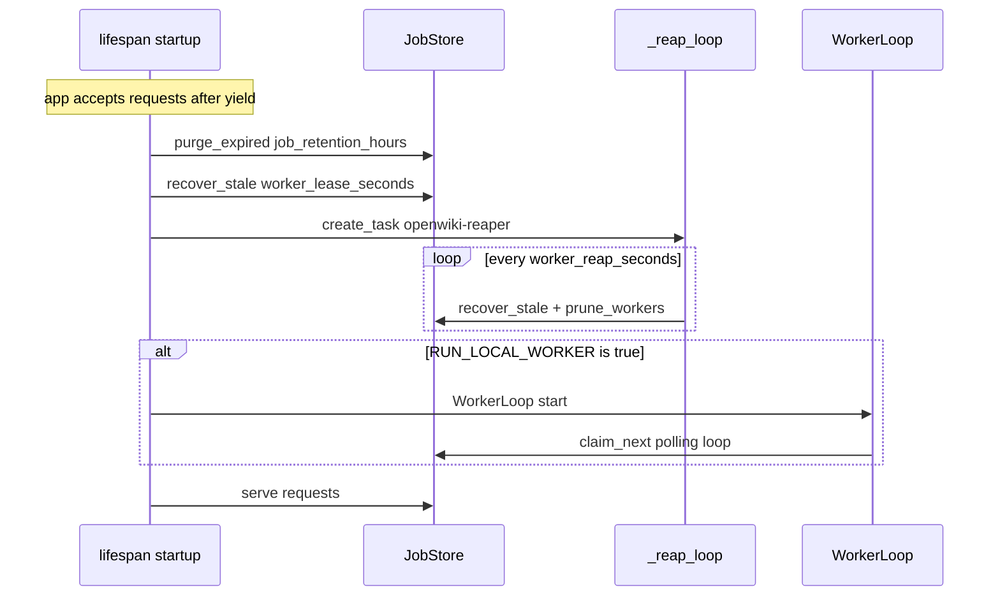
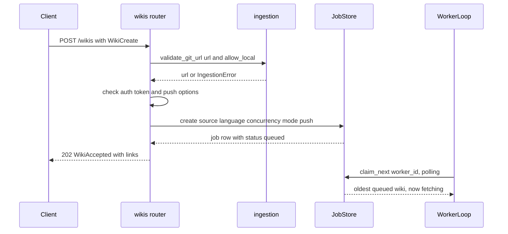
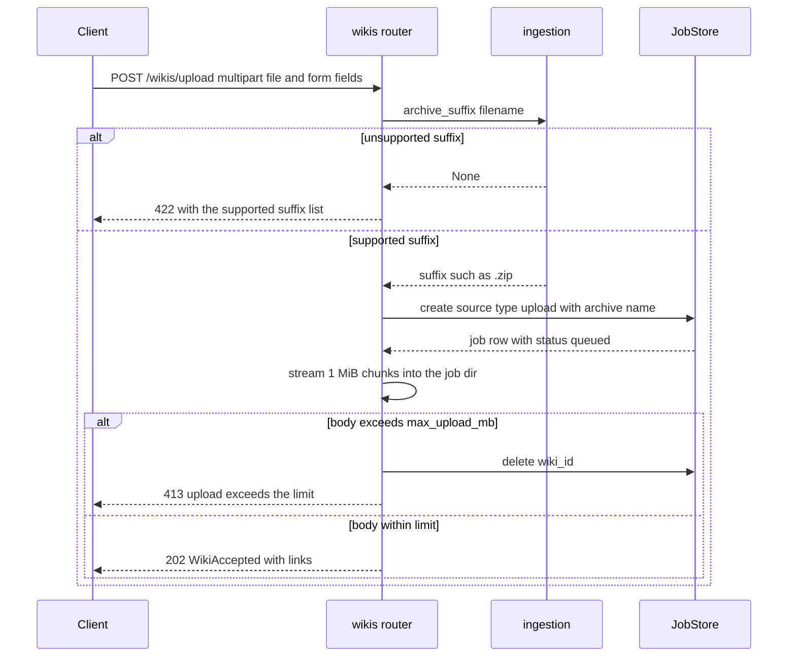
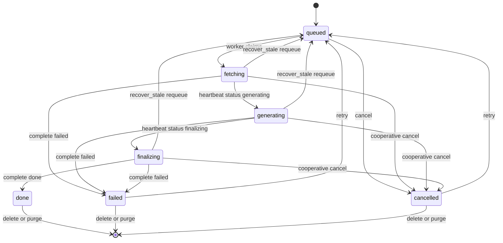

# Servicio HTTP: factory de FastAPI, routers y contratos

El servicio es una aplicación FastAPI construida por `create_app` en `app/main.py` y arrancada con el flag de factory:

```bash
uvicorn app.main:create_app --factory --host 0.0.0.0 --port 8000
```

La API solo **encola** trabajo, sirve estado/logs/artefactos y reencola claims caducados; el pipeline de generación corre en contenedores worker (`python -m app.worker`) o, para desarrollo y tests, dentro del proceso de la API cuando `RUN_LOCAL_WORKER=true`. API y workers no comparten nada más que el volumen de datos (la cola SQLite más `jobs/`), que es la razón por la que la API puede reiniciarse sin matar generaciones en curso.

## La factory y `app.state`

`create_app(settings: Settings | None = None)` hace, en orden:

1. **Resolución de configuración** — `settings or Settings()`, así que la configuración viene de variables de entorno y `.env` (`app/core/config.py`).
2. **Fail-fast ante cabeceras de proveedor mal formadas** — cuando `OPENAI_COMPATIBLE_EXTRA_HEADERS` está definido, `parse_extra_headers` se ejecuta de inmediato, de modo que un JSON inválido aborta la construcción de la app en vez de fallar en la primera petición.
3. **Instancias únicas de los colaboradores compartidos** — un `JobStore(settings.data_dir)` y un `ModelStatusCache(settings)` por app.
4. **Construcción de FastAPI** con `title="OpenWiki Service"`, `version=app.__version__` (`0.1.0`), la descripción del servicio y el context manager `lifespan`.
5. **Publicación de dependencias en `app.state`** — los routers son sin estado y lo resuelven todo a través de `request.app.state`:

| Clave de `app.state` | Escrita por | Propósito |
| --- | --- | --- |
| `settings` | factory | Instancia de `Settings` que usa cada ruta |
| `store` | factory | `JobStore`: la cola SQLite y las rutas de artefactos |
| `model_cache` | factory | `ModelStatusCache` detrás de `GET /health/model` |
| `worker` | lifespan | `WorkerLoop` cuando `RUN_LOCAL_WORKER=true`, si no `None` |
| `proxy` | lifespan | Handle del proxy de proveedor en loopback de ese worker, si no `None` |

6. **Registro de routers** — `health.router` y luego `wikis.router`, más un `GET /` raíz declarado con `include_in_schema=False` que devuelve `{"service": "openwiki-service", "docs": "/docs", "health": "/health", "wikis": "/wikis"}`.

Punto de extensión: un recurso nuevo significa un nuevo `app/routers/<recurso>.py` incluido en `create_app()`. Los routers no hablan con git ni con el CLI de OpenWiki; esa lógica vive en `app/services/`.

## Lifespan: limpieza inicial, reaper y worker local opcional



*Arranque del `lifespan`: limpieza de wikis caducadas, recuperación de claims, lanzamiento del reaper y worker local opcional.*

Qué garantiza cada paso:

- **`store.purge_expired(settings.job_retention_hours)`** — borra las wikis terminales (`done`/`failed`/`cancelled`) terminadas hace más de `JOB_RETENTION_HOURS`; el valor por defecto `0` lo conserva todo para siempre.
- **`store.recover_stale(settings.worker_lease_seconds)`** — reencola los claims en `fetching`/`generating`/`finalizing` cuyo heartbeat `last_seen_at` es más antiguo que el lease. Es la recuperación ante caídas: una wiki interrumpida a mitad de generación vuelve como `queued` y otro worker la reanuda en el mismo workspace.
- **`_reap_loop`** — una tarea `asyncio` llamada `openwiki-reaper` que duerme `WORKER_REAP_SECONDS` y luego repite `recover_stale` y `prune_workers()` (olvida los workers vistos por última vez hace más de una hora). Las excepciones se suprimen con `contextlib.suppress(Exception)`, así que el reaper nunca muere y mata el reencolado periódico.
- **Worker en proceso opcional** — solo cuando `settings.run_local_worker` es verdadero el lifespan construye un `WorkerLoop(settings, store)`, hace `await worker.start()` y publica `app.state.worker` / `app.state.proxy`. El mismo bucle alimenta los contenedores worker, así que desarrollo y tests ejercitan el pipeline de producción. `app.state.proxy` es el handle del proxy en loopback que inyecta cabeceras, y permanece `None` salvo que se haya arrancado un worker *y* haya cabeceras extra con una base URL configuradas.
- **Apagado** — la tarea del reaper se cancela (suprimiendo `CancelledError`) y, si existe, `worker.stop()` cancela las tareas del runner y detiene el proxy. El apagado nunca deja un escritor de heartbeats huérfano.

## Superficie HTTP

### `/wikis` — repositorios y subidas

El router se declara como `APIRouter(prefix="/wikis", tags=["wikis"])`.

| Método | Ruta | Entrada | Éxito | Errores |
| --- | --- | --- | --- | --- |
| `POST` | `/wikis` | JSON `WikiCreate` | `202` `WikiAccepted` | `422` validación de URL, token, push o cuerpo |
| `GET` | `/wikis` | query `limit`, `1..500`, por defecto `50` | `200` `list[WikiView]`, más recientes primero | `422` limit fuera de rango |
| `POST` | `/wikis/upload` | multipart `file` (obligatorio) + campos de formulario `language`, `concurrency` (`1..8`), `mode` | `202` `WikiAccepted` | `422` sufijo de archivo no soportado, `413` subida por encima de `MAX_UPLOAD_MB` |
| `GET` | `/wikis/{wiki_id}` | path | `200` `WikiView` | `404` wiki desconocida |
| `GET` | `/wikis/{wiki_id}/logs` | query `tail`, `1..2000`, por defecto `50` | `200` `text/plain` con la cola del log | `404` wiki desconocida |
| `GET` | `/wikis/{wiki_id}/download` | path | `200` `application/zip`, nombre `openwiki-{wiki_id}.zip` | `404` wiki desconocida o artefacto no listo |
| `POST` | `/wikis/{wiki_id}/cancel` | path | `200` `{"wiki_id", "status"}` | `404` desconocida, `409` wiki no en ejecución |
| `POST` | `/wikis/{wiki_id}/retry` | path | `202` `WikiAccepted` | `404` desconocida, `409` no reintentable |
| `DELETE` | `/wikis/{wiki_id}` | path | `204` sin cuerpo | `404` desconocida, `409` aún en ejecución |
| `GET` | `/health` | — | `200` snapshot JSON | — |
| `GET` | `/health/model` | query `force` | `200` resultado del probe | `503` cuando el modelo no está configurado, no responde o da error |
| `GET` | `/` | — | `200` `{"service", "docs", "health", "wikis"}` | — |

### `POST /wikis` — encolar una generación desde git



*Secuencia de `POST /wikis`: validación del origen, alta de la fila `queued` y reclamación posterior por un worker.*

El handler valida el origen, llama a `store.create(...)` y responde `202` con `_accepted(wiki_id)`, cuyos `links` son `{status, logs, download}` (todos relativos a `/wikis/{wiki_id}`). `202` significa *aceptado*, no generado: la respuesta nunca espera a un worker y `status` es siempre `queued`. El `source` almacenado es `{"type": "git", "url": <url validada>, "ref": ..., "token": ...}` más el `push` opcional volcado con `model_dump()`.

### `POST /wikis/upload` — encolar una generación desde un archivo



*Secuencia de `POST /wikis/upload`: comprobación del sufijo, alta del job antes de recibir el cuerpo y borrado del job cuando la subida excede el límite.*

Detalles destacables:

- El nombre subido se normaliza con `Path(file.filename or "upload").name`, así que una ruta enviada por el cliente no puede escapar del directorio del job.
- La fila del job se crea **antes** de transmitir el cuerpo, de modo que el store es dueño de `jobs/<wiki_id>/`; el archivo se escribe en `jobs/<wiki_id>/upload<suffix>`. Si el stream supera `MAX_UPLOAD_MB * 1024 * 1024`, `ingestion.save_upload` borra el archivo parcial, el router llama a `store.delete(wiki_id)` y solo entonces responde `413`: ninguna fila `queued` huérfana sobrevive a una subida rechazada.
- `mode or "auto"` hace opcional el campo de formulario, y `source` es `{"type": "upload", "filename": <basename>, "archive": "upload<suffix>"}`.
- A diferencia del cuerpo JSON, el campo de formulario `language` es una cadena opcional sin más: la restricción de 2 a 32 caracteres vive en `WikiCreate`, así que la validación Pydantic que dispara el router para las subidas solo constriñe `concurrency` (`ge=1`, `le=8`) y el literal de `mode`.

### Lectura de estado, logs y artefactos

- `GET /wikis/{wiki_id}` devuelve `wiki_to_view(job)` o `404`.
- `GET /wikis/{wiki_id}/logs` exige que la wiki exista (`404` en caso contrario) y devuelve un cuerpo vacío cuando el archivo de log no existe todavía (wiki en cola). La cola se calcula con `collections.deque(handle, maxlen=tail)`, así que el archivo se lee secuencialmente y solo se devuelven las últimas `tail` líneas.
- `GET /wikis/{wiki_id}/download` distingue dos casos de `404`: wiki desconocida (`"wiki not found"`) y wiki conocida sin `wiki.zip` (`"wiki is not ready (status=<status>)"`, por ejemplo aún en ejecución o fallida antes del empaquetado).
- `DELETE /wikis/{wiki_id}` exige un estado terminal (`done`, `failed`, `cancelled`); en caso contrario `409` con `"wiki is still running (status=<status>)"`. Si tiene éxito se eliminan la fila y el directorio completo `jobs/<wiki_id>/`, y la respuesta es `204`.
- Cada parámetro de path `{wiki_id}` se resuelve a través de `store.get`, que rechaza los ids que no encajan con el formato 32-hex de `JOB_ID_RE`; un id mal formado como `deadbeef` o `..%2Fescape` acaba por tanto en el mismo `404` `"wiki not found"` sin llegar nunca al sistema de archivos.

### Semántica de cancel y retry

Ambos endpoints delegan en el store y traducen su resultado en forma de cadena a un estado HTTP; el router solo añade el estado actual al detalle del error.

- `cancel` → `cancelled`: una wiki `queued` se cancela de inmediato con `error="cancelled before start"`. → `cancelling`: una wiki en ejecución recibe `cancel_requested=1` y se detiene de forma cooperativa —el worker lo nota en su siguiente heartbeat y termina con `cancelled`—. → `not_running` → `409` (ya es terminal). → `not_found` → `404`.
- `retry` → `queued`: solo se reencolan wikis `failed`/`cancelled`, reseteando `error`, `progress`, `finished_at` y todo el claim; OpenWiki reanuda desde su propio `openwiki/.run.json`. → `not_retryable` → `409` con `"only failed or cancelled wikis can be retried (status=...)"`. → `not_found` → `404`.

### Ciclo de vida del estado de una wiki



*Máquina de estados de una wiki tal como la observan las rutas HTTP y cómo la modifican los workers.*

La API solo observa estas transiciones: `claim_next` pone `fetching`, el heartbeat del worker reporta `generating`/`finalizing` (el progreso hace de heartbeat del lease) y `complete` escribe un estado terminal solo si el claim sigue coincidiendo.

## Validación a nivel de router y mapeo de errores

Todas las reglas de URL git viven en `app/services/ingestion.validate_git_url` / `SUPPORTED_ARCHIVE_SUFFIXES`; el router traduce los fallos a códigos HTTP en vez de reimplementarlos.

| Condición | Estado y detalle |
| --- | --- |
| `source.url` vacío | `422` `"source.url must not be empty"` |
| Esquema no soportado, p. ej. `ftp://` | `422` `"unsupported URL scheme: ftp"` |
| `file://` o ruta local mientras `ALLOW_LOCAL_GIT` es falso | `422` (los orígenes locales son opt-in) |
| `auth.token` con una URL que no es `http(s)` | `422` `"auth.token is only supported for http(s) git URLs"` |
| `push` activado con `git@...` / `ssh://` | `422` `"push requires an http(s) URL; SSH keys are not available in the service"` |
| `push` activado con `git://` | `422` `"push is not supported over the git:// protocol"` |
| `push` activado con `http(s)` pero sin token | `422` `"push requires source.auth.token (a PAT with write access)"` |
| Violaciones del cuerpo: `mode` fuera de `auto`/`init`/`update`, `concurrency` fuera de `1..8`, `language` menor de 2 o mayor de 32, token vacío, `push.branch` mal formada, `push.message` vacío, `limit`/`tail` fuera de rango | `422` lanzado por la validación de Pydantic/FastAPI |
| Sufijo de subida que no está en `SUPPORTED_ARCHIVE_SUFFIXES` | `422` listando los sufijos soportados |
| Cuerpo de subida por encima de `MAX_UPLOAD_MB` | `413`, y el job encolado se borra |
| `wiki_id` desconocido o mal formado en cualquier ruta | `404` `"wiki not found"` |
| Descarga antes de que exista `wiki.zip` | `404` `"wiki is not ready (status=...)"` |
| Cancel de una wiki terminal, retry de una wiki que no está failed/cancelled, `DELETE` de una wiki no terminal | `409` con el estado ofensor en el detalle |
| `GET /health/model` con un estado distinto de `ok`/`unsupported` | `503` (el cuerpo JSON sigue llevando `status` y `detail`) |

De este reparto se derivan dos invariantes: todo problema de dominio se convierte en un resultado tipado del store o en un `IngestionError` que el router mapea a un código 4xx, y las credenciales nunca aparecen en una respuesta — `wiki_to_view` redacta la URL de git y descarta el token, que se queda solo dentro de la fila SQLite para que los reintentos puedan clonar de nuevo sin que el cliente lo reenvíe.

## Contratos en `app/schemas.py`

`WikiStatus` enumera `queued`, `fetching`, `generating`, `finalizing`, `done`, `failed`, `cancelled`.

- **Peticiones** — `WikiCreate` requiere `source: GitSource` (`type` fijado a `"git"`, `url` obligatoria, `ref` opcional, `auth: GitAuth` opcional con `token` de `min_length=1`), más `language` opcional (2–32 caracteres), `concurrency` (1–8, reenviado como `OPENWIKI_PAGE_CONCURRENCY`), `mode` (`auto` por defecto, `init`, `update`) y `push: PushOptions | None`. `PushOptions` valida un nombre de rama git (se recorta; se rechaza si está vacío, empieza por `-`/`/`, termina en `/`/`.`, o contiene `..`, `@{`, `//`, ` `, `~`, `^`, `:`, `?`, `*`, `[` o `\`; longitud máxima 255) y un `message` de commit no vacío (máximo 500). `/wikis/upload` usa el mismo literal `mode` y un `concurrency` restringido a `1..8` como campos de formulario, mientras que su campo de formulario `language` no lleva restricción de longitud.
- **Respuesta aceptada** — `WikiAccepted` es `{wiki_id, status, links}` donde `links = {"status": "/wikis/{id}", "logs": "/wikis/{id}/logs", "download": "/wikis/{id}/download"}`. La respuesta es un eco puro del encolado: `status` es siempre `queued` y los links se calculan a partir del id, así que los clientes consultan `links.status` (o `GET /wikis/{id}`) para seguir el progreso.
- **Vistas** — `WikiView` es la representación pública de una wiki, y `wiki_to_view(job)` es el único punto donde el registro interno de job se convierte en ella. El mapeo es deliberadamente explícito: internamente una generación es un *job* (cola, workers, `job.json`), públicamente es una *wiki*; `claimed_by` pasa a `worker`, `attempts` se coacciona a `int`, las columnas JSON `push`/`push_result` se revalidan a `PushOptions`/`PushResult` (solo cuando son dicts), los orígenes git exponen la URL redactada más `ref`, y los orígenes de subida exponen `filename` con `source_url` vacío. `PushResult.status` es uno de `pushed`, `no_changes`, `failed`, `skipped` con `branch`, `commit`, `detail` y `at` opcionales.

Como tanto `create_wiki` como `upload_source` persisten dicts planos ya validados, cambiar un esquema de petición obliga a revisar `wiki_to_view` y las columnas JSON del store a la vez.

## Endpoints de health

`GET /health` es deliberadamente barato y **nunca llama a un modelo**:

- `status: "ok"` y `version` desde `app.__version__`.
- `openwiki_bin` más `openwiki_found`, calculado partiendo el comando configurado con `split_command` y probando el primer token de argv con `shutil.which`; así un comando como `"python" "/path/fake_openwiki.py"` se comprueba como `python`.
- `data_dir` como cadena, y `pool` = `store.stats()`, es decir `{queued, running, workers}` donde `workers` cuenta los heartbeats vistos en los últimos 120 segundos.
- `model` = `describe_model(settings)`, un snapshot pasivo (proveedor y su origen, modelo y su origen, nombre de la variable de credencial / si está presente / de dónde salió, `base_url` redactada y su origen, `base_url_warning` cuando la URL incluye por error una ruta de endpoint, `suggested_base_url`, nombres de cabeceras extra —solo para el proveedor `openai-compatible`—, `probe_supported`, `note`, `active_check_endpoint`). Lee el entorno del proceso superpuesto sobre `<OPENWIKI_CONFIG_DIR>/.env` y nunca expone valores de credenciales.

`GET /health/model` ejecuta el probe activo a través de `app.state.model_cache.check(force=force)`:

- `ModelStatusCache` cachea el resultado por instancia de app durante `MODEL_CHECK_TTL_SECONDS` y protege el probe con un `asyncio.Lock`, así que peticiones concurrentes disparan un único probe. `force=true` ignora una entrada de caché fresca y vuelve a sondear; el cuerpo devuelto siempre lleva `cached` para mostrar qué camino se tomó.
- El coordinador mapea `status` a HTTP: `ok` y `unsupported` → `200`, cualquier otro (`not_configured`, `error`) → `503`. `unsupported` es una respuesta válida para proveedores cuyas credenciales no son una API key simple (Bedrock IAM, sesión de Copilot, sign-in de ChatGPT, ADC de Gemini Enterprise) o para proveedores desconocidos.
- El resultado del probe (`provider`, `model`, `credential_env`, `checked_at`, `latency_ms`, `endpoint`, `detail`) va redactado: los cuerpos de error del proveedor y los endpoints pasan por `redact_text`/`redact_url`, así que una credencial repetida por el proveedor no puede filtrarse —incluso cuando `OPENAI_COMPATIBLE_EXTRA_HEADERS` está mal formado, lo que se manifiesta como `status="error"` en lugar de una excepción—.

## Configuración que cambia el comportamiento de la API

| Setting (variable de entorno) | Efecto en la superficie HTTP |
| --- | --- |
| `DATA_DIR` | Raíz de la cola SQLite y de los artefactos `jobs/<wiki_id>/` reportados por `/health` |
| `MAX_UPLOAD_MB` | Límite de cuerpo impuesto mientras se transmite `POST /wikis/upload`; el umbral del `413` |
| `JOB_RETENTION_HOURS` | Borrado en el arranque de wikis terminales; `0` las conserva para siempre |
| `WORKER_LEASE_SECONDS` | Antigüedad a partir de la cual se reencola un claim en ejecución (arranque y reaper) |
| `WORKER_REAP_SECONDS` | Periodo del reaper dentro del proceso de la API |
| `RUN_LOCAL_WORKER` | Arranca un worker dentro del proceso de la API y rellena `app.state.worker` / `app.state.proxy` |
| `ALLOW_LOCAL_GIT` | Habilita rutas locales y orígenes `file://` en `POST /wikis` |
| `MODEL_CHECK_TTL_SECONDS`, `MODEL_CHECK_TIMEOUT_SECONDS` | Ventana de caché y timeout de `GET /health/model` |

A nivel operativo, el healthcheck del contenedor sondea `/health` cada 15 s, y no hay autenticación en la API: está pensada para una red interna o detrás de un reverse proxy autenticado.

## Tests focalizados

- `tests/test_api_wikis.py` recorre toda la superficie con `fastapi.testclient.TestClient`, el CLI falso de OpenWiki (`tests/fixtures/fake_openwiki.py`) y `RUN_LOCAL_WORKER=true` de `tests/conftest.py`: `422` para URLs no soportadas y vacías, rechazo de sufijos en subidas, `202` más polling hasta `done`, `404` mientras falta el zip y para ids desconocidos/mal formados, `409`/`404` en las validaciones de cancel/retry, borrado, reintento tras fallo, cancelación cooperativa y reanudación, y persistencia/reanudación a través de reinicios de la app.
- `tests/test_health.py` comprueba que `/health` responde `200` con `pool.workers == 1` y que `/` apunta a `/docs`.
- `tests/test_model_status.py` cubre `GET /health/model`: resultados `200`/`503`, expectativas del camino de probe por proveedor, redacción de credenciales y el comportamiento de caché/`force`.
- `tests/test_push.py` cubre las validaciones de push a nivel de router (`422` para `https` sin token, para orígenes SSH y para una rama inválida) y el contrato `push_result` que devuelve `GET /wikis/{id}`.
- `tests/test_provider_proxy.py` cubre `parse_extra_headers`, el fail-fast de `create_app` ante JSON de cabeceras inválido, y que un worker en proceso expone el proxy en loopback en `app.state.proxy` y apunta OpenWiki a él.
- `tests/test_worker_queue.py`, `tests/test_wiki_state.py` y `tests/test_ingestion.py` cubren la semántica del store y de la validación de la que dependen los routers, de modo que los tests de router pueden quedarse delgados.

## Páginas relacionadas

- [JobStore: cola y estado en SQLite](/openwiki/architecture/job-store.md) — la cola SQLite, los claims y los heartbeats detrás de cada ruta.
- [System overview](/openwiki/architecture/overview.md) — API, workers y volumen compartido.
- [Worker pool and claim loop](/openwiki/architecture/worker-pool.md) — el bucle que la API arranca en modo in-process.
- [Generation from git](/openwiki/workflows/generation-from-git.md) — qué ocurre después de que `POST /wikis` devuelva `202`.
- [Upload and extraction](/openwiki/workflows/upload-and-extraction.md) — límites de seguridad de archivos e inicialización de git.
- [Model health check](/openwiki/workflows/model-health-check.md) — proveedores y estados del probe detrás de `/health/model`.
- [Credentials and redaction](/openwiki/concepts/credentials-and-redaction.md) — por qué ninguna respuesta lleva tokens.
