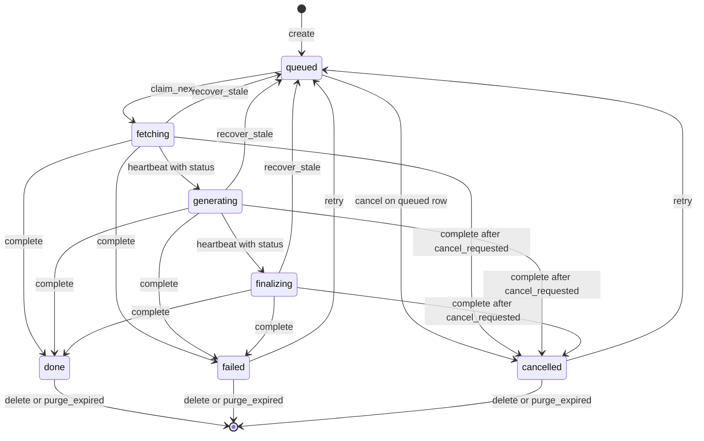
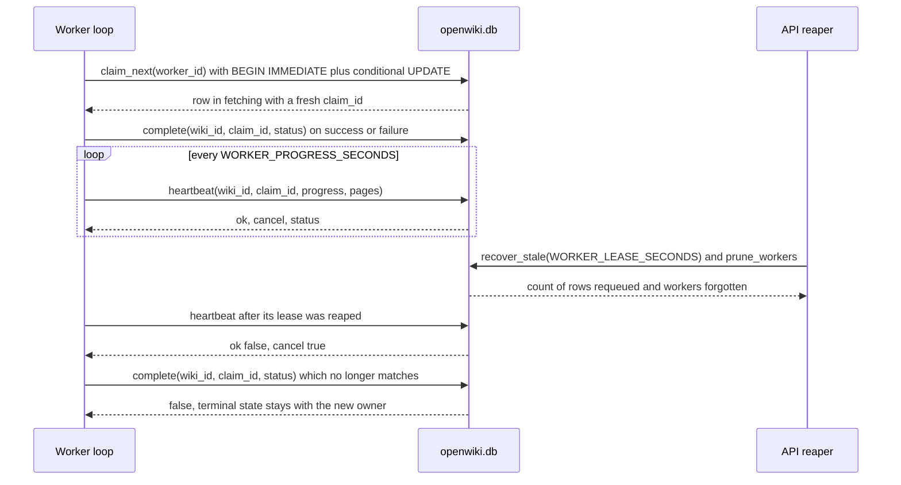

# JobStore: cola y estado en SQLite

`app/core/storage.py` concentra el único punto de coordinación del servicio. La API nunca genera
nada: inserta una fila y lee estado. Los workers reclaman filas de forma atómica y reportan el
progreso sobre esas mismas filas. Como ambos lados solo tocan el volumen compartido —`<data_dir>/openwiki.db`
más los directorios por wiki bajo `<data_dir>/jobs/<wiki_id>/`—, la API puede reiniciarse o morir sin
matar las generaciones en curso, y cualquier número de contenedores worker puede compartir una cola.

El módulo está explícitamente acotado a un host con un volumen compartido. Su docstring y el README
del repositorio nombran la vía de escalado prevista: sustituir este módulo por una implementación
sobre Postgres que exponga los mismos métodos (`claim_next`, `heartbeat`, `complete`,
`recover_stale`, ...).

Instanciaciones:

- `create_app()` construye un `JobStore(settings.data_dir)` por proceso de API.
- `python -m app.worker` construye uno por contenedor worker.
- Los tests construyen instancias adicionales sobre el mismo `data_dir` para simular un segundo
  worker o un reinicio.

## Archivos y rutas

La base de datos vive en `<data_dir>/openwiki.db` (`self.db_path`). Los artefactos permanecen en el
sistema de archivos, nunca dentro de la base de datos:

| Método | Ruta | Contenido |
| --- | --- | --- |
| `job_dir(wiki_id)` | `<data_dir>/jobs/<wiki_id>/` | raíz del workspace de cada wiki |
| `repo_dir(wiki_id)` | `.../repo/` | fuente clonada o extraída (`repo/.git` habilita la reanudación) |
| `logs_path(wiki_id)` | `.../logs.txt` | log de ejecución legible que va escribiendo el pipeline |
| `wiki_zip_path(wiki_id)` | `.../wiki.zip` | artefacto empaquetado que sirve `GET /wikis/{id}/download` |
| `meta_path(wiki_id)` | `.../job.json` | **solo legado** — el registro anterior a SQLite, ver la sección de migración |

El directorio por wiki también recibe los bytes que la API escribe para un job de subida
(`jobs/<wiki_id>/upload<suffix>`, p. ej. `upload.zip`, una ruta que el router compone a partir de
`job_dir()` en lugar de un accesor de `JobStore`). El pipeline lo extrae en `repo/` y el archivo
permanece en disco para que un `retry` posterior no requiera que el cliente vuelva a subirlo.

`jobs_dir` se crea en `__init__`, así que la API y los workers pueden competir por crearlo sin riesgo.

## Esquema e invariantes de la conexión

Dos tablas se crean de forma idempotente mediante `_SCHEMA` con `executescript` en cada apertura:

- `wikis`: `wiki_id TEXT PRIMARY KEY` más las columnas de ciclo de vida (`status`, `claimed_by`,
  `claim_id`, `claimed_at`, `last_seen_at`, `cancel_requested`, `attempts`, `progress`, `pages`,
  `size_bytes`, `error`, `created_at`, `started_at`, `finished_at`), las columnas de payload JSON
  (`source`, `push`, `push_result`) y los parámetros de la petición (`language`, `concurrency`,
  `mode`). `NOT NULL` cubre `status`, `source` y `created_at` además de la clave primaria;
  `mode DEFAULT 'auto'`, `cancel_requested DEFAULT 0` y `attempts DEFAULT 0` son los únicos valores
  por defecto, de modo que `create` es el único escritor que se apoya en no recibir esos valores.
  Las marcas de tiempo son cadenas UTC (`utc_now()` → `%Y-%m-%dT%H:%M:%SZ`), así que el orden
  lexicográfico es el orden cronológico en toda comparación de lease y de retención.
- `workers`: clave primaria `worker_id` y `last_seen_at` (`NOT NULL`), el registro de liveness que
  alimenta los contadores de pool de `/health`.
- `idx_wikis_queue` sobre `wikis (status, created_at)` respalda el escaneo de la cola en `claim_next`.

La conexión se abre una vez por `JobStore` con `check_same_thread=False`, `timeout=30` e
`isolation_level=None`, y `row_factory = sqlite3.Row`. El autocommit es el comportamiento por
defecto; la única transacción explícita es el `BEGIN IMMEDIATE` de `claim_next`. Un
`threading.RLock` (`self._lock`) serializa cada sentencia del proceso propietario, y los PRAGMAs
`journal_mode=WAL`, `synchronous=NORMAL` y `busy_timeout=5000` evitan que los lectores de la API
(list, status, logs, stats) bloqueen a los escritores de otros contenedores, y viceversa.

La corrección entre procesos nunca depende de `self._lock`, que por construcción solo cubre un
proceso: la exclusividad entre réplicas de contenedores viene del propio bloqueo de SQLite
(`BEGIN IMMEDIATE` más `busy_timeout`) y de que toda mutación se formula como un
`UPDATE ... WHERE` condicional, de modo que el ganador lo decide `rowcount` y no una coordinación
externa. No existe `close()`: la conexión vive tanto como el proceso y los archivos WAL
(`openwiki.db-wal`, `openwiki.db-shm`) quedan junto a la base de datos en el volumen compartido.

### Conjuntos de estados

```python
ACTIVE_STATUSES   = frozenset({"queued", "fetching", "generating", "finalizing"})
RUNNING_STATUSES  = frozenset({"fetching", "generating", "finalizing"})
TERMINAL_STATUSES = frozenset({"done", "failed", "cancelled"})
```

Estos conjuntos son el vocabulario de ciclo de vida del módulo y los aplican los métodos de
coordinación, no el esquema: `heartbeat` se niega a refrescar un claim cuya fila no está en
`RUNNING_STATUSES`, `recover_stale` solo barre `RUNNING_STATUSES`, `complete` rechaza cualquier
estado fuera de `TERMINAL_STATUSES` con `ValueError`, y el endpoint de borrado consulta
`TERMINAL_STATUSES` antes de permitir la eliminación. `ACTIVE_STATUSES` es una constante documentada
y no un guardia: ningún método del store la consulta, y los clientes reflejan los siete nombres a
través de `WikiStatus` en `app/schemas.py`.

### Validación de `wiki_id`

`JOB_ID_RE = re.compile(r"^[0-9a-f]{32}$")` y `is_valid_wiki_id` filtran toda lectura/escritura por
id: `get` y `delete` devuelven `None`/`False` ante un id malformado en lugar de llegar a SQLite, y el
importador legado omite los registros cuyo id no encaja. `new_wiki_id()` produce esos ids de 32
caracteres hexadecimales con `uuid4().hex`, y el mismo generador se reutiliza para acuñar los valores
de `claim_id`. `is_valid_job_id` se conserva como alias para llamadas antiguas.

## Guardias de escritura: `_UPDATABLE` y `_JSON_COLUMNS`

`update(wiki_id, **changes)` es la vía de escape para todo lo que no cubren los métodos de
coordinación, así que está deliberadamente restringido:

- Cualquier keyword fuera de `_UPDATABLE` lanza `ValueError("columns not updatable: ...")`, lo que
  impide que los llamadores escriban `created_at`, `wiki_id`, `source` o identificadores SQL
  arbitrarios. `source` se escribe una sola vez en `create`, así que la cola no puede reapuntarse a
  otro repositorio a mitad de vuelo.
- Las columnas de `_JSON_COLUMNS` (`source`, `push`, `push_result`) son las que se codifican con
  `json.dumps`: `push` y `push_result` al escribirse vía `update` y las tres al decodificarse en las
  lecturas. `None` se mantiene como `NULL`.
- `cancel_requested` se convierte a `1`/`0`, así que los llamadores pueden pasar booleanos.
- `rowcount == 0` lanza `KeyError(wiki_id)`; un conjunto de cambios vacío devuelve la fila actual (o
  lanza `KeyError` si no existe).

`_decode` es la operación inversa para las lecturas: cada valor de `_JSON_COLUMNS` se parsea con
`json.JSONDecodeError` suprimido (un blob corrupto degrada al estado en bruto en lugar de tumbar una
petición de la API) y `cancel_requested` se normaliza de vuelta a `bool`. Todos los métodos públicos
de lectura devuelven `dict` planos, que es lo que consumen la capa de router (`wiki_to_view`) y el
worker.

## El contrato de métodos compartido

La API y los workers usan el mismo tipo de instancia `JobStore`; los valores de retorno son el
protocolo entre ellos.

| Método | Llamador | Éxito | Ruta de fallo |
| --- | --- | --- | --- |
| `create(...)` | API (`POST /wikis`, `POST /wikis/upload`) | fila con `status='queued'` y `created_at` puesto | — |
| `get(wiki_id)` | API, worker | fila decodificada | `None` para id desconocido o malformado |
| `list_wikis(limit=50)` | API `GET /wikis` | lista de más reciente a más antigua | — |
| `claim_next(worker_id)` | bucle del worker | la fila reclamada, con `status='fetching'` | `None` cuando la cola está vacía o la actualización condicional no afectó a ninguna fila |
| `heartbeat(wiki_id, claim_id, ...)` | tracker del worker y pipeline | `{"ok": True, "cancel": bool, "status": ...}` | `{"ok": False, "cancel": True, "status": <estado de la fila o None>}` |
| `complete(wiki_id, claim_id, status=...)` | worker | `True` | `False` cuando `claim_id` ya no coincide o la fila no está en ejecución; `ValueError` para un estado no terminal |
| `recover_stale(lease_seconds)` | reaper de la API y arranque | número de filas reencoladas | `0` cuando no hay nada caducado |
| `note_worker(worker_id)` | bucle del worker | upsert de la fila de liveness | — |
| `prune_workers(max_age_seconds=3600)` | reaper de la API | número de workers olvidados | `0` |
| `stats(worker_ttl_seconds=120)` | `GET /health` | `{"queued", "running", "workers"}` | — |
| `cancel(wiki_id)` | `POST /wikis/{id}/cancel` | `"cancelled"` o `"cancelling"` | `"not_found"`, `"not_running"` |
| `retry(wiki_id)` | `POST /wikis/{id}/retry` | `"queued"` | `"not_found"`, `"not_retryable"` |
| `update(...)` | reinicios de la API y tests, `pipeline.run_pipeline` | la fila actualizada | `ValueError` (columna no válida), `KeyError` (fila ausente) |
| `delete(wiki_id)` | `DELETE /wikis/{id}` | `True` (también elimina el directorio del job) | `False` para id malformado o ausente |
| `purge_expired(retention_hours)` | arranque de la API | número de filas eliminadas | `0` cuando `retention_hours <= 0` |

Las rutas de fallo importan tanto como las felices: `heartbeat` devolviendo `ok=False` es como un
worker se entera de que su lease fue barrido o completado en otro sitio, y `pipeline.report()` lo
convierte en `PipelineCancelled` para que la generación se detenga en vez de escribir en una fila que
ahora posee otro worker. `complete` devolviendo `False` es la misma señal al final de una ejecución,
y los llamadores del worker simplemente la ignoran (el estado terminal pertenece a quien tenga el
claim vivo).

Dos contratos del lado de lectura que conviene fijar: `list_wikis(limit)` ordena por
`created_at DESC, wiki_id DESC` (el id es el desempate para filas creadas en el mismo segundo),
mientras que `claim_next` recorre el mismo índice en la dirección opuesta (`created_at ASC`) para
repartir primero el trabajo más antiguo. `stats` devuelve exactamente
`{"queued": int, "running": int, "workers": int}`, que es la forma que `/health` publica como `pool`.

### Borrado y retención

`delete(wiki_id)` es el único método que toca ambos almacenes de verdad en una sola llamada: borra la
fila y después hace `shutil.rmtree(job_dir, ignore_errors=True)` sobre el workspace, los logs y el
zip. La limpieza del sistema de archivos es best-effort (`ignore_errors=True`) y el valor de retorno
solo informa de si existía la *fila*, de modo que un directorio parcialmente limpiado se reintenta o
se recoge después en lugar de reportarse como un fallo. Como la API comprueba `TERMINAL_STATUSES`
antes de llamarlo, `delete` solo es alcanzable cuando ningún worker tiene un claim;
`purge_expired(retention_hours)` aplica el mismo borrado a toda fila terminal cuyo `finished_at` sea
anterior al corte.

### Claim atómico

`claim_next` es el único método que abre una transacción explícita:

1. `BEGIN IMMEDIATE` toma el bloqueo de escritura antes de la lectura, de modo que dos workers en
   conexiones distintas no pueden observar la misma fila `queued`.
2. `SELECT wiki_id FROM wikis WHERE status='queued' ORDER BY created_at LIMIT 1` elige la wiki
   encolada más antigua; un resultado vacío se confirma con `COMMIT` y devuelve `None`.
3. Un `UPDATE ... WHERE wiki_id=? AND status='queued'` condicional sella `status='fetching'`,
   `claimed_by`, un `claim_id` nuevo, `claimed_at`, `last_seen_at`, pone `cancel_requested=0`,
   incrementa `attempts` y fija `started_at=COALESCE(started_at, ?)` para que un intento
   reencolado conserve su hora de inicio original.
4. `COMMIT`, con `ROLLBACK` ante cualquier `BaseException`. Un `rowcount != 1` significa que otro
   worker ganó la carrera, y `claim_next` devuelve `None`.

El bucle del worker vuelve a leer la fila con `get` antes de devolverla, para que el diccionario
entregado lleve las columnas JSON ya decodificadas.

### Heartbeat como canal de progreso y de cancelación

`heartbeat` refresca `last_seen_at` —el lease— y opcionalmente escribe `status`, `progress` y
`pages`. Primero confirma que `(wiki_id, claim_id)` sigue existiendo *y* está en
`RUNNING_STATUSES`; si no, devuelve `ok=False, cancel=True` sin escribir nada. En la ruta de éxito
devuelve el flag `cancel_requested` de la fila como `cancel`, que es como
`POST /wikis/{id}/cancel` llega a un worker en ejecución: la API solo pone el flag
(`update(wiki_id, cancel_requested=True)` devuelve `"cancelling"`), y el tracker del worker o
`pipeline.report()` convierten el siguiente `cancel=True` en cancelación. Esto hace del reporte de
progreso y de la liveness un único viaje de ida y vuelta, de modo que un worker atascado se detecta
exactamente cuando deja de actualizar el progreso.

El texto de `progress` no lo produce el store: `WorkerLoop._track` lee el propio estado durable de
OpenWiki en `repo/openwiki/.run.json` mediante `read_run_state` y lo formatea con `format_progress`
(`"<completed>/<total> pages · <phase>"`), recurriendo a un recuento de páginas cuando todavía no
existe un plan. El store solo persiste la cadena que le manda el worker, y por eso `progress` es una
columna `TEXT` opaca y `GET /wikis/{id}` puede mostrarla sin entender nada de OpenWiki.

### Lease, recuperación y registro de workers

- `recover_stale(lease_seconds)` reencola cualquier fila en `RUNNING_STATUSES` cuyo `last_seen_at`
  sea `NULL` o anterior al lease: `status='queued'`, columnas de claim limpiadas, `last_seen_at=NULL`
  y `cancel_requested=0`. `attempts` se conserva a propósito, de modo que los reintentos y la
  recuperación de caídas comparten el mismo contador.
- La API lo ejecuta en el arranque y después cada `worker_reap_seconds` mediante `_reap_loop`,
  inmediatamente seguido de `prune_workers()`. La recuperación es idempotente y segura desde varias
  réplicas de la API porque es un único `UPDATE` condicional.
- `note_worker` hace upsert de la fila del worker con `ON CONFLICT(worker_id) DO UPDATE`; los
  workers lo llaman en cada iteración del poll y en el arranque, que es lo que los mantiene dentro de
  `stats(worker_ttl_seconds)` y fuera de `prune_workers`.
- `stats` cuenta las filas `queued`, las filas en ejecución y los workers vistos dentro de
  `worker_ttl_seconds` (120 s por defecto) en una sola consulta; `GET /health` lo publica como
  `pool`, que es como los operadores observan la profundidad de la cola y los workers vivos.

### Cancel y retry

`cancel` es inmediato para filas `queued` (`status='cancelled'`, `finished_at`, `error='cancelled
before start'`) y cooperativo para las que están en ejecución, como se describe arriba; las filas
terminales devuelven `"not_running"`. `retry` acepta solo filas `failed`/`cancelled` y limpia todo
el estado de claim y de resultado (`error`, `progress`, `finished_at`, `cancel_requested`, columnas
de claim) mientras deja intactos `attempts` y el workspace en disco. Eso es lo que hace reanudable a
un reintento: el `_fetch` del pipeline ve `repo/.git` y continúa desde `openwiki/.run.json` en lugar
de clonar de nuevo.

## Ciclo de vida de la fila



*Todos los estados y transiciones de una fila `wikis`, con el método de `JobStore` que los realiza.*

Estados y transiciones escritos por `JobStore`; los nombres de estado coinciden con `WikiStatus` en
`app/schemas.py`. `recover_stale` conserva `attempts` y limpia el claim, de modo que una wiki
reencolada puede ser reclamada por un worker distinto.

## Interacción claim / heartbeat / recover_stale



*Secuencia real de un claim: entrega atómica, refresco por heartbeat, barrido del reaper y cierre
condicionado al `claim_id`.*

## Migración del `job.json` legado

Antes del store SQLite, cada generación era un archivo `jobs/<id>/job.json`. `migrate_legacy_files()`
se ejecuta al final de cada `JobStore.__init__` y realiza una importación de un solo sentido:

1. Itera los `jobs/*/job.json` en orden ordenado.
2. Parsea el JSON, omitiendo los archivos ilegibles o que no sean objetos.
3. Acepta el id desde `wiki_id`, con respaldo en la clave antigua `job_id`, y luego en el nombre del
   directorio padre; el registro se omite salvo que el id encaje en `JOB_ID_RE` y `source` sea un
   diccionario.
4. Hace `INSERT OR IGNORE` del registro completo en `wikis`, con `status` por defecto `queued`,
   `mode` por defecto `auto`, `created_at` por defecto `utc_now()` y `attempts` por defecto `0`.
5. Renombra el archivo a `job.json.legacy` (con los errores del sistema de archivos suprimidos). El
   renombrado es la marca de migración: como ocurre incluso cuando `INSERT OR IGNORE` no insertó
   nada, un segundo `JobStore` sobre el mismo directorio es un no-op y el registro ni se duplica ni
   se pierde. El método devuelve cuántas filas insertó realmente.

`meta_path(wiki_id)` sobrevive como la ubicación documentada de ese archivo legado, pero nada más en
el servicio lee o escribe `job.json`: la fila `wikis` es la fuente de verdad de estado, progreso y
resultados, y el directorio por wiki solo contiene `repo/`, `logs.txt`, `wiki.zip` (más el archivo
subido en los jobs `upload`). Mantener `meta_path` es lo que permite que el importador siga en este
módulo (y que las llamadas antiguas sigan funcionando) sin reintroducir un segundo formato de
metadatos divergente.

## Mandos operativos

Todo aquello de lo que depende el comportamiento del store viene de `Settings` (variables de
entorno):

- `worker_lease_seconds` (por defecto 180) — el lease que se pasa a `recover_stale`.
- `worker_reap_seconds` (por defecto 30) — el intervalo del barrido de la API.
- `worker_poll_seconds` (por defecto 2.0) — cada cuánto llama `claim_next` un worker ocioso.
- `worker_progress_seconds` (por defecto 2.0) — cada cuánto llama `heartbeat` un worker ocupado, es
  decir, la tasa efectiva de refresco del lease.
- `job_retention_hours` (por defecto 0 = conservar siempre) — se pasa a `purge_expired` en el
  arranque, que borra las filas terminales cuyo `finished_at` es anterior al corte junto con sus
  directorios.
- `data_dir` — decide `openwiki.db` y `jobs/`; `/data` en contenedores, el volumen compartido que
  hace que la API y todas las réplicas de worker vean la misma cola.

La poda es deliberadamente asimétrica: `prune_workers(max_age_seconds=3600)` usa un valor por
defecto de una hora que el reaper nunca sobrescribe, mientras que `stats` cuenta los workers vistos
dentro de `worker_ttl_seconds=120`. Un worker que muere desaparece por tanto de `pool.workers` a los
dos minutos, pero solo se olvida al cabo de una hora, de modo que un worker que se reinicia reutiliza
su fila mediante el upsert `ON CONFLICT` en lugar de acumular duplicados.

## Puntos de extensión y límites declarados

El alcance de un solo host es la frontera de diseño explícita del módulo, declarada tanto en el
docstring como en el README: un host, un volumen compartido, cualquier número de *contenedores* de
API y de worker. No sobrevive a un despliegue multi-host, porque el bloqueo de SQLite y las rutas de
archivos solo funcionan cuando todos los procesos ven el mismo sistema de archivos.

La costura de reemplazo es la clase misma, no una interfaz: nada en `app/` importa tipos de SQLite ni
las interioridades de `JobStore` —los routers, `WorkerLoop`, `publisher` y `pipeline.run_pipeline`
solo llaman a los métodos listados en la tabla del contrato y consumen diccionarios planos. Se espera
por tanto que un backend Postgres exponga los mismos nombres de método con las mismas formas de
retorno (`claim_next`, `heartbeat`, `complete`, `recover_stale`, `note_worker`, `prune_workers`,
`stats`, `cancel`, `retry`, `delete`, `purge_expired`, los helpers de rutas, más el `utc_now`/
`new_wiki_id` a nivel de módulo que usan `pipeline`, `publisher` y `loop`). Cualquier backend así
debe preservar dos comportamientos de los que dependen los llamadores: la actualización condicional
debe hacer que `claim_next`/`complete`/`heartbeat` rechacen un claim caducado mediante los mismos
resultados `None`/`False`/`ok=False`, y `heartbeat` debe seguir devolviendo cancelación y estado del
lease en un solo viaje de ida y vuelta.

Dentro de este módulo no hay framework de migración de esquema. `_SCHEMA` se ejecuta con
`CREATE TABLE IF NOT EXISTS` en cada apertura, así que una base de datos existente nunca se altera y
una columna nueva debe añadirse tanto a `_SCHEMA` como a `_UPDATABLE` (o escribirse solo desde
`create`) para poder usarse. Esa es la forma prevista para los puntos de extensión más probables:
metadatos adicionales por wiki van en la fila `wikis` a través de esos dos frozensets, y cualquier
transición de estado nueva va en un `UPDATE ... WHERE` condicional para seguir siendo segura entre
réplicas.

## Tests focalizados

`tests/test_worker_queue.py` es el test de contrato de este módulo y se lee como la especificación de
las invariantes anteriores:

- `test_claim_is_atomic_and_exclusive` — dos instancias de `JobStore` sobre el mismo directorio; el
  segundo `claim_next` devuelve `None`, la primera fila queda en `fetching` con `attempts == 1`.
- `test_heartbeat_cancel_and_complete` — la forma del resultado de `heartbeat`, la cancelación
  cooperativa vía `cancel_requested` y la escritura terminal mediante `complete`.
- `test_complete_with_stale_claim_is_ignored` — `complete` con un `claim_id` equivocado devuelve
  `False` y deja la fila en `fetching`; el claim real sí completa y guarda `pages`.
- `test_stale_claims_are_requeued` — `recover_stale` deja en paz un claim fresco, reencola uno con
  `last_seen_at` antiguo y conserva `attempts`.
- `test_queued_cancel_and_retry` — `cancel` → `cancelled` → `retry` → `queued` para una fila nunca
  reclamada.
- `test_stats_count_recent_workers` y `test_prune_workers` — contabilidad de liveness de workers.
- `test_legacy_job_json_is_migrated` — importa un `job.json` escrito con la clave antigua `job_id`,
  verifica los campos, comprueba que existe `job.json.legacy` y reabre el store para demostrar que la
  migración es idempotente.

`tests/test_api_wikis.py::test_active_wikis_are_resumed_after_a_restart` ejercita la ruta de
recuperación de extremo a extremo: fuerza una fila en ejecución con un claim muerto y sin
`wiki.zip`, reinicia la app y espera que `recover_stale` en el arranque reencole la wiki para que
termine y pase a ser descargable. Su hermano `test_completed_wikis_survive_a_restart` muestra la otra
mitad del mismo contrato: las filas `done` y su `wiki.zip` sobreviven al proceso de la API porque
viven en SQLite y en el volumen, no en memoria.

`tests/test_wiki_state.py` cubre los valores que el store se limita a persistir: `read_run_state`
tolera un `openwiki/.run.json` ausente o corrupto (devolviendo `None`, sin lanzar nunca hacia el
tracker del worker) y `format_progress` define las cadenas exactas de `progress` que acaba llevando
una fila `wikis` (`"2/7 pages · generating"`, `"3 pages written"`), que es lo que `GET /wikis/{id}`
y la vista de logs muestran a los clientes.
