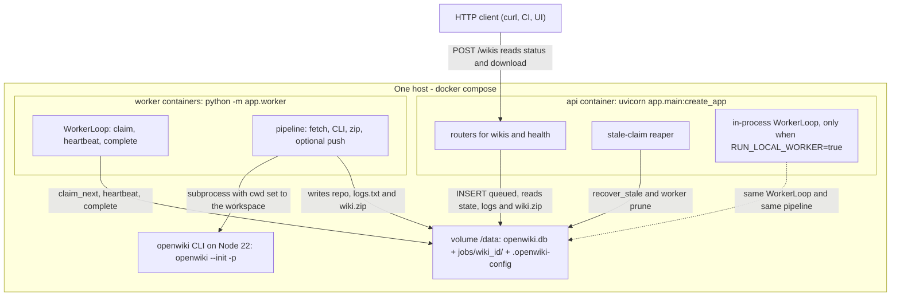
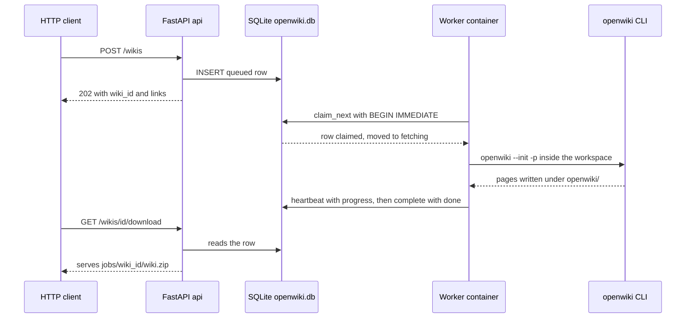

# Vista general del sistema

OpenWiki Service convierte un repositorio en documentación: acepta una URL git
pública, una privada con personal access token o un `zip`/`tar` subido, y devuelve
lo que generó el CLI OpenWiki como un `wiki.zip` (Markdown más
`openwiki/.claims/`). Con `push` también puede commitear esa wiki de vuelta al
repositorio de origen.

Todo el diseño es una única regla de desacople aplicada dos veces:

1. **El trabajo HTTP y el trabajo de generación nunca comparten proceso.** La API
   encola y sirve estado; los workers generan. Se encuentran en un volumen.
2. **Todo lo específico de OpenWiki vive en un solo módulo.** El servicio conoce el
   CLI únicamente a través de `app/services/wiki_runner.py`, así que actualizar el
   CLI es reconstruir la imagen.

| Pieza | Página |
| --- | --- |
| Endpoints HTTP, validación, estados | [/openwiki/architecture/api-service.md](/openwiki/architecture/api-service.md) |
| Esquema de `openwiki.db`, claims, leases | [/openwiki/architecture/job-store.md](/openwiki/architecture/job-store.md) |
| Etapas de `run_pipeline` | [/openwiki/architecture/pipeline.md](/openwiki/architecture/pipeline.md) |
| Bucle del worker, reintentos, reanudación | [/openwiki/architecture/worker-pool.md](/openwiki/architecture/worker-pool.md) |
| Arranque y escalado del stack | [/openwiki/operations/deployment.md](/openwiki/operations/deployment.md) |

## Contenedores y el volumen compartido

*Vista de contenedores: la API y los contenedores worker nunca se llaman entre sí —
ambos abren la misma base SQLite y el mismo árbol de artefactos en el volumen
`/data`, y solo los workers lanzan el CLI OpenWiki.*

`docker-compose.yml` construye una sola imagen (`openwiki-ci:latest`) y la ejecuta
dos veces:

| Servicio | Comando | Rol |
| --- | --- | --- |
| `api` | `uvicorn app.main:create_app --factory` (`CMD` de la imagen) | Crea wikis (`queued`), sirve estado/logs/zip, recupera claims caducados y opcionalmente aloja un worker |
| `worker` | `python -m app.worker` | Reclama la wiki encolada más antigua y ejecuta el pipeline: clone → OpenWiki → zip → push opcional |
| volume | `openwiki-ci-data:/data` en ambos | `openwiki.db`, `jobs/<wiki_id>/` (workspace `repo/`, `logs.txt`, `wiki.zip` y, en subidas, el archivo cargado), `.openwiki-config/` |

`docker compose up -d --scale worker=N` añade workers que reclaman de la misma cola;
cada worker ejecuta `MAX_CONCURRENT_JOBS` generaciones (por defecto `1`), así que la
concurrencia viene de las réplicas y no de hilos dentro de un contenedor.

## Dirección de las dependencias

Las dependencias apuntan **hacia el store y hacia el CLI**, nunca de vuelta a la API:

- `api` (routers + reaper) → escrituras/lecturas de filas en `JobStore`, escritura
  del archivo subido en `jobs/<wiki_id>/upload<ext>` y lecturas del sistema de
  archivos (`jobs/<wiki_id>/logs.txt`, `jobs/<wiki_id>/wiki.zip`); además borra el
  directorio de la wiki al eliminarla o al caducar por `JOB_RETENTION_HOURS`.
- `worker` → `JobStore` (`claim_next`, `heartbeat`, `complete`) y el workspace del
  trabajo bajo `jobs/<wiki_id>/repo`.
- `worker` → subproceso `openwiki`, lanzado por generación con `cwd` puesto en el
  workspace del repositorio.
- Nada dentro del sistema llama a la superficie HTTP de la API; la API es una puerta
  de entrada para clientes, no un coordinador.

La única ruta de recuperación entre actores es el store: una wiki en ejecución cuyo
worker deja de mandar heartbeat durante más de `WORKER_LEASE_SECONDS` es reencolada
por la API y la recoge otro worker, que reanuda en el mismo workspace (el pipeline
reutiliza un `repo/.git` existente y OpenWiki continúa desde `openwiki/.run.json`).

`RUN_LOCAL_WORKER=true` rompe a propósito la separación "dos procesos", no la
arquitectura: arranca un `WorkerLoop` dentro del proceso de la API para desarrollo
en un solo contenedor y para la suite de tests, usando el mismo bucle y el mismo
pipeline que los contenedores worker.

## Qué no sabe cada componente

Esta es la parte que mantiene cambiable el sistema; cada hueco lo cubre otro módulo.

| Componente | **No** sabe | Ese conocimiento vive en |
| --- | --- | --- |
| Proceso y routers de la API (`app/main.py`, `app/routers/`) | Cómo se genera una wiki: nada de clone, ni CLI, ni empaquetado, ni push. Tampoco invoca el binario `git` ni el CLI OpenWiki: los routers validan payloads, transmiten subidas y hablan con el store. | `app/services/ingestion.py`, `app/worker/loop.py` |
| Manejadores de petición de la API | Las etapas del pipeline y sus estados intermedios; exponen `status`, `progress`, `pages` y logs exactamente como los escribieron los workers. | `app/services/pipeline.py`, `app/core/storage.py` |
| Contenedores worker | Preocupaciones HTTP: sin rutas, sin modelos de respuesta, sin renderizado. Solo leen la fila reclamada y escriben resultados. | `app/routers/` |
| Capa de cola (`app/core/storage.py`) | Semántica de git, de OpenWiki y de empaquetado; almacena JSON opaco de `source`/`push` y los campos de ciclo de vida. | `app/services/*` |
| Pipeline (`app/services/pipeline.py`) | Flags del CLI, el nombre del directorio `openwiki/`, el formato de `INSTRUCTIONS.md` y el parseo de `.run.json`: solo secuencia servicios y reporta progreso. | `app/services/wiki_runner.py` |
| Configuración de modelos | Nada: `Settings` no declara credenciales de proveedor a propósito, las deja en el entorno del proceso y las reenvía al subproceso OpenWiki sin tocarlas; el servicio solo fuerza `OPENWIKI_CONFIG_DIR` y `OPENWIKI_TELEMETRY_DISABLED`. | `app/services/model_status.py` (conocimiento del proveedor y sonda activa), `app/services/provider_proxy.py` (proxy loopback que inyecta cabeceras de gateway) |
| **Todo lo de OpenWiki** | — | `app/services/wiki_runner.py` es el único punto de contacto: construcción del comando (`openwiki --init\|-p`), el directorio de salida `openwiki/` fijo, adopción de artefactos ocultos (`.openwiki/` → `openwiki/`), la decisión `auto`/`init`/`update`, `openwiki/INSTRUCTIONS.md`, el parseo de progreso de `.run.json`, el entorno de telemetría/configuración y los timeouts. |

Dos consecuencias que conviene recordar:

- Actualizar OpenWiki es `docker compose build --build-arg OPENWIKI_VERSION=x.y.z`
  más `docker compose up -d`; no hay cambios de código del servicio mientras el CLI
  mantenga `openwiki --init -p`. Si cambia la interfaz del CLI, el único archivo a
  tocar es `app/services/wiki_runner.py`.
- Añadir un endpoint significa un router nuevo en `app/routers/` incluido desde
  `create_app()`, con la lógica de negocio en `app/services/`. Los routers no deben
  crecer con llamadas a git o al CLI.

## Ciclo de vida de una petición

*Flujo desacoplado: la petición HTTP que crea una wiki y el proceso que la genera
solo están conectados por filas y archivos en el volumen.*

Los estados son `queued → fetching → generating → finalizing → done`, o `failed` /
`cancelled`; `POST /wikis/{id}/cancel` cancela de inmediato mientras está encolada y
de forma cooperativa mientras corre (el worker nota la cancelación en su siguiente
heartbeat), y `POST /wikis/{id}/retry` reencola una wiki fallida o cancelada para que
OpenWiki reanude desde su propia cola de páginas. Detalles en
[/openwiki/architecture/job-store.md](/openwiki/architecture/job-store.md) y
[/openwiki/architecture/worker-pool.md](/openwiki/architecture/worker-pool.md).

Las sondas operativas siguen la misma separación: `GET /health` es una llamada
rápida que nunca toca al proveedor y reporta version, `data_dir`, estadísticas del
pool desde el store y la configuración pasiva del modelo, mientras que
`GET /health/model` hace la sonda activa contra el proveedor (cacheada durante
`MODEL_CHECK_TTL_SECONDS`) y devuelve `503` cuando el modelo no está configurado o no
responde.

## Límites conocidos y fronteras de diseño

- **Un solo host con un volumen local.** La cola es SQLite (`/data/openwiki.db`, WAL)
  y los artefactos son un árbol de directorios local (`jobs/`), así que sirve para un
  host con varios contenedores. Para escalar a varios hosts, sustituye
  `app/core/storage.py` por una implementación sobre Postgres que exponga los mismos
  métodos (`claim_next`, `heartbeat`, `complete`, `recover_stale`, ...) y ofrece un
  volumen de artefactos compartido.
- **Sin autenticación en la API.** Está pensada para una red interna o detrás de un
  reverse proxy con auth; un bearer token es el siguiente paso natural. Cualquiera que
  alcance la API puede enviar wikis y leer sus logs.
- **Secretos en el volumen.** El token de un repositorio privado se persiste en la
  base del volumen (fuera de logs y respuestas) para que un reintento pueda
  re-clonar sin reenviarlo; si se pierde el workspace, la wiki falla y hay que
  enviarla de nuevo.
- **`push` escribe en tu repositorio** con ese PAT y exige una URL `http(s)` (las
  claves SSH no están disponibles en el contenedor). Un push fallido deja la wiki en
  `failed` con `push_result.detail`, mientras el `wiki.zip` sigue siendo descargable.
- **`ALLOW_LOCAL_GIT=true`** permite clonar rutas locales y URLs `file://`; mantenlo
  desactivado en producción.
- El servicio depende del contrato fijo `openwiki --init -p`; un cambio incompatible
  del CLI se manifiesta como generaciones `failed` y se arregla en
  `app/services/wiki_runner.py`.

## Cómo se prueba el cableado

`tests/conftest.py` configura `Settings` con `openwiki_bin` apuntando a
`tests/fixtures/fake_openwiki.py` y `run_local_worker=True`, de modo que los tests de
API (`tests/test_api_wikis.py`) recorren el pipeline real —validación, cola, worker,
empaquetado, descarga— a través del worker in-process, sin proveedor de modelos y sin
red. `tests/test_worker_queue.py` cubre el contrato de la cola en sí: claims
exclusivos atómicos, heartbeat/cancel/complete con claim ids caducados, reencolado de
claims muertos, estadísticas y migración de registros legacy `jobs/*/job.json`. El
comportamiento del push se ejercita contra repositorios bare reales en
`tests/test_push.py`.
