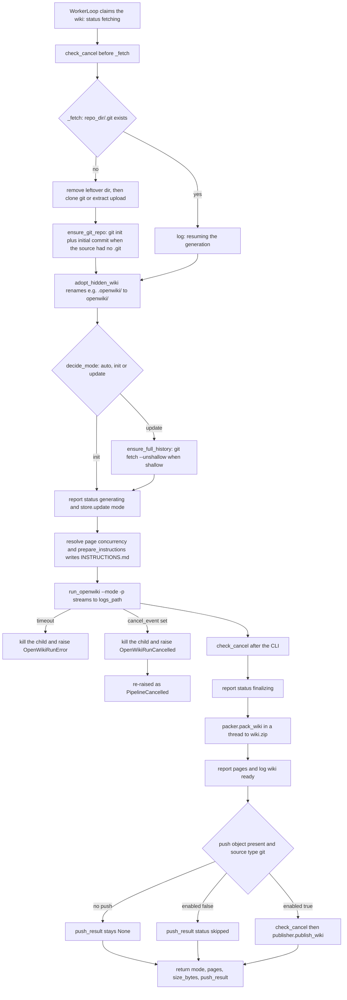
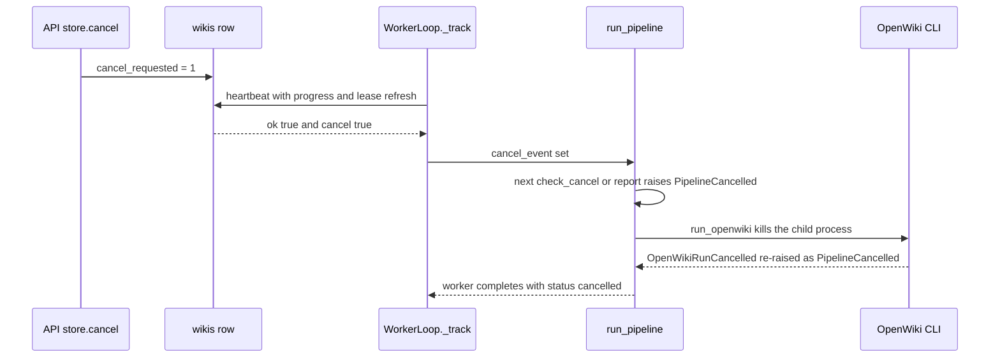

# Generation pipeline (`run_pipeline`)

`app/services/pipeline.py` owns **one claimed generation**. `run_pipeline` is the
only routine that walks a wiki from "a worker holds the claim" to "`wiki.zip` is
packaged and optionally pushed back", and it is shared verbatim by the worker
containers (`python -m app.worker`) and by the optional in-process worker
(`RUN_LOCAL_WORKER=true`), so tests exercise the production path.

It is deliberately thin: it sequences the four service modules that own the real
work and reports progress into the row it was handed. It never writes SQL itself —
the queue, the claim and the terminal state belong to
[/openwiki/architecture/job-store.md](/openwiki/architecture/job-store.md), and the
claim loop that calls it belongs to
[/openwiki/architecture/worker-pool.md](/openwiki/architecture/worker-pool.md).

## Stages, owners and the fields each stage may write

Every mutation the pipeline itself performs goes through `report()` →
`store.heartbeat(...)` (lease refresh plus at most one `status` or `pages` value)
or through the single `store.update(wiki_id, mode=mode)`. Terminal columns are
written by `WorkerLoop._run` when `run_pipeline` returns or raises.

| Stage | Owner module | Fields the stage writes on the row |
| --- | --- | --- |
| Fetch source, or resume the workspace | `pipeline._fetch` → `ingestion` | none (the claim already set the running status); log lines only |
| Adopt hidden wiki, decide `init`/`update`, unshallow | `wiki_runner` (`adopt_hidden_wiki`, `decide_mode`) + `ingestion.ensure_full_history` | `mode` (via `store.update`) |
| Report `generating`, write `INSTRUCTIONS.md`, run the CLI | `wiki_runner` (`prepare_instructions`, `run_openwiki`) | `status="generating"`, lease refresh |
| Report `finalizing`, package | `packer.pack_wiki` (in a thread) | `status="finalizing"`, `pages` |
| Commit and push | `publisher.publish_wiki` | none; `push_result` is stored by `WorkerLoop.complete` |
| Terminal state | `WorkerLoop._run` → `store.complete` | `done`/`failed`/`cancelled`, `error`, `size_bytes`, `push_result`, `finished_at` |

The `progress` column is *not* on that list: it belongs exclusively to
`WorkerLoop._track`, so a generation's progress string keeps advancing while the
CLI runs without the pipeline ever writing it.

Related detail lives in
[/openwiki/concepts/wiki-artifact-and-paths.md](/openwiki/concepts/wiki-artifact-and-paths.md)
(paths and the `openwiki/` → `.openwiki/` rename),
[/openwiki/workflows/generation-from-git.md](/openwiki/workflows/generation-from-git.md)
(the operational git flow) and
[/openwiki/workflows/upload-and-extraction.md](/openwiki/workflows/upload-and-extraction.md)
(archives).

## Signature and inputs

```python
async def run_pipeline(
    *,
    wiki: dict[str, Any],
    settings: Settings,
    store: JobStore,
    log: Callable[[str], None],
    cancel_event: asyncio.Event,
    env_overrides: dict[str, str] | None = None,
) -> dict[str, Any]:
```

- `wiki` is the row returned by `JobStore.claim_next`, so it carries `wiki_id`,
  `claim_id`, `mode` (`auto` / `init` / `update`), `language`, `concurrency`,
  `push` and `source` (`type`, `url`, `ref`, `token`, or
  `filename`/`archive` for uploads).
- `store` supplies every path — `store.job_dir`, `store.repo_dir`,
  `store.logs_path`, `store.wiki_zip_path` — so the workspace layout is owned by
  the store, not the pipeline.
- `cancel_event` is the shared cooperative-cancel signal; `env_overrides` is the
  worker's extra environment for the CLI (used by the header-injecting provider
  proxy, see [/openwiki/architecture/worker-pool.md](/openwiki/architecture/worker-pool.md)).
- `log` and `cancel_event` are created by the caller, not by the pipeline:
  `WorkerLoop._run` builds the logger from `store.logs_path(wiki_id)` with the
  source token as the redaction secret, writes `claimed by worker <worker_id>` as
  the first line and only then calls `run_pipeline`.
- The caller is `WorkerLoop._run`, which translates the returned dict into
  `store.complete(..., status="done", pages=..., size_bytes=..., push_result=...)`
  and maps the pipeline's exceptions onto `failed` / `cancelled`.

## Stage flow



*The per-stage flow of one claimed generation, including the two early exits
(timeout and cooperative cancellation) and the two paths that skip the push.*

## Stage 1 — Resuming or fetching the workspace (`_fetch` → `ingestion`)

The first thing `_fetch` does is test `repo_dir / ".git"`. If the workspace from a
previous attempt is still there, the pipeline logs
`repository workspace already present; resuming the generation` and returns
without cloning or extracting again. This is what makes retry and requeue cheap:
`POST /wikis/{id}/retry` and the stale-claim reaper both hand the same `wiki_id`
back to a worker, and the pipeline continues over the surviving checkout —
including OpenWiki's own durable run state in `openwiki/.run.json`. Only a missing
`.git` triggers a fresh fetch, and any leftover non-git directory is removed first
(`shutil.rmtree(repo_dir, ignore_errors=True)`).

Resume is therefore keyed on the file system, not on the store: the workspace
lives under `<data_dir>/jobs/<wiki_id>/repo`, so deleting the job directory also
invalidates the resume shortcut.

A fresh fetch dispatches on `source["type"]`:

- **upload** — `ingestion.extract_archive` runs in a thread with
  `max_extracted_mb=settings.max_extracted_mb` on the archive the API stored under
  `job_dir`; if that file is gone the pipeline raises `IngestionError` telling the
  caller to submit the wiki again, rather than producing an empty workspace.
- **git** (everything else) — `ingestion.clone_git` clones
  `source["url"]` with the optional `ref` and token; the pipeline logs the target
  through `redact_url` so a credential embedded in the URL never reaches the log.
- Both branches end in `ingestion.ensure_git_repo`, because OpenWiki versions its
  source evidence through git; a source that arrived without `.git` gets an
  `init` plus an initial commit and the pipeline logs that fact.

## Stage 2 — Hidden-wiki adoption and the mode decision (`wiki_runner`)

`adopt_hidden_wiki(repo_dir, settings.wiki_artifact_dir)` renames e.g.
`.openwiki/` to the hardcoded `openwiki/` (a no-op when the artifact dir *is*
`openwiki/`, or when `openwiki/` already exists), which is what lets a repository
that ships a hidden wiki be updated incrementally. The adoption happens *before*
the mode decision so `decide_mode` sees the wiki the source actually ships.

`decide_mode(repo_dir, requested_mode)` resolves `auto` against the workspace:
`update` when `openwiki/index.md` exists, `init` otherwise. An explicit `update`
on a source without docs silently degrades to `init`, and the pipeline logs the
fallback so the API's log tail explains the outcome. The resolved mode is
persisted with `store.update(wiki_id, mode=mode)`, which is why `GET /wikis/{id}`
reports the effective mode rather than the requested one.

When the mode is `update`, the pipeline calls
`ingestion.ensure_full_history(repo_dir, url=..., token=...)` before running the
CLI. A `--depth 1` clone does not contain the commit recorded in
`openwiki/.last-update.json`, so `--update` would otherwise diff against an empty
history; the helper runs `git fetch --unshallow` and returns `True` only when a
fetch actually happened.

Right after the decision the pipeline sends `report(status="generating")` and
persists the mode, then moves on to the CLI. `store.update` is a plain column
write, not a heartbeat, so it neither refreshes the lease nor observes a cancel
request.

## Stage 3 — Instructions and the CLI run (`wiki_runner`)

- Page concurrency is resolved as `wiki["concurrency"] or
  settings.default_page_concurrency` and logged with the mode
  (`starting openwiki --init|--update -p (page concurrency: N)`) so the chosen
  parallelism is visible in the log tail. `run_openwiki` forwards it as
  `OPENWIKI_PAGE_CONCURRENCY`.
- `prepare_instructions(repo_dir, wiki.get("language"))` writes
  `openwiki/INSTRUCTIONS.md` when a language was requested; a user-authored
  `INSTRUCTIONS.md` shipped with the source always wins and is left untouched.
- `run_openwiki` builds `openwiki --<mode> -p`, runs it inside `repo_dir` with
  `build_env(settings, page_concurrency=..., extra=env_overrides)` and streams
  stdout/stderr (`stderr` is merged into `stdout`) into `store.logs_path(wiki_id)`,
  line by line and redacted, after writing the command banner
  `$ openwiki ... (cwd=...)`.
- The run is bounded by `settings.job_timeout_minutes * 60` seconds. On expiry the
  child is killed, `! openwiki exceeded the N minute timeout and was killed` is
  appended to the log and `OpenWikiRunError` is raised, which the worker records as
  a failed job. A missing `OPENWIKI_BIN`/binary (`FileNotFoundError`) and a non-zero
  exit code fail the same way.

## Stage 4 — Packaging (`packer`)

After the CLI exits, the pipeline calls `check_cancel()`, reports
`status="finalizing"` and then runs `packer.pack_wiki` in a thread via
`asyncio.to_thread`, with `root_name=settings.wiki_artifact_dir` renaming the
archive's top-level folder. It fails with `PackError` when `openwiki/` or
`openwiki/index.md` is missing, so the pipeline never returns a partial zip. The
returned page count is reported (`report(pages=pages)`) and logged as
`wiki ready: N pages, S bytes` before the push block runs.

## Stage 5 — Push (`publisher`)

The push block is conditional: it runs only when the wiki carries a `push` object
*and* `source["type"] == "git"`. `push.enabled = false` produces a
`{"status": "skipped", ...}` result without calling the publisher. Otherwise the
pipeline calls `check_cancel()` and then `publisher.publish_wiki`, which commits
`<artifact_dir>/` (excluding the transient `.run.json`) and pushes to the resolved
branch, returning one of `pushed`, `no_changes` or raising `PushError`. A failed
push still leaves the packaged zip downloadable; the job is reported failed with
`push_result.status = "failed"`.

## Progress, heartbeat and cancellation

Two nested helpers carry all reporting:

- `check_cancel()` raises `PipelineCancelled("cancelled by user")` as soon as
  `cancel_event` is set.
- `report(**fields)` calls `store.heartbeat(wiki_id, claim_id, **fields)`. The
  heartbeat is both a lease refresh and the control channel: `ok=False` means the
  claim was reaped or completed elsewhere (the store answers that way whenever the
  row is no longer in a running status or the `claim_id` no longer matches), so the
  pipeline raises `PipelineCancelled("the worker lease was lost")`; `cancel=True`
  means the API recorded a cancel request, so the pipeline sets `cancel_event` and
  raises `PipelineCancelled("cancelled by user")`.

`PipelineCancelled` is the **only** stop signal `run_pipeline` raises for a
control-plane reason. Callers therefore have one exception to handle, whichever
cause applied: an explicit `POST /wikis/{id}/cancel`, a lease lost to the reaper or
to another completion, or an `OpenWikiRunCancelled` bubbled up from the CLI. It
maps to `status="cancelled"` and never to `failed`.

Because `check_cancel` is cheap and non-invasive, it is called only at stage
boundaries — before the fetch, before adoption/the mode decision, after the CLI run
and before the push. A long clone, a long CLI run or a long package step is
therefore not interrupted mid-stage by the pipeline itself; each of those stages
either swallows the latency or is the responsibility of the module that owns it.
When the CLI is running, the kill does not come from `run_pipeline` at all: the
worker's watcher sets `cancel_event` and `run_openwiki` kills the child process.

`report` exists for the same reason plus lease hygiene: it is the pipeline's only
mutating call, so it refreshes `last_seen_at` (keeping the API's stale-claim reaper
away from a live generation) while simultaneously surfacing a cancel request that
the API wrote into the row. Statuses reported from the pipeline:

- `generating` — right before the CLI starts (the claim itself already put the row
  in the fetch state).
- `finalizing` — after the CLI exits and before packaging, so the API window where
  a finished run is being zipped is visible.
- `pages` — right after `pack_wiki` returns, before the push.

### The cancellation path



*The cooperative cancel path: the API only writes a flag, the worker discovers it
on its next heartbeat, and the CLI is killed inside `run_openwiki`.*

Cancellation is **cooperative** and layered. The pipeline never kills the CLI
subprocess itself. A third heartbeat watcher in the worker (`WorkerLoop._track`,
period `settings.worker_progress_seconds`) reads the same lease/cancel flags,
refreshes the lease with OpenWiki's own plan progress and sets `cancel_event`;
`run_openwiki` watches that event and kills the child process, raising
`OpenWikiRunCancelled`, which the pipeline re-raises as `PipelineCancelled`.

The practical consequence for operators is a bounded but non-zero stopping
latency: a cancel request is noticed at most one heartbeat period after the API
writes it (sooner when the CLI is running, because both watchers share the same
event), and the pipeline only acts on the resulting event at its next
`check_cancel`/`report` point. Nothing in the API can interrupt a worker process
directly.

## Logging: `make_logger` and `logs_path`

`make_logger(log_path, secrets)` returns a `log(message)` callable that appends one
`[HH:MM:SS] message` line (UTC) per call, creating the parent directory on demand.
Every message passes through `redact_text`, which masks URL credentials
(`user:***@host`), `authorization`/`private-token` headers and any literal secret in
`secrets` — the pipeline passes the source token, and the worker passes it again
when it builds the logger.

The destination is `store.logs_path(wiki_id)` (`<data_dir>/jobs/<wiki_id>/logs.txt`).
That file is the **only** channel the API exposes as run logs: the pipeline's
`log()` and the CLI's streamed stdout/stderr (written by `run_openwiki` to the same
path, also redacted) land in it, and `GET /wikis/{id}/logs?tail=N` reads the last N
lines. Nothing else the worker sees is observable to an API client, so a message
that is not passed to `log()` or printed by the CLI is effectively invisible.

## Return value

```python
return {"mode": mode, "pages": pages, "size_bytes": size,
        "push_result": push_result}
```

- `mode` — the resolved `init` / `update`.
- `pages` — number of `.md` files inside the packaged archive.
- `size_bytes` — size of `wiki.zip` on disk.
- `push_result` — `None` when no push was requested, else the publisher's dict
  (or the `skipped` stub).

`WorkerLoop._run` turns `pages`, `size_bytes` and `push_result` into the
`store.complete(..., status="done", ...)` call; `mode` is only informative there,
since the pipeline already persisted it.

## Failure map

| Raised by | Reaches the caller as | Store effect |
| --- | --- | --- |
| `PipelineCancelled` (user cancel, lost lease, `OpenWikiRunCancelled`) | `PipelineCancelled` | `status="cancelled"`, full reason in `error` |
| `publisher.PushError` | `PushError` | `status="failed"`, `error="push failed: ..."` and `push_result.status="failed"` — zip kept |
| `ingestion.IngestionError`, `OpenWikiRunError` (non-zero exit, missing binary, timeout), `packer.PackError` | same type | `status="failed"` with the message |
| Any other exception escaping the pipeline | propagated | `status="failed"` with `"<ExceptionType>: <message>"` |
| `asyncio.CancelledError` (worker shutdown) | propagated | claim left running; the API lease reaper requeues it |

`error` messages for failed jobs are truncated to 500 characters (the `push_result`
detail too) before they reach the row; the cancel branch stores the reason
untruncated.

Except for the pre-fetch `rmtree` of a directory that has no `.git`, the pipeline
never deletes anything: logs, a previously packaged zip and the workspace all
survive a failure, which is what lets a retry resume instead of starting over.

## Focused tests

- `tests/test_api_wikis.py` drives whole generations through the API with the fake
  CLI (`tests/fixtures/fake_openwiki.py`): end-to-end git and upload runs, mode
  selection
  (`test_auto_mode_uses_update_when_the_source_ships_a_wiki`,
  `test_explicit_update_without_wiki_falls_back_to_init`), hidden-wiki adoption,
  cancellation of a running generation followed by a resuming retry
  (`test_cancel_running_wiki_and_retry_resumes`), and resume after a simulated
  crash (`test_active_wikis_are_resumed_after_a_restart`).
- `tests/test_push.py` covers the push block: default and custom branches,
  `no_changes`, disabled push, `push.branch is required` on a detached checkout,
  a failed push that still serves `/download`, and the unshallow step for `update`
  runs (`test_update_wikis_fetch_the_full_history` asserts `.git/shallow` is gone
  and the `fetched the full history` log line is present).
- `tests/test_wiki_state.py` unit-tests `decide_mode`, `adopt_hidden_wiki`,
  `read_run_state` (tolerating a missing or malformed `.run.json`),
  `format_progress` and `pack_wiki`'s root renaming.
- `tests/test_worker_queue.py` covers the lease/heartbeat contract that `report()`
  depends on: atomic claims, cancel propagation through heartbeats, heartbeat field
  updates, and that a stale claim cannot complete a row.
