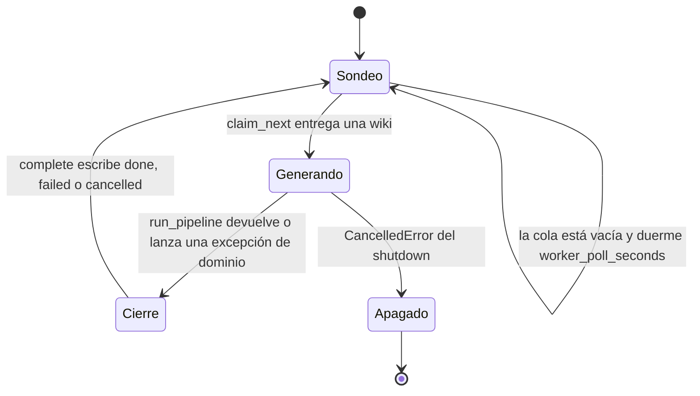
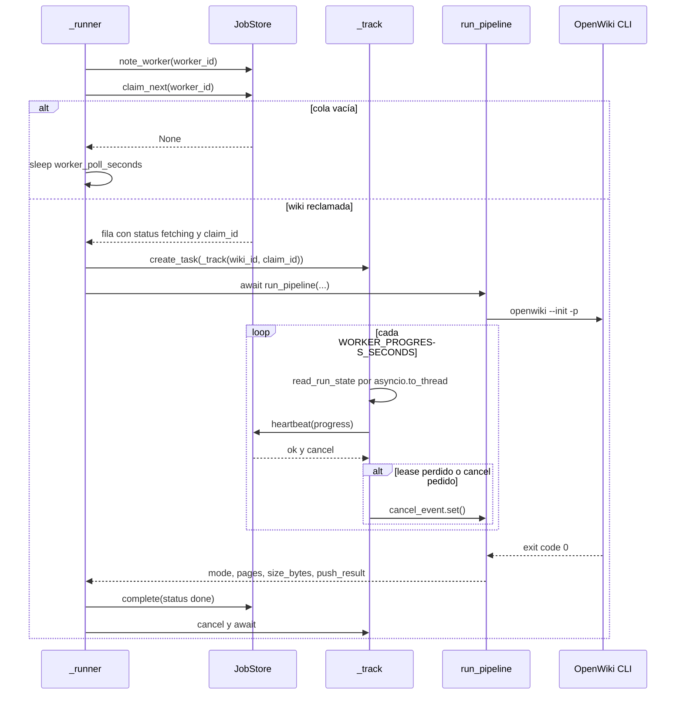

# Pool de workers y bucle de reclamación

`app/worker/loop.py` es dueño de `WorkerLoop`, la única pieza del servicio que reclama wikis
de la cola y las ejecuta. La misma clase sirve a los contenedores de worker
(`python -m app.worker`) y al worker opcional dentro del proceso de la API
(`RUN_LOCAL_WORKER=true`), de modo que el desarrollo y los tests recorren exactamente el
pipeline de producción.

El reparto de responsabilidades es deliberadamente estrecho:

- La **API** crea filas `queued`, sirve estado/logs/zip y reencola claims caducados
  (`app/main.py` → `_reap_loop`). Nunca genera nada.
- El **worker** reclama la siguiente wiki encolada, ejecuta `pipeline.run_pipeline` y escribe
  el estado terminal en la misma fila.
- El contrato entre ambos es el volumen compartido (`openwiki.db` + `jobs/`), documentado en
  [/openwiki/architecture/job-store.md](/openwiki/architecture/job-store.md).

## Dos formas de arrancar el mismo bucle

| Entrada | Quién la usa | Cómo llega al bucle |
| --- | --- | --- |
| `python -m app.worker` | contenedores `worker` de `docker-compose.yml` | `__main__.main()` construye `Settings` + `JobStore` y llama a `asyncio.run(_serve(worker))` |
| `RUN_LOCAL_WORKER=true` | un solo contenedor / dev / tests | el `lifespan` de `create_app()` construye `WorkerLoop(settings, store)` y hace `await worker.start()` |

`app/worker/__main__.py` registra manejadores para `SIGINT` y `SIGTERM` que activan un
`asyncio.Event`; cuando se activa, el `finally` llama a `worker.stop()`. En plataformas sin
`add_signal_handler` (Windows) la excepción se suprime y el `KeyboardInterrupt` capturado en
`main()` cumple la misma función.

En modo in-process, `create_app()` guarda el worker en `app.state.worker` y su proxy en
`app.state.proxy`, y lo detiene en el `finally` del `lifespan` junto con el reaper.

## Identidad del worker y registro de liveness

En el constructor:

```python
self.worker_id = settings.worker_id.strip() or socket.gethostname()
```

Es decir, `WORKER_ID` cuando está definido y no vacío; en caso contrario, el hostname del
contenedor, que es el identificador por defecto en el pool. Ese `worker_id` es lo que se
escribe como `claimed_by` en cada claim y lo que aparece en la tabla `workers`.

`note_worker()` hace un upsert (`ON CONFLICT(worker_id) DO UPDATE`) sobre `workers.last_seen_at`
y se invoca en dos puntos del bucle:

- una vez en `start()`, antes de crear las tareas;
- al principio de **cada** iteración de `_runner`, antes de intentar reclamar.

Efecto operativo: `GET /health` publica `pool: store.stats()`, y `stats(worker_ttl_seconds=120)`
cuenta las filas de `workers` vistas en los últimos 120 s. Es la forma de observar cuántos
workers están vivos y cuánta cola queda.

> Matiz importante: `note_worker` **no** se llama durante una generación; el heartbeat actualiza
> `wikis.last_seen_at`, no `workers.last_seen_at`. Un worker que pasa más de 120 s dentro de una
> sola generación deja de contarse en `pool.workers` hasta que vuelve a sondear la cola. Ese
> contador mide workers libres recientes, no procesos vivos. `prune_workers(max_age_seconds=3600)`
> olvida definitivamente las filas más antiguas.

## Arranque: proxy de cabeceras y tareas de concurrencia

`start()` hace tres cosas, en este orden: levanta el proxy opcional de cabeceras, registra al
worker con `note_worker` y crea una tarea por hueco de concurrencia.

**1. Proxy loopback opcional para gateways OpenAI-compatible.** Si
`OPENAI_COMPATIBLE_EXTRA_HEADERS` define cabeceras y además hay `OPENAI_COMPATIBLE_BASE_URL`, el
worker levanta un proxy local con `start_proxy(base_url, extra_headers, port=compat_proxy_port)` y
publica `env_overrides = {"OPENAI_COMPATIBLE_BASE_URL": proxy.base_url}`. Ese diccionario viaja
por `run_pipeline` → `run_openwiki` → `build_env`, así que el CLI habla con el proxy y el proxy
añade las cabeceras que OpenWiki no sabe enviar. El proxy pertenece al proceso worker y lo usan
todas sus tareas de runner; `stop()` lo apaga.

**2. Una tarea por hueco de concurrencia.** `MAX_CONCURRENT_JOBS` (`max_concurrent_jobs`, por
defecto `1`) decide cuántas tareas `_runner` se crean:

```python
for index in range(max(1, self.settings.max_concurrent_jobs)):
    self._tasks.append(
        asyncio.create_task(self._runner(index), name=f"openwiki-worker-{self.worker_id}-{index}")
    )
```

El `index` solo se usa para nombrar la tarea (`openwiki-worker-<worker_id>-<index>`); cada runner
es idéntico. El validador de `Settings` exige `max_concurrent_jobs >= 1` y el `max(1, ...)`
protege frente a un valor cero.

**Por qué la concurrencia se escala con réplicas y no con hilos internos.** Cada generación es un
subproceso de OpenWiki de larga duración más un `git clone` y un workspace en disco bajo
`<data_dir>/jobs/<wiki_id>/repo`. Subir `MAX_CONCURRENT_JOBS` multiplica esos procesos, el uso de
disco y de red dentro de la misma caja, mientras que añadir réplicas (`docker compose up -d
--scale worker=4`) añade contenedores que reclaman de la misma cola SQLite sin coordinación
adicional: `claim_next` ya garantiza exclusividad. Por eso el valor por defecto es `1` y el README
lo describe como "concurrencia por réplicas".

## Bucle de reclamación (`_runner`)

Cada runner es un bucle infinito sin estado propio:

```python
while True:
    self.store.note_worker(self.worker_id)
    wiki = self.store.claim_next(self.worker_id)
    if wiki is None:
        await asyncio.sleep(self.settings.worker_poll_seconds)
        continue
    await self._run(wiki)
```

- `claim_next` es atómico (`BEGIN IMMEDIATE` + `UPDATE ... WHERE status='queued'`) y devuelve la
  fila ya decodificada con `status='fetching'`, un `claim_id` nuevo, `claimed_by` y `attempts`
  incrementado. Si no hay nada encolado, o si otro worker ganó la carrera, devuelve `None`.
- El sondeo **no** consume un ciclo apretado: `WORKER_POLL_SECONDS` (por defecto `2.0`) separa
  los intentos y `note_worker` refresca la liveness en cada vuelta.
- Cada runner ocupa a lo sumo una wiki a la vez, porque `_run` es un `await` que no retorna hasta
  que la wiki llega a estado terminal.
- No hay `try` alrededor de `await self._run(wiki)`: el bucle depende de que `_run` contenga las
  excepciones del pipeline (ver el cierre del resultado más abajo).



*Ciclo de vida de una tarea `_runner`: sondeo de la cola, generación, escritura del estado terminal y salida por apagado.*

## `_run`: una wiki reclamada

`_run(wiki)` es el punto donde el bucle se convierte en generación:

1. Extrae `wiki_id`, `claim_id`, `source` y `token` de la fila.
2. Construye el logger del wiki con `pipeline.make_logger(store.logs_path(wiki_id), (token,) if
   token else ())` y registra `claimed by worker {worker_id}`.
3. Crea un `asyncio.Event` de cancelación y una tarea `_track(wiki_id, claim_id, log, cancel_event)`.
4. Espera `pipeline.run_pipeline(...)`, pasando `settings`, `store`, `log`, `cancel_event` y
   `env_overrides`.
5. Convierte el resultado (`{mode, pages, size_bytes, push_result}`) en
   `store.complete(wiki_id, claim_id, status="done", pages=..., size_bytes=..., push_result=...)`.
6. En el `finally`, cancela la tarea tracker y la espera suprimiendo `asyncio.CancelledError`.

El `finally` es lo que garantiza que el heartbeat se detiene exactamente cuando termina la
generación: no hay ventana en la que un tracker de un wiki ya completado siga latiendo.

## `_track`: heartbeat alimentado por el plan de OpenWiki

`_track` es un bucle independiente cuya única responsabilidad es refrescar el lease y publicar
progreso legible. En cada vuelta:

1. **Espera `WORKER_PROGRESS_SECONDS`** (por defecto `2.0`). Es la frecuencia de heartbeat *y* de
   progreso, porque `JobStore.heartbeat` hace las dos cosas a la vez.
2. **Lee el estado del run** con `read_run_state(store.repo_dir(wiki_id))`, ejecutado en un hilo
   aparte con `asyncio.to_thread` para no bloquear el event loop. `read_run_state` parsea
   `openwiki/.run.json` y resume el plan: `phase`, `total`, `completed`, `pending` y `current`
   (la primera página no completa). Devuelve `None` si el archivo no existe todavía o no se puede
   parsear, y tolera basura estructural (`plan.pages` no lista ⇒ `total = 0`).
3. **Anuncia el plan una sola vez**, la primera vez que hay estado:
   `openwiki plan: {total} pages planned, phase={phase}`.
4. **Formatea el progreso**: `format_progress(state)` produce `"{completed}/{total} pages"` y le
   añade `" · {phase}"` cuando hay fase.
5. **Fallback a `packer.count_pages`**: si `format_progress(state)` devuelve `None` — típicamente
   porque `.run.json` aún no existe o su plan está vacío — cuenta recursivamente los `*.md` bajo
   `repo/openwiki/` y formatea con `format_progress(None, pages_written)`, es decir
   `"{n} pages written"`. Si tampoco hay páginas escritas, el texto es `None` y el heartbeat se
   envía igualmente solo con el refresco del lease.
6. **Envía el heartbeat** con `store.heartbeat(wiki_id, claim_id, progress=text)`.

Detalle relevante: la variable `last` deduplica el texto para no reasignarlo, pero el heartbeat
**se envía en cada vuelta aunque el progreso no cambie**. No puede ser de otro modo: `heartbeat`
es lo que actualiza `last_seen_at`, y de él depende que el claim no sea reclamado por el reaper.

**Qué significa perder el lease.** El resultado del heartbeat es un diccionario. Si
`result["ok"]` es falso o `result["cancel"]` es verdadero, `_track` activa `cancel_event` y
retorna, terminando la vigilancia:

- `ok=False` ⇒ `(wiki_id, claim_id)` ya no existe o su fila no está en `RUNNING_STATUSES`: el
  claim fue reencolado por el reaper (`recover_stale`) o completado en otro sitio. A partir de
  ahí, el siguiente `report()`/`check_cancel()` del pipeline lanza
  `PipelineCancelled("the worker lease was lost")` y la generación se detiene en vez de escribir
  en una fila que ahora pertenece a otro worker.
- `cancel=True` ⇒ la API registró `cancel_requested` (vía `POST /wikis/{id}/cancel`). El
  `cancel_event` hace que el pipeline cancele cooperativamente y que `run_openwiki` mate el
  subproceso del CLI; `OpenWikiRunCancelled` se re-lanza como `PipelineCancelled`.

La cancelación es por tanto **cooperativa y canalizada por la misma llamada** que reporta
progreso: el worker nunca recibe una señal externa, solo observa la fila.

## Secuencia claim → run → heartbeat → complete



*Secuencia de una generación: el runner reclama, el tracker late en paralelo y el resultado se cierra después.*

La generación y el heartbeat corren en paralelo dentro del mismo event loop: el diagrama los
muestra en orden para dejar claro que el tracker arranca antes del pipeline y se cancela después
de cerrar el resultado.

## Cierre del resultado: excepciones → estados terminales

`_run` es el traductor entre excepciones de dominio y los tres estados terminales de la fila.
Ninguna rama vuelve a lanzar excepto `asyncio.CancelledError`.

| Excepción | Origen típico | Efecto en la fila | Notas |
| --- | --- | --- | --- |
| `PipelineCancelled` | `check_cancel()` / `report()` del pipeline, o `OpenWikiRunCancelled` re-lanzada | `complete(status="cancelled", error=str(exc))` | cubre cancelación de usuario y lease perdido; **no** está envuelta en `suppress` y su mensaje se guarda sin truncar |
| `publisher.PushError` | `git add/commit/push` al devolver la wiki al origen | `complete(status="failed", error="push failed: ..."[:500], push_result={"status": "failed", "detail": str(exc)[:500], "at": utc_now()})` | envuelta en `contextlib.suppress(Exception)`: un fallo del push no debe tumbar al runner, y el `wiki.zip` sigue descargable |
| `ingestion.IngestionError`, `OpenWikiRunError`, `packer.PackError` | clonado/extracción, timeout o exit code ≠ 0 del CLI, empaquetado incompleto | `complete(status="failed", error=str(exc)[:500])` | sin `push_result`; la wiki es resumible con retry |
| `asyncio.CancelledError` | `WorkerLoop.stop()` cancelando las tareas | **ninguno** — se re-lanza | el claim queda `fetching`/`generating`/`finalizing` y lo reencola el reaper tras el lease |
| `Exception` genérica | cualquier fallo inesperado | `complete(status="failed", error=f"{type(exc).__name__}: {exc}"[:500])`, con `suppress(Exception)` | comentario explícito en el código: *a runner must never die* |

El truncado a 500 caracteres se aplica a los mensajes de las ramas `failed` —tanto `error` como
`push_result["detail"]`— para que esas columnas no crezcan sin control; la rama `cancelled`
guarda `str(exc)` completo. `store.complete` devuelve `False` cuando el `claim_id` ya no coincide:
ese `False` se ignora a propósito, porque el estado terminal pertenece a quien tenga el claim
vivo.

**Alcance del "a runner must never die".** Ese comentario describe contención de excepciones del
*pipeline*, no una garantía frente a fallos del almacén: solo las ramas `PushError` y `Exception`
genérica envuelven su `complete` en `contextlib.suppress(Exception)`. Las ramas `PipelineCancelled`
y de fallos tipados escriben sin esa red, así que un error del propio `JobStore` (por ejemplo, un
fallo de SQLite) escaparía de `_run`, y como `_runner` no captura nada la tarea terminaría: ese
hueco de concurrencia queda muerto hasta reiniciar el proceso, porque nada supervisa ni recrea las
tareas de `self._tasks`. La wiki, eso sí, no se pierde: sin heartbeats, el reaper la reencola tras
el lease.

El caso de worker muerto (proceso eliminado, `SIGKILL`, contenedor recreado) tampoco pasa por esta
tabla: la tarea simplemente desaparece sin escribir nada, el claim se convierte en huérfano, y la
recuperación la hace la API con `recover_stale(WORKER_LEASE_SECONDS)`. Otro worker lo reclama y
`run_pipeline._fetch` ve `repo/.git` y reanuda en el mismo workspace. El detalle de ese camino
—retry, cancel y reanudación desde `openwiki/.run.json`— está en
[/openwiki/workflows/cancel-retry-and-resume.md](/openwiki/workflows/cancel-retry-and-resume.md)
y en [/openwiki/operations/observability-and-recovery.md](/openwiki/operations/observability-and-recovery.md).

## Apagado

`stop()` recorre `self._tasks`, llama a `task.cancel()` en todas y luego las espera una a una
suprimiendo `asyncio.CancelledError`; después limpia la lista y detiene el proxy si existe. El
orden importa: cancelar todas primero evita que un runner recién despertado reclame otra wiki
mientras se están apagando las demás.

La propagación hacia arriba es limpia: `_run` re-lanza `CancelledError`, `_runner` no la captura y
la tarea termina; `run_openwiki` ya ha matado el subproceso del CLI al recibir la cancelación, así
que el shutdown no deja procesos huérfanos. Lo que **no** ocurre es un `complete`: el apagado no
marca la wiki como fallida, porque el trabajo es reanudable y el reaper la devolverá a la cola.

## Configuración operativa

| Variable (`Settings`) | Default | Papel en el pool |
| --- | --- | --- |
| `WORKER_ID` (`worker_id`) | `""` ⇒ hostname | identidad en `claimed_by` y en la tabla `workers` |
| `MAX_CONCURRENT_JOBS` (`max_concurrent_jobs`) | `1` | número de tareas `_runner` por contenedor |
| `WORKER_POLL_SECONDS` (`worker_poll_seconds`) | `2.0` | espera entre sondeos de cola vacía |
| `WORKER_PROGRESS_SECONDS` (`worker_progress_seconds`) | `2.0` | periodo de `_track`, por tanto frecuencia efectiva de heartbeat |
| `WORKER_LEASE_SECONDS` (`worker_lease_seconds`) | `180` | lease que usa el reaper de la API |
| `WORKER_REAP_SECONDS` (`worker_reap_seconds`) | `30` | intervalo del barrido `recover_stale` en la API |
| `RUN_LOCAL_WORKER` (`run_local_worker`) | `false` | arranca el mismo `WorkerLoop` dentro de la API |
| `JOB_TIMEOUT_MINUTES` | `45` (60 en `docker-compose.yml`) | timeout del subproceso del CLI, no del bucle |

`worker_poll_seconds` y `worker_progress_seconds` deben ser positivos (validador), y
`worker_lease_seconds`/`worker_reap_seconds`/`max_concurrent_jobs` deben ser ≥ 1. La relación
sensata es `worker_lease_seconds >> worker_progress_seconds`: el default 180 s frente a 2 s da
margen para ~90 heartbeats perdidos antes de declarar muerto a un worker.

## Tests enfocados

No hay un test unitario dedicado a `WorkerLoop`; se cubre indirectamente, lo cual es coherente con
que el mismo bucle sea el de producción:

- `tests/conftest.py` configura `Settings(run_local_worker=True, max_concurrent_jobs=1,
  worker_poll_seconds=0.1, worker_progress_seconds=0.1, ...)` apuntando `OPENWIKI_BIN` al CLI falso
  (`tests/fixtures/fake_openwiki.py`). Todo el pipeline se ejecuta dentro del `TestClient`, sin
  proveedor de modelos ni red.
- `tests/test_health.py::test_health` comprueba `payload["pool"]["workers"] == 1`, es decir que
  `note_worker` ha registrado al worker in-process.
- `tests/test_api_wikis.py` ejercita la cancelación cooperativa sobre una wiki en ejecución
  (llega a `cancelled` a través del heartbeat) y
  `test_active_wikis_are_resumed_after_a_restart` fuerza una fila en ejecución con claim muerto
  (`claimed_by="crashed-worker"`, `claim_id="deadbeef"`, `last_seen_at=None`) y sin `wiki.zip`,
  reinicia la app y espera que el reaper la reencuele hasta `done`.
- `tests/test_wiki_state.py` cubre `read_run_state` y `format_progress`, el contrato exacto que
  alimenta a `_track`: resumen del plan, tolerancia a JSON inválido y a `plan.pages` no lista, y
  las dos formas del texto (`"2/7 pages · generating"`, `"3 pages written"`).
- `tests/test_worker_queue.py` fija el contrato del store que el bucle consume: claim atómico y
  exclusivo, forma del resultado de `heartbeat`, `complete` con claim caducado, reencolado por
  `recover_stale` y contabilidad de workers.
