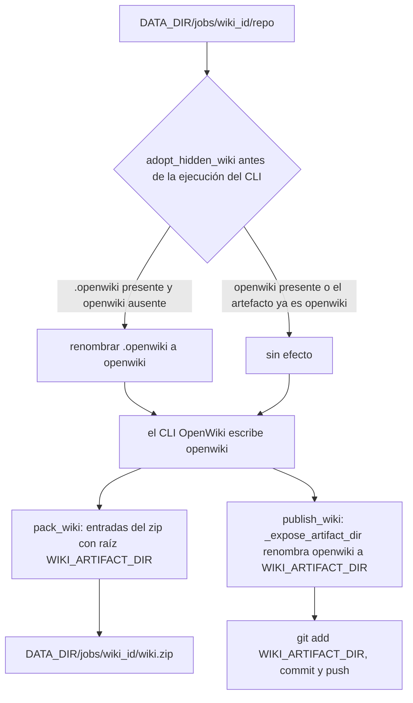

# Artefactos y rutas de la wiki: `openwiki/` vs `WIKI_ARTIFACT_DIR`

Dos nombres distintos describen el mismo árbol de wiki, y confundirlos es la causa
más frecuente de fallos del tipo "no encuentro la wiki" en este servicio:

| Nombre | Quién lo fija | Dónde aparece |
| --- | --- | --- |
| `openwiki/` | El CLI OpenWiki — hardcodeado, sin opción para cambiarlo | El workspace dentro de `<DATA_DIR>/jobs/<wiki_id>/repo/` |
| `WIKI_ARTIFACT_DIR` (por defecto `.openwiki`) | Este servicio (`Settings.wiki_artifact_dir`) | La carpeta raíz dentro de `wiki.zip` y la carpeta que commitea el paso de push |

`app/services/wiki_runner.py` declara la constante que mantiene separados ambos
nombres:

```python
#: OpenWiki hardcodes this directory name in the repository (no option to change it).
NATIVE_WIKI_DIR = "openwiki"
```

`Settings.wiki_artifact_dir` está documentado como **exclusivo del empaquetado**:
OpenWiki siempre escribe en `openwiki/` dentro del workspace; el ajuste "solo
renombra la salida empaquetada". `packer.py` y `publisher.py` importan
`NATIVE_WIKI_DIR` desde `wiki_runner` en lugar de repetir el literal, así que el
nombre fijo del CLI tiene una única definición. `pipeline.py` nunca nombra el
directorio nativo: propaga `settings.wiki_artifact_dir` a `adopt_hidden_wiki`,
`pack_wiki` (`root_name=`) y `publish_wiki` (`artifact_dir=`), de modo que el nombre
del workspace solo se lee dentro de los dos módulos que realmente mueven archivos.

El ajuste se valida como un nombre de carpeta simple — sin separadores, distinto de
`.` y `..`, no vacío — porque se convierte en un componente de ruta dentro del zip y
en un pathspec de `git add`:

```python
@field_validator("wiki_artifact_dir")
@classmethod
def _check_artifact_dir(cls, value: str) -> str:
    value = value.strip()
    if not value or value in {".", ".."} or "/" in value or "\\" in value:
        raise ValueError("wiki_artifact_dir must be a simple folder name")
    return value
```

## Transformaciones de rutas



*Transformaciones de rutas: el workspace conserva el `openwiki/` hardcodeado del CLI, y solo la raíz del zip y el árbol commiteado usan `WIKI_ARTIFACT_DIR`.*

## Diseño del workspace: un directorio por wiki

Todo parte de `Settings.data_dir`, la raíz de almacenamiento única (véase
[configuration](/openwiki/operations/configuration.md) para la variable de entorno y
su valor por defecto). Tres rutas derivadas de `Settings` importan aquí, y una de
ellas se confunde con facilidad con el directorio de artefactos:

| Miembro de `Settings` | Valor | Consumidor |
| --- | --- | --- |
| `data_dir` | `/data` en contenedores, `./data` en desarrollo local sobre Windows | `JobStore` y los contenedores API/worker lo comparten como punto de montaje |
| `jobs_dir` (propiedad) | `data_dir / "jobs"` | Espejo de conveniencia de `JobStore.jobs_dir` |
| `resolved_config_dir` (propiedad) | `openwiki_config_dir` o `data_dir / ".openwiki-config"` | Se exporta al subproceso del CLI como `OPENWIKI_CONFIG_DIR`; `model_status` lee su `.env` |

`resolved_config_dir` es la trampa: es un directorio punto bajo `DATA_DIR` cuyo
nombre por defecto se parece mucho al `.openwiki` por defecto de `WIKI_ARTIFACT_DIR`,
pero guarda estado del CLI (credenciales, install id) y nunca contiene páginas de
wiki. El directorio de artefactos, en cambio, vive siempre *dentro* de un workspace
de repositorio, nunca directamente bajo `DATA_DIR`.

El `JobStore` es dueño de todas las rutas del workspace; el pipeline le pregunta al
store en lugar de componer directorios por su cuenta, y por eso el diseño se describe
en un solo sitio (`app/core/storage.py`):

| Método | Ruta | Contenido |
| --- | --- | --- |
| `job_dir(wiki_id)` | `<DATA_DIR>/jobs/<wiki_id>/` | raíz del workspace de esa wiki |
| `repo_dir(wiki_id)` | `.../repo/` | fuente clonada o extraída; el árbol de la wiki queda en `.../repo/openwiki/` |
| `logs_path(wiki_id)` | `.../logs.txt` | el único log de ejecución que expone la API (`GET /wikis/{id}/logs`) |
| `wiki_zip_path(wiki_id)` | `.../wiki.zip` | artefacto empaquetado que sirve `GET /wikis/{id}/download` como `openwiki-{wiki_id}.zip` |
| `meta_path(wiki_id)` | `.../job.json` | registro legado pre-SQLite, usado solo por `migrate_legacy_files` |

La propia base de datos de coordinación vive en la misma raíz:
`JobStore.__init__` abre `<DATA_DIR>/openwiki.db` (WAL) y crea
`<DATA_DIR>/jobs/` con `mkdir(parents=True, exist_ok=True)`, de modo que la API y los
contenedores worker pueden competir por crear el directorio sin errores. `wiki_id` es
un `uuid4` de 32 caracteres hexadecimales validado por `JOB_ID_RE`, así que es seguro
concatenarlo en una ruta. Borrar una wiki elimina tanto la fila como el directorio de
job completo, con lo que los artefactos del workspace y el zip empaquetado se
recuperan juntos.

## Qué artefactos viven dentro del árbol de la wiki

```
<DATA_DIR>/jobs/<wiki_id>/repo/openwiki/
├── index.md               # página de entrada; obligatoria para un run correcto
├── *.md                   # resto de páginas (architecture/, concepts/, ...)
├── INSTRUCTIONS.md        # brief que recibe OpenWiki (opcional; el del usuario gana)
├── .run.json              # estado de reanudación transitorio - NO se commitea
├── .last-update.json      # commit desde el que se generó la wiki
├── .page-manifest.json    # procedencia por página para las actualizaciones incrementales
└── .claims/               # evidencia de Claims versionada a la que apuntan las páginas
```

### `.run.json` — estado de reanudación transitorio, se lee para el progreso y nunca se commitea

El CLI guarda su propio estado de ejecución duradero en `openwiki/.run.json`, y nada
en este servicio lo escribe nunca. Se lee en dos sitios:

- `wiki_runner.read_run_state(repo_dir)` lo parsea a
  `{phase, total, completed, pending, current}` contando
  `plan.pages[*].status == "complete"`. Es deliberadamente tolerante: un archivo
  ausente, no parseable o con una forma inesperada devuelve `None` (o un resumen a
  cero) en lugar de lanzar excepción, porque se consulta mientras el CLI aún escribe.
- La tarea `_track` del worker lo llama cada `WORKER_PROGRESS_SECONDS` y convierte el
  resultado en la columna `progress` (`2/7 pages · generating`) mediante
  `format_progress`, con repliegue a `packer.count_pages` (un recuento de `**/*.md`)
  cuando todavía no hay plan.

Es el mecanismo de reanudación: un claim reencolado continúa en el workspace
superviviente y el CLI retoma el plan inacabado. Es además el único artefacto
excluido del commit de push, igual que en el flujo de actualización propio de
OpenWiki.

### `.last-update.json` — el gitHead que impulsa las actualizaciones incrementales

Este archivo registra de qué commit se generó la wiki, junto con el comando, el
modelo, el estado y el idioma usados (`updatedAt`, `command`, `gitHead`, `model`,
`status`, `language`). `ingestion.ensure_full_history` existe precisamente por él:
`--update` compara el `HEAD` actual contra el commit de `openwiki/.last-update.json`,
y un clon `--depth 1` no contiene ese commit, así que el pipeline ejecuta
`git fetch --unshallow` antes de un run `update`. Sin él, una actualización
incremental compararía contra una historia vacía.

```python
if mode == "update" and await ingestion.ensure_full_history(
    repo_dir, url=str(source.get("url") or ""), token=token
):
    log("fetched the full history so --update can diff against the last documented commit")
```

### `.claims/` y `.page-manifest.json` — evidencia versionada y procedencia por página

`.claims/` contiene los registros JSON de evidencia que citan las páginas generadas;
se commitea con la wiki y viaja dentro de `wiki.zip`, que es la razón por la que el
README describe la descarga como "Markdown + `openwiki/.claims/`". `.page-manifest.json`
es la contabilidad por página con la que el CLI decide qué regenerar: las entradas
están indexadas por ruta de página y llevan `gitHead`, `sourceFingerprint`,
`pageVersion`, `completedBy` y `completedRunId`. Ambos son salidas propiedad de
OpenWiki — el servicio solo las transporta por el empaquetado y el push.

### `INSTRUCTIONS.md` — el brief, y dónde vive el idioma

`prepare_instructions(repo_dir, language)` escribe `openwiki/INSTRUCTIONS.md` solo
cuando la wiki pidió un `language` **y** la fuente no trae ya uno; un brief escrito por
el usuario gana siempre, y sin idioma no se crea archivo. Forma parte del árbol
subido/extraído o del árbol generado, así que termina tanto en `wiki.zip` como en el
commit empujado.

## `adopt_hidden_wiki`: `.openwiki/` → `openwiki/` antes del run

Un repositorio que ya commitea su wiki bajo `WIKI_ARTIFACT_DIR` (habitualmente
`.openwiki/`) parecería no documentado para el CLI, que solo lee `openwiki/`.
`adopt_hidden_wiki` lo renombra antes de que nada más decida:

```python
def adopt_hidden_wiki(repo_dir: Path, artifact_dir: str) -> bool:
    if artifact_dir == NATIVE_WIKI_DIR:
        return False
    native = Path(repo_dir) / NATIVE_WIKI_DIR
    hidden = Path(repo_dir) / artifact_dir
    if hidden.is_dir() and not native.exists():
        native.parent.mkdir(parents=True, exist_ok=True)
        hidden.rename(native)
        return True
    return False
```

- **Cuándo**: en `run_pipeline`, justo después del fetch y **antes** de `decide_mode`.
  El orden importa: la decisión de modo busca `openwiki/index.md`, así que una wiki
  oculta adoptada resuelve correctamente a `--update` (incremental) en lugar de
  `--init`.
- **Idempotente**: no hace nada cuando el directorio de artefactos *es* `openwiki/`,
  cuando `openwiki/` ya existe (ya adoptada, o el repo trae ambos) o cuando el
  directorio de artefactos no contiene ninguna wiki.
- **Observable**: el pipeline registra `adopted .openwiki/ as openwiki/ for
  incremental updates`, que es la línea que buscan las aserciones sobre los logs en la
  suite de tests.

Como el renombrado es un `Path.rename` dentro del mismo workspace, la adopción es
barata y el directorio `.git` no se toca — el `git fetch --unshallow` posterior sigue
funcionando sobre el mismo checkout.

## `_expose_artifact_dir`: `openwiki/` → `.openwiki/` antes del commit

La transformación inversa ocurre al final del pipeline, dentro de
`publisher.publish_wiki`, después de que el zip ya esté empaquetado:

```python
async def publish_wiki(
    repo_dir: Path,
    *,
    artifact_dir: str,
    url: str,
    token: str | None,
    mode: str,
    options: dict,
    author_name: str,
    author_email: str,
    log: Callable[[str], None],
) -> dict:
    ...
    branch = await _target_branch(repo_dir, options.get("branch"))
    _expose_artifact_dir(repo_dir, artifact_dir, log)

    await run_git(
        ["add", "--all", "--force", "--", artifact_dir, f":(exclude){artifact_dir}/.run.json"],
        cwd=repo_dir,
        secrets=secrets,
    )
```

`_expose_artifact_dir(repo_dir, artifact_dir, log)`:

```python
def _expose_artifact_dir(repo_dir: Path, artifact_dir: str, log: Callable[[str], None]) -> None:
    """Rename OpenWiki's ``openwiki/`` to ``artifact_dir/`` before committing."""
    native = repo_dir / NATIVE_WIKI_DIR
    if not native.is_dir():
        raise PushError("openwiki/ directory is missing; nothing to push")
    if artifact_dir == NATIVE_WIKI_DIR:
        return
    target = repo_dir / artifact_dir
    if target.exists():
        log(f"replacing the existing {artifact_dir}/ tree with the updated wiki")
        if target.is_dir():
            shutil.rmtree(target)
        else:
            target.unlink()
    native.rename(target)
```

De ahí se derivan tres detalles deliberados:

- El commit está acotado al directorio de artefactos, y `--force` es necesario porque
  el `.openwiki` convencional en la raíz es un directorio punto, que `git add` omite
  por defecto (y que un repositorio fuente bien puede listar en `.gitignore`).
- El staging usa `--all`, así que sigue el estado del workspace: como `openwiki/` se
  *reemplaza* sobre el directorio de artefactos en lugar de fusionarse con él, las
  rutas borradas también se preparan y las páginas que una regeneración eliminó
  desaparecen del commit en vez de quedarse junto a sus reemplazos.
- El pathspec `:(exclude)<artifact_dir>/.run.json` mantiene fuera del commit el estado
  transitorio de ejecución; `tests/test_push.py` comprueba que `.openwiki/.run.json` y
  el andamiaje (`AGENTS.md`) no están en el árbol remoto, mientras que
  `.openwiki/index.md` y `.openwiki/.claims/*` sí lo están. El andamiaje fuera de la
  carpeta de la wiki nunca se toca, así que `AGENTS.md`, un workflow de CI o cualquier
  otro archivo quedan como los dejó el repositorio fuente.

Orden global: **primero la adopción (antes del CLI), después el empaquetado y por
último el renombrado a `WIKI_ARTIFACT_DIR`.** `pack_wiki` lee `openwiki/`, así que no
puede ejecutarse después de `_expose_artifact_dir`; esa es la razón de que el
empaquetado ocurra antes del bloque condicional de push. Por eso un push fallido deja
igualmente un `wiki.zip` válido y descargable.

### La ida y vuelta: por qué la adopción también es una regla de reanudación

`_expose_artifact_dir` es el último paso que muta el workspace, así que el workspace
que deja atrás contiene `<artifact_dir>/`, no `openwiki/`. Cuando un reintento o un
claim reencolado reanuda ese mismo directorio (véase
[wiki lifecycle](/openwiki/concepts/wiki-lifecycle.md)), `_fetch` cortocircuita sobre
el `.git` superviviente y nada recrea `openwiki/` — la llamada refleja a
`adopt_hidden_wiki` al inicio del siguiente intento es lo que devuelve el árbol al
sitio que el CLI espera. Los dos renombrados son simétricos por diseño: exposición para
el push, adopción para la reanudación.

## `pack_wiki`: el renombrado de la raíz del zip

```python
pages, size = await asyncio.to_thread(
    packer.pack_wiki,
    repo_dir,
    store.wiki_zip_path(wiki_id),
    root_name=settings.wiki_artifact_dir,
)
```

`pack_wiki(repo_dir, dest_zip, *, root_name=NATIVE_WIKI_DIR)` es el otro único lugar
donde se aplica el nombre raíz del artefacto. Hace lo siguiente:

- lanza `PackError("openwiki/ directory was not produced")` cuando falta `openwiki/` y
  `PackError("openwiki/index.md is missing; the run did not complete")` cuando falta la
  página de entrada — así el pipeline nunca anuncia una wiki parcial;
- recorre `wiki.rglob("*")` y escribe cada archivo como
  `f"{root_name}/{path.relative_to(wiki).as_posix()}"`, de modo que toda entrada está
  enraizada en `WIKI_ARTIFACT_DIR` sea cual sea el nombre del workspace;
- cuenta las entradas `.md` (devueltas como `pages` y guardadas en la fila) e informa
  del tamaño del archivo (`size_bytes`);
- escribe en `dest_zip + ".tmp"` y luego hace `replace` sobre el destino, para que una
  ejecución interrumpida no deje un zip a medio escribir que `/download` pueda servir.

El valor por defecto de `root_name` hace que llamar al packer sin configuración
produzca un archivo con raíz `openwiki/…` — útil en tests unitarios, y la razón de que
`test_pack_wiki_renames_root` afirme el conjunto exacto de nombres
`{".openwiki/index.md", ".openwiki/quickstart.md"}`.

## Invariantes y modos de fallo

| Invariante | Cómo se rompe | Consecuencia |
| --- | --- | --- |
| El workspace siempre usa `openwiki/` | Esperar que el CLI lea una wiki colocada en `WIKI_ARTIFACT_DIR` | El CLI no ve wiki y el empaquetado lanza `PackError("openwiki/ directory was not produced")` |
| La adopción corre antes de la decisión de modo | Reordenar `adopt_hidden_wiki` después de `decide_mode` | Un repo con `.openwiki/` degrada a `--init` y descarta la historia incremental |
| `WIKI_ARTIFACT_DIR` es un nombre de carpeta simple | Un valor con `/`, `\`, `.` o `..` | Error de validación de `Settings` al arrancar |
| `pack_wiki` corre antes de `_expose_artifact_dir` | Empujar antes de empaquetar | `PackError` (el árbol `openwiki/` ya fue renombrado) |
| `.run.json` nunca llega al commit | Quitar el pathspec `:(exclude)` | El estado transitorio de reintento contamina el repositorio fuente |
| Un `WIKI_ARTIFACT_DIR/` existente se reemplaza, no se fusiona | Dejar el árbol antiguo en su sitio | Páginas obsoletas sobreviven en el repositorio fuente tras una actualización |

## Configuración y operación

- `WIKI_ARTIFACT_DIR=.openwiki` (`.env.example`, valor por defecto en
  `app/core/config.py`) — el nombre raíz empaquetado y commiteado. Ponerlo a
  `openwiki` desactiva ambas transformaciones (adopción y exposición se vuelven
  no-ops) y produce un zip con raíz `openwiki/` sin más.
- La ruta no es configurable por otra vía: el nombre del directorio del workspace lo
  fija el CLI y no puede cambiarse sin parchear `NATIVE_WIKI_DIR`.
- Cambiar el valor entre ejecuciones deja atrás en el repositorio fuente el árbol
  empujado con el nombre anterior; solo se commitea el nombre nuevo.
- Para inspeccionar los artefactos de una wiki terminada, mira en
  `<DATA_DIR>/jobs/<wiki_id>/repo/openwiki/` el árbol vivo y en
  `<DATA_DIR>/jobs/<wiki_id>/wiki.zip` el empaquetado. `JOB_RETENTION_HOURS` controla
  cuándo se recupera el directorio de job completo.

## Tests enfocados

- `tests/test_wiki_state.py` cubre el tema a nivel unitario: validación de
  `wiki_artifact_dir` (acepta `.openwiki`, rechaza `bad/name`), `adopt_hidden_wiki`
  (adopta una vez y luego informa no-ops para el caso ya adoptado y para el nativo),
  el renombrado de raíz y el recuento de páginas de `pack_wiki`, `decide_mode`,
  `read_run_state` (archivo ausente, plan resumido, basura y formas malformadas) y
  `format_progress`.
- `tests/test_push.py::test_push_commits_the_wiki_to_the_cloned_branch` verifica el
  renombrado y la exclusión de extremo a extremo contra un remoto real: el árbol
  empujado contiene `.openwiki/index.md`, `.openwiki/architecture.md` y
  `.openwiki/.claims/*`, pero ni `.openwiki/.run.json` ni `AGENTS.md`.
- `tests/test_api_wikis.py::test_hidden_wiki_is_adopted_for_incremental_updates` usa un
  repo cuya wiki está commiteada como `.openwiki/`: el run resuelve a `update`, el CLI
  recibe `--update`, la línea de adopción aparece en los logs y la descarga contiene
  `.openwiki/index.md`.
- Los tests git y de subida de `tests/test_api_wikis.py` afirman que la raíz del zip es
  `.openwiki/` y que `.openwiki/INSTRUCTIONS.md` lleva el idioma solicitado.
- `tests/conftest.py` fabrica el árbol de artefactos para estos tests (`.claims/`,
  `index.md` con frontmatter OKF y `.last-update.json`) y
  `tests/fixtures/fake_openwiki.py` escribe `.claims/quickstart.json` más las páginas
  que el packer luego comprime, de modo que la ruta de empaquetado se ejercita sin
  proveedor de modelos. Nota los dos valores por defecto de las factorías:
  `make_git_repo` escribe una wiki preexistente en `wiki_dir="openwiki"` (ya nativa),
  mientras que `make_remote_repo` usa `wiki_dir=".openwiki"` por defecto, que es lo que
  pone la ruta de adopción por delante de cada test de push.
