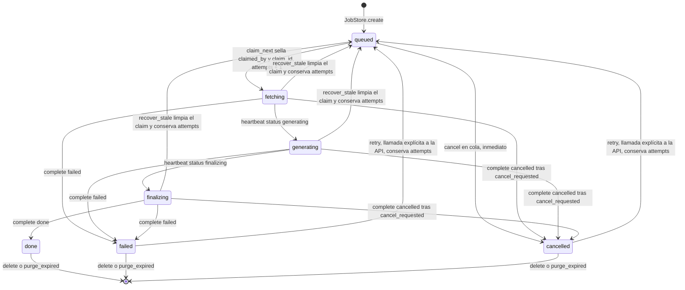

# Ciclo de vida de una wiki: estados, claims y reanudación

Cada generación de este servicio tiene exactamente una fila de estado: el registro `wikis` en
`<DATA_DIR>/openwiki.db`, escrito por `app/core/storage.py`. La API la crea, un worker la reclama, el
pipeline reporta su progreso en ella y quien posee el claim vivo escribe su estado terminal. Nada más
en el sistema es dueño de la verdad del ciclo de vida: los logs, el workspace y `wiki.zip` son
artefactos laterales, mientras que `attempts`, `claimed_by`, `last_seen_at` y `cancel_requested` en la
fila son lo que hace observables y seguras la cancelación, la recuperación tras una caída y el retry.

El vocabulario lo fija el store y lo refleja la API pública:

```python
ACTIVE_STATUSES   = frozenset({"queued", "fetching", "generating", "finalizing"})
RUNNING_STATUSES  = frozenset({"fetching", "generating", "finalizing"})
TERMINAL_STATUSES = frozenset({"done", "failed", "cancelled"})
```

`WikiStatus` en `app/schemas.py` enumera los mismos siete nombres para los clientes. Los conjuntos se
hacen cumplir por comportamiento, no por el esquema: `heartbeat` se niega a refrescar una fila que no
está en ejecución, `recover_stale` solo barre filas en ejecución, `complete` lanza `ValueError` fuera de
`TERMINAL_STATUSES`, y `DELETE /wikis/{id}` consulta `TERMINAL_STATUSES` antes de borrar nada.

| Estado | Quién lo escribe | Significado |
| --- | --- | --- |
| `queued` | `create`, `retry`, `recover_stale` | esperando a un worker; sin claim vivo |
| `fetching` | `claim_next` | un worker posee el claim y está obteniendo el source |
| `generating` | pipeline `report(status="generating")` | el subproceso del CLI OpenWiki está corriendo |
| `finalizing` | pipeline `report(status="finalizing")` | la ejecución terminó, queda empaquetar/pushear |
| `done` / `failed` / `cancelled` | `complete(wiki_id, claim_id, status=...)` | terminal; `finished_at` establecido |



*Máquina de estados de una fila `wikis`, incluidas las dos vías de reencolado: la llamada explícita a `retry` y el barrido automático de `recover_stale` guiado por `last_seen_at`.*

La parte de base de datos de este contrato (esquema, ajustes WAL, columnas JSON) es de
[/openwiki/architecture/job-store.md](/openwiki/architecture/job-store.md); la parte de worker
(`WorkerLoop._runner`, `_run`, `_track`) se describe en
[/openwiki/architecture/worker-pool.md](/openwiki/architecture/worker-pool.md).

## Reclamar: el lease que hace que una fila sea "de alguien"

`JobStore.claim_next(worker_id)` es la única transición fuera de `queued`, y es atómica: `BEGIN
IMMEDIATE` toma el lock de escritura antes de un `SELECT ... WHERE status='queued' ORDER BY created_at
LIMIT 1`, y después un `UPDATE ... WHERE wiki_id=? AND status='queued'` condicional sella el claim. Si
ese update no afecta a ninguna fila —otro worker ganó la carrera— la llamada devuelve `None` y el
runner vuelve a sondear tras `WORKER_POLL_SECONDS`.

Una sola llamada escribe todo lo que el ciclo de vida necesita después. Estos son los campos de la fila
que definen un intento:

| Campo | Quién lo escribe | Significado |
| --- | --- | --- |
| `status` | `claim_next`, `heartbeat`, `complete`, `cancel`, `retry`, `recover_stale` | estado actual; `fetching` justo después del claim |
| `claimed_by` | `claim_next` | identidad del worker que posee el intento (`WORKER_ID` o, si está vacío, el hostname del contenedor); se expone como `worker` |
| `claim_id` | `claim_next`, con un `uuid4().hex` **nuevo** en cada claim | token de propiedad: `heartbeat` y `complete` filtran por `(wiki_id, claim_id)` |
| `claimed_at` | `claim_next` | momento en que se entregó el intento |
| `last_seen_at` | `claim_next`, `heartbeat`, `complete` | el latido; *es* el lease, y `recover_stale` reencola la fila cuando envejece más que `WORKER_LEASE_SECONDS` |
| `cancel_requested` | `cancel` (a `1`), `claim_next`/`recover_stale`/`complete` (a `0`) | petición cooperativa de cancelación, leída por el worker en su siguiente heartbeat |
| `attempts` | `claim_next`, con `attempts = attempts + 1` | cuenta *claims entregados*, no fallos; sobrevive a reencolados y a `retry` |
| `started_at` | `claim_next`, con `started_at = COALESCE(started_at, ?)` | la primera hora de arranque sobrevive a cada reencolado, porque solo es nula en el primer claim |
| `finished_at` | `complete` y el `cancel` de una fila en cola; `retry` lo vuelve a `None` | marca del final del ciclo |

`claimed_by`, `claim_id` y `attempts` son la huella pública de un intento: `GET /wikis/{id}` los expone
como `worker` y `attempts`, de modo que un operador ve qué contenedor posee una generación y cuántas
veces se ha entregado.

`claim_id` es más que contabilidad: es el token de propiedad. `heartbeat` y `complete` filtran ambos por
`(wiki_id, claim_id)`, así que un worker cuyo claim fue reencolado ya no puede refrescar el progreso ni
escribir un estado terminal. `complete` devuelve `False` en ese caso, y `_run` ignora deliberadamente
ese `False`: el estado terminal pertenece a quien posee el claim vivo.

## Heartbeat: progreso, liveness y canal de control en una sola llamada

Mientras una generación corre, dos escritores anidados hablan con la fila:

- `WorkerLoop._track` sondea cada `WORKER_PROGRESS_SECONDS` (por defecto 2.0) y llama a
  `heartbeat(wiki_id, claim_id, progress=...)`.
- `pipeline.report(...)` llama al mismo método con `status` y `pages`, y `check_cancel()` consulta el
  `cancel_event` compartido entre etapas largas.

`heartbeat` refresca `last_seen_at` —eso *es* el lease—, opcionalmente escribe `status`, `progress` y
`pages`, y devuelve `{"ok", "cancel", "status"}`. Su camino de fallo es la señal negativa más importante
del ciclo de vida:

- `ok=False` significa que el par `(wiki_id, claim_id)` ya no existe o que la fila ya no está en
  `RUNNING_STATUSES`: el claim fue reencolado por el reaper o completado en otro sitio. En esa respuesta
  el store también devuelve `cancel=True`, y `report()`/`_track` lo convierten en
  `PipelineCancelled("the worker lease was lost")` / un `cancel_event` activado, de modo que el pipeline
  se detiene en lugar de escribir en una fila que ahora pertenece a otro worker, y `_run` cierra el
  intento como `cancelled`.
- `cancel=True` es el canal de entrega de la cancelación del usuario, descrito más abajo.

Como el progreso y el liveness comparten un único round-trip, un worker atascado se detecta exactamente
cuando deja de actualizar el progreso. Con los valores por defecto, un worker sano late cada ~2 s frente
a un lease de 180 s (`WORKER_LEASE_SECONDS`), es decir, del orden de 90 heartbeats perdidos de margen
antes de que la fila se declare huérfana.

## Cancelar: inmediato en cola, cooperativo en ejecución

`POST /wikis/{id}/cancel` delega en `JobStore.cancel`, que tiene dos comportamientos muy distintos:

| Estado de la fila | Efecto de `cancel` | Resultado de la API |
| --- | --- | --- |
| `queued` | `status='cancelled'`, `finished_at` establecido, `error="cancelled before start"` | `200` `{"status": "cancelled"}` |
| en ejecución (`fetching`/`generating`/`finalizing`) | solo `cancel_requested=True`; el estado no se toca | `200` `{"status": "cancelling"}` |
| terminal | nada | `409` (`not_running`) |
| `wiki_id` desconocido | nada | `404` (`not_found`) |

Cancelar algo en cola es inmediato y es puramente una transacción del store: no interviene ningún worker
y la fila ya no se puede reclamar nunca después. Cancelar algo en ejecución es **cooperativo**: la API
solo levanta una bandera y el worker la descubre en su siguiente heartbeat. `_track` ve
`result["cancel"]` y activa `cancel_event`; `check_cancel()`/`report()` lanzan entonces
`PipelineCancelled("cancelled by user")`; `run_openwiki` vigila el mismo evento y mata el subproceso del
CLI, registrando `! openwiki killed: generation cancelled` y lanzando `OpenWikiRunCancelled`, que el
pipeline vuelve a lanzar como `PipelineCancelled`. La escritura terminal es un `complete(status="cancelled",
error=...)` normal, así que una wiki cancelada es un estado terminal de primera clase con un motivo, no
una fila perdida.

Merece la pena conocer dos consecuencias antes de apoyarse en la cancelación:

- **Una petición de cancelación solo funciona mientras un worker sigue latiendo.** Si el worker ya está
  muerto, nadie lee `cancel_requested`, y `recover_stale` limpia la bandera (`cancel_requested=0`) al
  reencolar la fila: la wiki se *reanuda*, no se cancela. No hay otra vía de cancelación para un claim
  huérfano que borrar la fila después de que termine.
- La cancelación mata el subproceso del CLI y no empaqueta nada: una wiki cancelada no tiene `wiki.zip`
  de ese intento, así que `GET /wikis/{id}/download` responde `404` hasta que complete un intento
  posterior.

## Retry frente a resume

Son dos operaciones diferentes que convergen en el mismo estado `queued`, y la distinción es el corazón
del ciclo de vida:

- **Retry es una acción explícita de la API sobre una fila terminal.** `POST /wikis/{id}/retry` acepta
  solo `failed` o `cancelled` (`409` en otro caso, `404` para ids desconocidos), y reencola limpiando el
  resultado *y* el claim: `status='queued'`, `error=None`, `progress=None`, `finished_at=None`,
  `cancel_requested=False`, y todas las columnas de claim a `NULL`. `attempts` se deja intacto a
  propósito, y también todo lo que hay en disco.
- **Resume es lo que el siguiente claim hace con los ficheros supervivientes.** Reencolar nunca implica
  rehacer el trabajo: el pipeline continúa en el mismo workspace y OpenWiki continúa desde su propio
  plan duradero.

### Nivel de reanudación 1 — el reaper de la API y el workspace superviviente

La API nunca genera nada, pero es la autoridad de recuperación. `_reap_loop` llama a
`store.recover_stale(settings.worker_lease_seconds)` cada `WORKER_REAP_SECONDS` (30 s por defecto), y la
misma llamada se ejecuta una vez al arrancar. Reencola toda fila en ejecución cuyo `last_seen_at` sea
`NULL` o más antiguo que el lease: `status='queued'`, `claimed_by`/`claim_id`/`claimed_at`/`last_seen_at`
a `NULL`, `cancel_requested=0`. Es un único `UPDATE` condicional, así que es idempotente y seguro de
ejecutar desde varias réplicas de la API.

La recuperación es barata porque el workspace nunca se limpia en caso de fallo. Lo primero que comprueba
`pipeline._fetch` es `repo_dir / ".git"`: si existe, registra
`repository workspace already present; resuming the generation` y se salta el clone/extract por
completo. Un worker distinto (con un `claim_id` nuevo) puede por tanto retomar una wiki que dejó atrás un
contenedor caído y seguir en `<DATA_DIR>/jobs/<wiki_id>/repo`. Solo un `.git` ausente provoca una
obtención desde cero, y cualquier directorio sobrante que no sea git se borra antes.

Ese atajo está indexado por el sistema de ficheros, que es también la razón de que `DELETE /wikis/{id}`
elimine todo el directorio `jobs/<wiki_id>/`: borrar la fila tira la reanudabilidad de esa wiki.

### Nivel de reanudación 2 — `openwiki/.run.json` como cola de páginas de OpenWiki

Dentro del workspace, OpenWiki persiste su propio plan. `wiki_runner.read_run_state(repo_dir)` parsea
`openwiki/.run.json` a `{phase, total, completed, pending, current}` contando
`plan.pages[*].status == "complete"`, y es deliberadamente tolerante: un fichero ausente, no parseable o
con forma extraña devuelve `None` o un resumen a cero en lugar de lanzar una excepción, porque se sondea
mientras el CLI todavía lo está escribiendo. `_track` lo ejecuta cada `WORKER_PROGRESS_SECONDS` en un
hilo, y `format_progress` convierte el resumen en la columna `progress` (`2/7 pages · generating`),
recurriendo a `packer.count_pages` (`N pages written`) mientras el plan todavía está vacío.

La consecuencia para el ciclo de vida: cuando un claim reencolado vuelve a ejecutar el CLI en ese
workspace, OpenWiki retoma las páginas inacabadas de ese plan en vez de regenerar la wiki desde cero. El
servicio nunca escribe `.run.json`; solo lo lee para el progreso, y el publicador lo excluye del commit
del push porque es estado de reanudación transitorio. El inventario completo de artefactos del workspace,
y la división `openwiki/` frente a `.openwiki/`, está en
[/openwiki/concepts/wiki-artifact-and-paths.md](/openwiki/concepts/wiki-artifact-and-paths.md).

El retry y el reencolado son también donde importa el *modo* de ejecución. `decide_mode` resuelve `auto`
contra el workspace (update cuando existe `openwiki/index.md`, init en caso contrario, con un `update`
explícito degradando a `init` cuando no hay docs). En modo `update` OpenWiki solo revisa el diff del
repositorio y los claims obsoletos, así que **un update limpio no consume trabajo de modelo**, mientras
que `init` regenera la wiki entera y sus Claims. El modo resuelto se escribe de vuelta con
`store.update(wiki_id, mode=mode)`, de modo que `GET /wikis/{id}` reporta lo que realmente se ejecutó. El
recorrido de extremo a extremo está en
[/openwiki/workflows/generation-from-git.md](/openwiki/workflows/generation-from-git.md) y
[/openwiki/workflows/cancel-retry-and-resume.md](/openwiki/workflows/cancel-retry-and-resume.md).

## Cómo termina un intento

`WorkerLoop._run` es el único traductor de excepciones de dominio a estados terminales:

| Desenlace | Efecto sobre la fila |
| --- | --- |
| El pipeline tiene éxito | `complete(status="done", pages=..., size_bytes=..., push_result=...)` |
| `PipelineCancelled` (cancelación del usuario **o** lease perdido) | `complete(status="cancelled", error=...)` |
| `publisher.PushError` | `complete(status="failed", error="push failed: ...", push_result={"status": "failed", ...})` — el zip empaquetado sigue siendo descargable |
| `ingestion.IngestionError`, `OpenWikiRunError` (salida distinta de cero, `JOB_TIMEOUT_MINUTES` superado), `packer.PackError` | `complete(status="failed", error=<mensaje>)` |
| Cualquier otra `Exception` | `complete(status="failed", ...)`; un runner nunca debe morir |
| `asyncio.CancelledError` (apagado del worker) | **nada** — el claim queda en ejecución y `recover_stale` lo reencola más tarde |

Nótese que un lease perdido se reporta como `cancelled`, no como `failed`: para el intento que fue
desplazado, el trabajo ni está terminado ni está roto. Como no se ejecuta ninguna limpieza en caso de
fallo, cada wiki `failed` y `cancelled` es material reintentable en lugar de trabajo perdido, que es la
propiedad de la que depende todo el flujo de retry. Los errores se truncan a 500 caracteres para que la
fila no pueda crecer sin límite.

Las filas terminales son las únicas que se pueden borrar (`DELETE /wikis/{id}` devuelve `409` mientras
una wiki sigue corriendo) y las únicas que toca `purge_expired`: con `JOB_RETENTION_HOURS > 0` la API
borra al arrancar las wikis terminales cuyo `finished_at` es anterior al corte, fila y directorio juntos.

De ahí se sigue una sutileza operativa, porque `GET /wikis/{id}/download` solo exige que exista un
`wiki.zip`: una wiki todavía en ejecución devuelve `404` (`wiki is not ready (status=...)`) porque aún no
hay zip, pero una wiki *reintentada* cuyo intento anterior ya había empaquetado uno sigue sirviendo ese
archivo antiguo hasta que el nuevo intento lo reemplaza (el packer escribe un fichero `.tmp` y sustituye
el destino de forma atómica).

## Observar y afinar el ciclo de vida

`GET /wikis/{id}` expone el ciclo de vida como `status`, `worker` (`claimed_by`), `attempts`, `progress`,
`pages`, `size_bytes`, `error`, `push_result`, `started_at` y `finished_at`; `GET /wikis/{id}/logs?tail=N`
lee el log escrito por el worker; `GET /health` publica `pool = store.stats()` (`queued`, `running`,
workers vistos en los últimos 120 s).

Los mandos que cambian la temporización del ciclo de vida vienen todos de `Settings`:

| Variable | Por defecto | Efecto sobre el ciclo de vida |
| --- | --- | --- |
| `WORKER_LEASE_SECONDS` | `180` | antigüedad de `last_seen_at` a la que `recover_stale` reencola una fila en ejecución |
| `WORKER_REAP_SECONDS` | `30` | intervalo del barrido de claims caducados de la API (más una vez al arrancar) |
| `WORKER_PROGRESS_SECONDS` | `2.0` | periodo de heartbeat/progreso, es decir, la tasa efectiva de refresco del lease |
| `WORKER_POLL_SECONDS` | `2.0` | cuánto espera un runner ocioso antes de reclamar de nuevo |
| `MAX_CONCURRENT_JOBS` | `1` | generaciones por contenedor worker; la cola escala con las réplicas |
| `JOB_TIMEOUT_MINUTES` | `45` | timeout del subproceso del CLI; superarlo falla el intento (reintentable) |
| `JOB_RETENTION_HOURS` | `0` | `0` conserva las wikis terminadas para siempre; en otro caso las filas terminales se purgan al arrancar |

## Tests enfocados

- `tests/test_worker_queue.py` es la especificación a nivel de store de estas semánticas: claims atómicos
  y exclusivos (`test_claim_is_atomic_and_exclusive`), heartbeat más cancelación cooperativa
  (`test_heartbeat_cancel_and_complete`), un `claim_id` caducado incapaz de completar una fila
  (`test_complete_with_stale_claim_is_ignored`), reencolado al expirar el lease con `attempts` preservado
  (`test_stale_claims_are_requeued`) y cancelación/retry inmediatos de una fila nunca reclamada
  (`test_queued_cancel_and_retry`).
- `tests/test_api_wikis.py` recorre el ciclo de vida a través de la API con el CLI falso:
  `test_cancel_queued_wiki` (inmediato), `test_cancel_running_wiki_and_retry_resumes` (cancelación
  cooperativa y después un retry con éxito), `test_failed_wiki_can_be_retried`,
  `test_cancel_and_retry_validation` (`409`/`404`), `test_wiki_is_not_available_while_running` (`404` sin
  zip), `test_completed_wikis_survive_a_restart` y `test_active_wikis_are_resumed_after_a_restart` (una
  fila en ejecución forzada, con claim muerto y sin zip, es reencolada por el reaper de arranque y
  termina).
- `tests/test_wiki_state.py` fija el parseo de la señal de reanudación que hay detrás de `progress`:
  `read_run_state` (resumen del plan, tolerancia a fichero ausente/leniente/basura) y `format_progress`
  (`2/7 pages · generating`, `3 pages written`).
