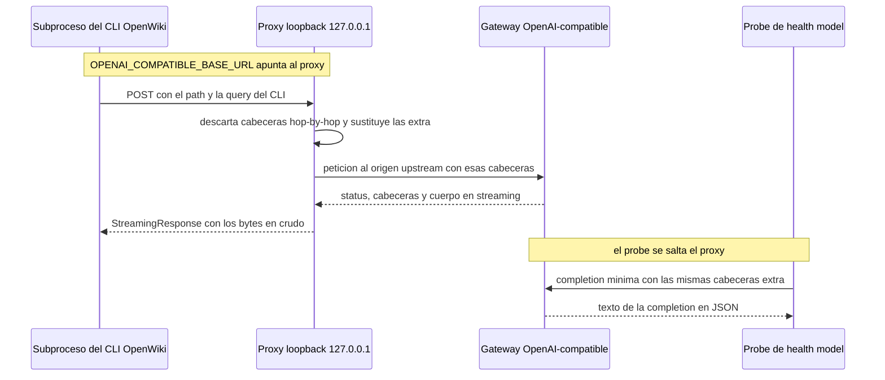

# Providers de modelos, flujo de credenciales y proxy de cabeceras

OpenWiki Service no habla con ningún proveedor de modelos por sí mismo. Pasa la
configuración del proveedor al subproceso del CLI OpenWiki y, cuando un gateway
necesita cabeceras que el CLI no puede enviar, coloca un **proxy loopback**
delante de ese gateway para que cada petición del CLI salga enriquecida. Esta
página cubre las tres piezas que lo hacen posible: la tabla de proveedores que
se usa para reportar, las capas de configuración que deciden qué variables se
leen y el proxy en sí.

## Las credenciales viven en el entorno del proceso

`Settings`, en `app/core/config.py`, **no** declara deliberadamente
`OPENAI_API_KEY`, `ANTHROPIC_API_KEY` ni ninguna otra credencial de proveedor.
Las credenciales de proveedor se quedan en el entorno del proceso y se reenvían
al subproceso de OpenWiki sin tocarlas; solo se sobrescriben variables propias
del servicio. La única función que construye el entorno del CLI, `build_env` en
`app/services/wiki_runner.py`, copia `os.environ` y después fija
`OPENWIKI_CONFIG_DIR`, `OPENWIKI_TELEMETRY_DISABLED`, opcionalmente
`OPENWIKI_PAGE_CONCURRENCY`, y por último aplica los overrides que recibe en
`extra` — el gancho que usa el proxy.

Por eso el servicio no almacena credenciales: cambiar de proveedor es un cambio
de entorno, no de código, y `/health` puede informar *si* hay credencial y *de
dónde* sale sin manejar nunca su valor.

## Tabla de proveedores y tipos de probe

`app/services/model_status.py` mantiene un mapa `PROVIDERS` que refleja la tabla
de proveedores del README de OpenWiki. Cada `ProviderSpec` registra la variable
de credencial, la variable de base URL, la base URL y el modelo por defecto, y
el tipo de probe que usa el chequeo activo.

| Provider | Variables de credencial / base URL | Probe |
| --- | --- | --- |
| `openai` | `OPENAI_API_KEY` / `OPENAI_BASE_URL` (por defecto `https://api.openai.com/v1`) | `openai-responses` (`POST /responses`) |
| `anthropic` | `ANTHROPIC_API_KEY` / `ANTHROPIC_BASE_URL` | `anthropic` (`/v1/messages`) |
| `gemini` | `GEMINI_API_KEY`, base URL fija | `gemini` (`generateContent`, la key va como query param) |
| `openrouter` | `OPENROUTER_API_KEY`, base URL fija | `chat` (`/chat/completions`) |
| `openai-compatible` | `OPENAI_COMPATIBLE_API_KEY` / `OPENAI_COMPATIBLE_BASE_URL` | `chat` |
| `nvidia` | `NVIDIA_API_KEY` / `NVIDIA_BASE_URL` | `chat` |
| `fireworks` | `FIREWORKS_API_KEY` / `FIREWORKS_BASE_URL` | `chat` |
| `baseten` | `BASETEN_API_KEY` / `BASETEN_BASE_URL` | `chat` |
| `nebius` | `NEBIUS_API_KEY`, sin base URL | ninguno — chequeo activo no implementado |
| `bedrock`, `copilot`, `gemini-enterprise`, `openai-chatgpt` | no es una API key simple (IAM, token OAuth de GitHub o sesión `gh`, ADC de Google, inicio de sesión en navegador) | ninguno — se reportan como `unsupported` |

(`copilot` sí llega a declarar `COPILOT_API_KEY` / `COPILOT_BASE_URL`, pero sigue
sin probe porque su autenticación real es una sesión de GitHub.) El proveedor por
defecto es `openai` (`DEFAULT_PROVIDER`), y el modelo efectivo es
`OPENWIKI_MODEL_ID` o, si no está definido, el `default_model` del proveedor
—que solo `openai` tiene—.

`PROVIDERS` es la única superficie de reporte de proveedores: tanto
`describe_model` como el probe de `/health/model` la leen, así que añadir un
proveedor o un tipo de probe es un cambio localizado aquí más, como mucho, una
rama nueva en `_probe_once`. Los proveedores cuya autenticación no es una API
key simple se reportan `unsupported` en vez de adivinar; un valor de proveedor
desconocido produce un `note` que lo nombra.

Los tipos de probe se despachan en `_probe_once`, que envía la completion más
pequeña posible y lanza `ProbeError` ante cualquier fallo. Los probes
OpenAI-compatible y OpenAI usan `_post_with_v1_hint`: ante un 404/405 reintentan
contra `{base}/v1{path}` y, si eso funciona, informan de qué base URL funciona
realmente —porque los SDK de OpenAI (y por tanto OpenWiki) construyen la URL de
la petición como `baseURL + path`—.

## Capas de configuración

La configuración del proveedor se resuelve **exactamente como la resuelve
OpenWiki**: el entorno del contenedor se superpone al `<OPENWIKI_CONFIG_DIR>/.env`
y gana el entorno. `settings.resolved_config_dir` es el directorio de estado de
OpenWiki (`openwiki_config_dir` o, si no está definido,
`<data_dir>/.openwiki-config`).

`load_openwiki_env` y `describe_model` implementan esa mezcla con un parser
mínimo de `KEY=VALUE` (`_parse_env_file`) que ignora comentarios y líneas vacías,
quita un `export ` inicial opcional y elimina las comillas que rodeen al valor. El
resultado es un dict con forma de entorno, que es lo que usan tanto el reporte de
salud como el probe para buscar credencial, modelo y base URL.

Esta estratificación importa en operación porque determina *qué* valor razona el
servicio: una credencial definida solo en `OPENWIKI_CONFIG_DIR/.env` pero ausente
del entorno del contenedor se reporta correctamente como presente con origen
`config`, y definir esa misma variable en el entorno cambia el origen reportado a
`environment` y el valor efectivo al del entorno. `describe_model` además informa
por variable del origen (`environment`, `config`, `default` o ninguno), y devuelve
`credential_present` / `credential_source` en vez del propio secreto.

Un caso especial es la base URL mal formada: `_split_base_url` detecta que la URL
termina en uno de los sufijos de endpoint (`/chat/completions`, `/responses`,
`/completions`, `/messages`), en cuyo caso `describe_model` emite un
`base_url_warning` que nombra la variable y la raíz sugerida, junto con
`suggested_base_url`.

## `parse_extra_headers`: la puerta de las cabeceras propias del gateway

Algunos gateways OpenAI-compatible (por ejemplo OpenCode Go) exigen cabeceras
identificativas que el CLI OpenWiki no puede enviar por sí mismo, como
`x-opencode-session` y un user agent de cliente.
`OPENAI_COMPATIBLE_EXTRA_HEADERS` las transporta como un objeto JSON de valores
string.

`parse_extra_headers` impone el contrato:

- `None` o una cadena en blanco devuelven `{}` — la funcionalidad simplemente
  está apagada.
- Un JSON inválido lanza `ValueError` con un mensaje que nombra la forma esperada
  y reproduce el error del parser.
- Un JSON que no sea un objeto, o cuyos valores sean objetos, arrays o `null`,
  lanza `ValueError`; los valores se convierten con `str()`.
- Si ninguna clave es `user-agent` en minúsculas, se añade un
  `User-Agent: openwiki-service/<versión>` por defecto, porque algunos gateways
  rechazan los user agents genéricos de los SDK. Un `User-Agent` configurado se
  respeta tal cual.

Como un valor mal formado solo se notaría en la primera petición proxeada, el
mismo parser se invoca en tres puntos de validación:

1. **`create_app` falla rápido al arrancar.** Cuando
   `OPENAI_COMPATIBLE_EXTRA_HEADERS` está definido, `app/main.py` llama a
   `parse_extra_headers` antes de construir nada, de modo que un valor malo
   aborta la construcción de la aplicación.
2. **`WorkerLoop.start`** lo parsea antes de decidir si lanza el proxy; un valor
   mal formado impide arrancar el worker en lugar de desactivar en silencio la
   inyección de cabeceras.
3. **`describe_model` nunca lanza excepciones.** Parsea el valor solo cuando el
   proveedor es `openai-compatible` y, ante un `ValueError`, guarda el mensaje en
   `extra_headers_error`. Así `/health` expone el problema como dato.
   `ModelStatusCache._run` se comporta igual: un fallo de parseo se convierte en
   `status: error` con el mensaje del parser como `detail`.

`/health` expone únicamente los **nombres ordenados** de las cabeceras extra
(`extra_headers`), nunca sus valores, de modo que un token de sesión pasado como
valor de cabecera no se filtra al reporte de salud.

## El proxy loopback

`app/services/provider_proxy.py` implementa una app Starlette más un servidor
uvicorn que, juntos, reenvían todo lo que sale del CLI al gateway real añadiendo
las cabeceras configuradas.

**Alcance y binding.** El proxy escucha solo en `127.0.0.1`, dentro del proceso
que lo arranca, en `COMPAT_PROXY_PORT` (`compat_proxy_port`, por defecto `9100`;
`0` elige un puerto libre, que es lo que usan los tests). `Settings` valida que el
puerto esté entre `0` y `65535`. Al ser solo loopback, no es alcanzable desde
fuera del contenedor.

**Fidelidad de path.** `create_forward_app` captura la base URL upstream una vez y
deriva `base_path` de su path. Una petición cuyo path no empiece por ese prefijo
se responde `404` con
`openwiki-service proxy: path outside the configured base URL` en lugar de
reenviarse: el proxy no puede convertirse en un relay abierto a paths arbitrarios
del upstream. En caso contrario la URL destino conserva el **path y la query**
entrantes y sustituye el scheme, host y puerto del upstream, así que
`…/zen/go/v1/chat/completions` llega al gateway intacto. La ruta se declara como
`/{path:path}` y acepta `GET`, `POST`, `PUT`, `PATCH`, `DELETE` y `OPTIONS`;
`create_forward_app` también acepta un `httpx.AsyncClient` inyectable (los tests
pasan un `httpx.MockTransport`), mientras que `start_proxy` siempre crea uno
propio.

**Manejo de cabeceras.** Dos reglas definen la transformación:

- `HOP_BY_HOP_HEADERS` — `connection`, `keep-alive`, `proxy-authenticate`,
  `proxy-authorization`, `te`, `trailers`, `transfer-encoding`, `upgrade`,
  `host`, `content-length` — no se reenvían en ninguna dirección. Descartar
  `content-length` es lo que permite re-chunkear la respuesta como stream, y
  descartar `host` deja que httpx escriba la autoridad del upstream.
- Las cabeceras extra **sustituyen** a las entrantes sin distinguir mayúsculas
  mediante `_replace_headers`, así que un `x-opencode-session` enviado por el
  cliente nunca puede duplicar ni tapar el valor configurado, use la caja que use.

**Streaming.** La respuesta upstream se abre con `stream=True` y se devuelve como
`StreamingResponse` sobre `aiter_raw()`, con `BackgroundTask(aclose)` para cerrar
la conexión upstream cuando el cliente termina. Los timeouts del cliente upstream
son `connect=30.0` con `read`, `write` y `pool` ilimitados, de forma que las
generaciones largas no se cortan a mitad de stream.

**Ciclo de vida del servidor.** `start_proxy` crea la app con un
`httpx.AsyncClient` dedicado, ejecuta un servidor uvicorn en una tarea asyncio
llamada `openwiki-compat-proxy` y sondea `server.started` durante ~10 s, fallando
con `RuntimeError` si la tarea muere o se agota el tiempo. El puerto enlazado se
lee de vuelta del socket del servidor, que es lo que hace posible `port=0`. El
`ProxyHandle` devuelto expone `base_url` como
`http://127.0.0.1:{puerto_enlazado}{prefijo}`, donde `prefix` es el path del
upstream — así el CLI sigue enviando sus rutas de endpoint habituales y el proxy
vuelve a añadir el origen. `_ProxyServer` sobrescribe `install_signal_handlers`
con un no-op: el proxy no debe robar SIGINT/SIGTERM al proceso de API o worker
que lo posee. `ProxyHandle.stop` pone `should_exit`, espera hasta 10 s a la tarea
y cierra el cliente.



*Flujo de la petición: el CLI habla con el proxy loopback, que reenvía al gateway real; `/health/model` se salta el proxy y contacta el upstream directamente.*

### Propiedad y ciclo de vida en el worker

El proxy pertenece al proceso que ejecuta las generaciones. En `WorkerLoop.start`,
`OPENAI_COMPATIBLE_EXTRA_HEADERS` se parsea primero y el proxy solo se arranca
cuando las cabeceras extra no están vacías **y** `openai_compatible_base_url` está
configurada; si falta cualquiera de las dos no hay proxy y el CLI sigue hablando
con la `OPENAI_COMPATIBLE_BASE_URL` que ya tuviera. Cuando el proxy arranca, el
worker fija

```python
self.env_overrides = {"OPENAI_COMPATIBLE_BASE_URL": self.proxy.base_url}
```

Ese diccionario recorre `run_pipeline` → `run_openwiki` → `build_env`, de modo que
el subproceso del CLI recibe la URL loopback en lugar de la pública. Todas las
tareas runner del worker comparten el único proxy. `WorkerLoop.stop` llama a
`ProxyHandle.stop()`, y `create_app` publica el handle en `app.state.proxy` (solo
tiene valor real cuando `RUN_LOCAL_WORKER=true`) para que la API pueda observarlo.

El efecto neto sobre el despliegue: en un stack compose escalado, cada contenedor
worker arranca su propio proxy loopback en `COMPAT_PROXY_PORT` y el CLI de ese
contenedor apunta a él. `OPENAI_COMPATIBLE_BASE_URL` es la única variable de
entorno que se reescribe para el subproceso; las cabeceras extra en sí nunca se
escriben en el entorno del subproceso.

## `/health/model` prueba el upstream real

El chequeo activo habla con el upstream directamente y con las mismas cabeceras
extra, así que `/health/model` sigue probando el endpoint real y no el proxy. En
`ModelStatusCache._run` se aplica `parse_extra_headers` para
`openai-compatible`, y el dict resultante se pasa a `_probe_once` como
`extra_headers`, donde se mezcla **después** de las cabeceras de autenticación
—por eso las cabeceras extra pueden aportar o sobrescribir cualquier cosa,
incluida `Authorization`—. En el caso de un proveedor sin credencial (sin
`credential_env`) el probe sigue ejecutándose; el chequeo solo reporta
`not_configured` cuando falta una variable requerida (credencial, modelo o base
URL) y el `detail` nombra exactamente cuál.

`_probe_once` acepta además un `base_override`, que se usa para *confirmar* una
base URL corregida antes de reportarla: cuando la base URL configurada incluye
por error el path del endpoint, el chequeo reintenta contra la raíz sugerida y, si
el modelo responde, lo dice en `detail`. En caso contrario se limita a la
advertencia, sin prometer que la corrección funciona.

En operación esto cierra el bucle: si `/health/model` devuelve `ok`, el gateway
real aceptó las credenciales **y** las cabeceras extra, lo que significa que el
proxy que usará el CLI está bien configurado. Los resultados se cachean por
instancia de aplicación durante `MODEL_CHECK_TTL_SECONDS` (con `0` desactivando la
caché) y las comprobaciones concurrentes se serializan con un `asyncio.Lock`, a
menos que se pase `?force=true`. El endpoint responde `200` para `ok` y
`unsupported`, y `503` para `error` y `not_configured`.

## Tests que fijan el comportamiento

`tests/test_provider_proxy.py` es la suite específica de esta página:

- `parse_extra_headers` con los valores por defecto, la conservación de un
  `User-Agent` configurado, la entrada en blanco y el rechazo de JSON no válido,
  arrays, objetos anidados y valores `null`.
- `create_app` lanzando `ValueError` ante un
  `openai_compatible_extra_headers` mal formado.
- `create_forward_app` inyectando cabeceras y conservando path y query contra un
  upstream `httpx.MockTransport`, y devolviendo `404` para paths fuera de la base
  configurada.
- Una ejecución de extremo a extremo con el CLI falso que comprueba que
  `app.state.proxy.base_url` empieza por `http://127.0.0.1:` y termina con el path
  del upstream, y que el subproceso recibió la URL del proxy (no la del upstream)
  en `OPENAI_COMPATIBLE_BASE_URL`.

El lado del probe queda fijado en `tests/test_model_status.py`
(`test_probe_sends_extra_headers` comprueba que la cabecera y el User-Agent por
defecto llegan al upstream, y
`test_health_lists_extra_header_names_without_values` comprueba que los valores
nunca aparecen en `/health`), y `tests/fixtures/fake_openai_server.py` ofrece un
mock manual que puede exigir `x-opencode-session` (`FAKE_REQUIRE_SESSION=1`) para
reproducir el comportamiento de OpenCode Go.

## Páginas relacionadas

- [/openwiki/integrations/openwiki-cli.md](/openwiki/integrations/openwiki-cli.md)
- [/openwiki/operations/configuration.md](/openwiki/operations/configuration.md)
- [/openwiki/workflows/model-health-check.md](/openwiki/workflows/model-health-check.md)
