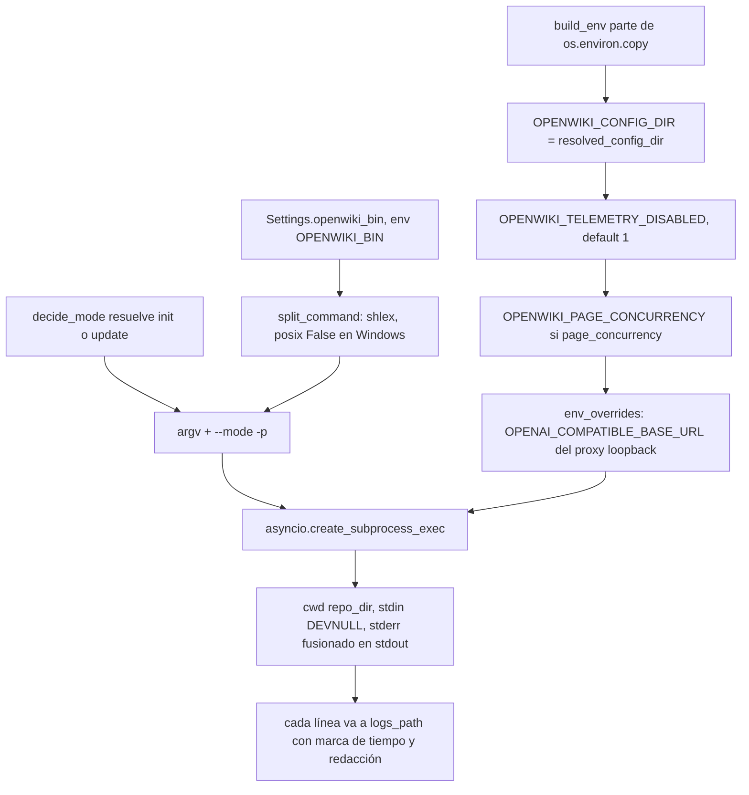
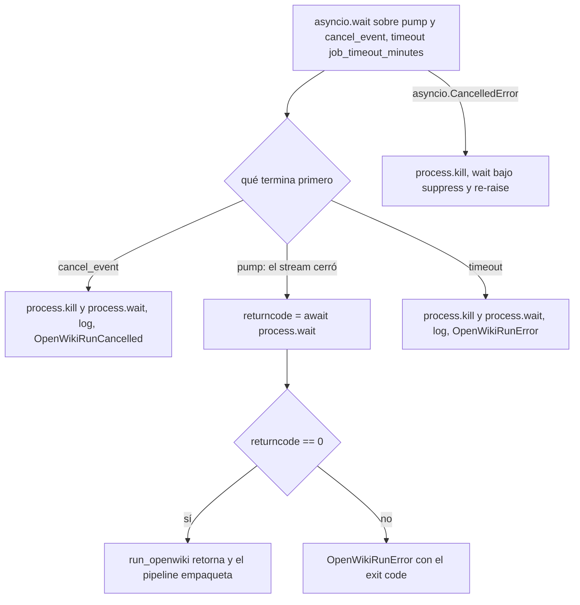

# Integración con el CLI OpenWiki

El CLI `openwiki` es la dependencia externa que hace el trabajo real del servicio.
Todo el conocimiento que el servicio tiene de ese CLI vive en un único módulo,
`app/services/wiki_runner.py`, que se declara a sí mismo como "el único módulo que
sabe cómo invocar el CLI OpenWiki". Esa concentración tiene una consecuencia
operativa explícita en la cabecera del archivo: actualizar OpenWiki es reconstruir
el contenedor, y una nueva interfaz del CLI solo exige tocar este módulo.

| Responsabilidad | Símbolo | Dónde |
| --- | --- | --- |
| Composición del comando | `split_command`, `run_openwiki` | `app/services/wiki_runner.py` |
| Entorno del subproceso | `build_env` | `app/services/wiki_runner.py` |
| Decisión `init` / `update` | `decide_mode` | `app/services/wiki_runner.py` |
| Directorio fijo `openwiki/` | `NATIVE_WIKI_DIR` | `app/services/wiki_runner.py` |
| Brief de idioma | `prepare_instructions` | `app/services/wiki_runner.py` |
| Estado de ejecución y progreso | `read_run_state`, `format_progress` | `app/services/wiki_runner.py` |

Nadie más construye la línea de comandos: `app/services/pipeline.py` importa
`run_openwiki`, `decide_mode`, `adopt_hidden_wiki` y `prepare_instructions`, y
`app/worker/loop.py` importa `read_run_state`, `format_progress` y
`OpenWikiRunError`. `app/services/packer.py` importa `NATIVE_WIKI_DIR` en vez de
repetir el literal.

## El comando efectivo

`run_openwiki` compone el argv así:

```python
command = split_command(settings.openwiki_bin) + [f"--{mode}", "-p"]
if not command[0]:
    raise OpenWikiRunError("OPENWIKI_BIN is not configured")
```

Es decir, `openwiki --init -p` o `openwiki --update -p`, siempre en modo one-shot
y siempre con `-p`. `OPENWIKI_BIN` (default `openwiki`) no es una lista de
argumentos en YAML sino una cadena que se tokeniza con `split_command`, lo que
permite apuntarlo a un intérprete más un script — exactamente lo que hace la
suite de tests con `"python" "script.py"`:

```python
def split_command(command: str) -> list[str]:
    """Split ``OPENWIKI_BIN`` into argv, keeping Windows backslashes intact."""
    if os.name == "nt":
        return [token.strip('"') for token in shlex.split(command, posix=False) if token.strip('"')]
    return shlex.split(command)
```

`split_command` no es solo privado del runner: `GET /health` lo usa para extraer
el binario y comprobar `shutil.which`, de modo que un `OPENWIKI_BIN` mal escrito
se detecta como `openwiki_found: false` sin lanzar ninguna generación.



*Composición del comando y del entorno: los dos flujos que `run_openwiki` une en una sola llamada a `create_subprocess_exec`.*

## El entorno: `build_env`

`build_env(settings, *, page_concurrency=None, extra=None)` copia
`os.environ` y **solo sobreescribe variables propias del servicio**. Esa decisión
es la que permite que las credenciales de proveedor (`OPENAI_API_KEY`,
`ANTHROPIC_API_KEY`, `OPENWIKI_PROVIDER`, `OPENWIKI_MODEL_ID`, …) se hereden sin
que `Settings` las declare ni las inspeccione nunca: viven en el entorno del
proceso y se reenvían intactas al subproceso.

| Variable | Cómo se fija | Efecto |
| --- | --- | --- |
| `OPENWIKI_CONFIG_DIR` | Siempre, con `str(settings.resolved_config_dir)` | Estado del CLI: credenciales guardadas, id de instalación, `.env` propio |
| `OPENWIKI_TELEMETRY_DISABLED` | `env.get("OPENWIKI_TELEMETRY_DISABLED", "1")` | Por defecto se desactiva la telemetría, pero un valor explícito del entorno gana |
| `OPENWIKI_PAGE_CONCURRENCY` | Solo si `page_concurrency` es un entero verdadero | Workers de página de esta generación; si no se fija, manda el default del CLI |
| `extra` (`env_overrides`) | Último `env.update`, con prioridad sobre todo lo anterior | Único canal por el que el worker inyecta variables |

`resolved_config_dir` es `openwiki_config_dir` si está definido y, si no,
`<DATA_DIR>/.openwiki-config`; la imagen además lo fija a
`/data/.openwiki-config`. Como ese directorio cuelga del volumen compartido, dos
generaciones concurrentes comparten el mismo estado del CLI aunque cada una tenga
su propio `cwd` y su propio subproceso.

El caso de `page_concurrency` ilustra la cadena de valores: el pipeline pasa
`wiki.get("concurrency") or settings.default_page_concurrency`, la API valida el
valor de la petición entre 1 y 8, y `Settings` valida el default en el mismo
rango. Si la generación no pide concurrencia, se usa el default; y si ese default
fuera falsy, la variable simplemente no se establece y OpenWiki decide.

`env_overrides` existe para el proxy de cabeceras: cuando hay
`OPENAI_COMPATIBLE_EXTRA_HEADERS` y una base URL compatible, el worker arranca un
proxy loopback y pasa `{"OPENAI_COMPATIBLE_BASE_URL": proxy.base_url}` para que el
CLI hable con el proxy en lugar del gateway real.

## `NATIVE_WIKI_DIR`: el directorio que el servicio no puede elegir

```python
#: OpenWiki hardcodes this directory name in the repository (no option to change it).
NATIVE_WIKI_DIR = "openwiki"
```

El CLI siempre lee y escribe `openwiki/`; no hay opción para cambiarlo. El
servicio lo respeta en tres puntos:

- `decide_mode` mira si existe `openwiki/index.md` para deducir si la fuente ya
  trae wiki.
- `adopt_hidden_wiki(repo_dir, artifact_dir)` renombra un directorio de artefacto
  oculto (por convención `.openwiki/`) a `openwiki/` **antes** de decidir el modo,
  porque de lo contrario el CLI no vería wiki alguna.
- `packer.pack_wiki` lee `openwiki/` y solo renombra la raíz dentro del zip, que es
  el único uso de `WIKI_ARTIFACT_DIR` en la frontera con el CLI.

Detalles de esa separación de nombres, transformaciones y artefactos en
[/openwiki/concepts/wiki-artifact-and-paths.md](/openwiki/concepts/wiki-artifact-and-paths.md).

## Decisión de modo: `init` vs `update`

```python
def decide_mode(repo_dir: Path, requested: str | None) -> str:
    has_wiki = (Path(repo_dir) / "openwiki" / "index.md").exists()
    mode = (requested or "auto").strip().lower()
    if mode == "auto":
        return "update" if has_wiki else "init"
    if mode == "update" and not has_wiki:
        return "init"
    return mode
```

`openwiki/index.md` es, por tanto, la única prueba de "wiki existente" que el
servicio utiliza, y el valor resuelto se persiste en la fila (`store.update`), así
que `GET /wikis/{id}` informa del modo efectivo y no del pedido. Un `update`
explícito sobre una fuente sin wiki degrada a `init` en silencio, y el pipeline
deja constancia en el log (`falling back to --init`) para que el tail de logs
explique el resultado.

## `INSTRUCTIONS.md`: el brief y el idioma

`prepare_instructions(repo_dir, language)` escribe `openwiki/INSTRUCTIONS.md`
**solo** si la wiki pidió un `language` y el archivo no existe todavía; un brief
escrito por el usuario en la fuente nunca se pisa, y sin idioma no se crea nada.
El contenido es corto y estable: idioma de redacción, la regla de no traducir
identificadores, rutas, comandos ni nombres de API, y la preferencia por
arquitectura y flujos de datos sobre comentario línea a línea. Es el único lugar
del servicio donde se fija el idioma de salida del CLI.

## Ciclo de vida del subproceso

`run_openwiki` abre el log en modo append y arranca el proceso con
`asyncio.create_subprocess_exec(*command, cwd=repo_dir, env=env, stdin=DEVNULL,
stdout=PIPE, stderr=STDOUT)`: stdin cerrado (el CLI nunca debe esperar entrada),
salida y errores fusionados en un único flujo. Antes de leer nada escribe la
cabecera `$ <comando> (cwd=<repo_dir>)`, y cada línea posterior se sella con
`[HH:MM:SS]` en UTC, se pasa por `redact_text(line, secrets)` —que enmascara
credenciales embebidas en URLs, cabeceras `authorization`/`private-token` y el
token del repositorio— y se fuerza el `flush`, de modo que el log es legible
mientras la generación sigue viva. Ese archivo (`store.logs_path(wiki_id)`) es el
único log que expone la API vía `GET /wikis/{id}/logs`, así que todo lo que el CLI
imprima acaba siendo visible para quien consulta la wiki.

La espera se resuelve con una carrera explícita entre el bombeo de salida y el
evento de cancelación:

```python
done, _ = await asyncio.wait(
    waiters, timeout=timeout_seconds, return_when=asyncio.FIRST_COMPLETED
)
```



*Semántica de terminación: tres finales normales y un cuarto camino para el apagado del worker.*

| Situación | Acción sobre el proceso | Excepción / resultado |
| --- | --- | --- |
| `pump` termina (el CLI cerró stdout) | ninguna; se espera el `exit` | `returncode`; si es ≠ 0, `OpenWikiRunError("openwiki exited with code N (see the job logs)")` |
| `cancel_event` activado | `kill()` + `wait()`, con la línea `! openwiki killed: generation cancelled` | `OpenWikiRunCancelled("cancelled by user")` |
| Timeout de `job_timeout_minutes * 60` | `kill()` + `wait()`, con la línea de timeout | `OpenWikiRunError("openwiki timed out after N minutes")` |
| `asyncio.CancelledError` (apagado del worker) | `kill()` y `wait()` bajo `contextlib.suppress` | se re-lanza: nunca se deja un proceso huérfano |
| El binario no existe | el proceso no llega a crearse | `OpenWikiRunError("OpenWiki binary not found: ...")` |

Dos invariantes sostienen esa tabla: el proceso **siempre** se mata antes de
relanzar, y las tareas auxiliares (`pump_task`, `cancel_task`) se cancelan y se
esperan en un `finally`, de modo que ni un subproceso ni una tarea sobreviven a la
llamada. Un fallo de arranque (`FileNotFoundError`) es la única ruta que sale sin
proceso vivo, porque no hubo proceso.

`OpenWikiRunError` y `OpenWikiRunCancelled` son las dos excepciones que el runner
expone. El pipeline traduce `OpenWikiRunCancelled` a `PipelineCancelled` (que
`WorkerLoop._run` convierte en `cancelled`), y `WorkerLoop` mapea
`OpenWikiRunError` a `complete(status="failed", error=...)`, con el error
recortado a 500 caracteres. Un timeout, un exit code ≠ 0 y un binario ausente son,
por tanto, estados terminales `failed` observables desde la API, y el retry
reutiliza el workspace porque el pipeline reanuda sobre el `.git` existente.

`JOB_TIMEOUT_MINUTES` es servicio y no CLI: su default es 45 minutos en
`Settings`, y `docker-compose.yml` sube el default del contenedor `worker` a 60.
El timeout solo cubre la ejecución del CLI: no incluye clonado, empaquetado ni
push.

## Lectura del estado de ejecución

El CLI mantiene su propio estado durable en `openwiki/.run.json`; el servicio
nunca lo escribe, solo lo lee.

```python
def read_run_state(repo_dir: Path) -> dict[str, Any] | None:
    path = Path(repo_dir) / "openwiki" / ".run.json"
    try:
        data = json.loads(path.read_text(encoding="utf-8"))
    except (OSError, json.JSONDecodeError):
        return None
    ...
```

Devuelve `{phase, total, completed, pending, current}`, contando
`plan.pages[*].status == "complete"` y tomando `current` del primer page no
completado. La tolerancia es deliberada y está cubierta por tests: archivo ausente
o JSON inválido ⇒ `None`; `plan` ausente o `pages` con un tipo inesperado ⇒
resumen a ceros en vez de excepción. Es obligatorio ser tolerante porque el archivo
se sondea mientras el CLI todavía lo está escribiendo.

`format_progress(state, pages_written=0)` convierte ese dict en la cadena que
guarda la columna `progress`: `2/7 pages · generating` cuando hay plan, y
`N pages written` cuando aún no lo hay. El consumidor es la tarea `_track` del
worker, que cada `WORKER_PROGRESS_SECONDS` llama a `read_run_state` vía
`asyncio.to_thread` (para no bloquear el event loop), anuncia el plan una sola vez
y cae a `packer.count_pages` (un conteo `**/*.md`) cuando no existe plan. Ese
heartbeat es a la vez refresco de lease y canal de control: si el lease se perdió
o la API registró una cancelación, `_track` activa el mismo `cancel_event` que
`run_openwiki` vigila. El ciclo claim → run → heartbeat → complete se detalla en
[/openwiki/architecture/worker-pool.md](/openwiki/architecture/worker-pool.md).

## Qué asume el servicio del CLI

Estas suposiciones forman el contrato real entre ambos. Ninguna está versionada ni
verificada en runtime, así que romperlas se manifiesta como una generación fallida:

| Suposición | Dónde se usa | Qué habría que cambiar si cambia |
| --- | --- | --- |
| Interfaz `openwiki --init -p` / `openwiki --update -p` | `run_openwiki` | `wiki_runner.run_openwiki`: la construcción del argv |
| Directorio de salida fijo `openwiki/` | `NATIVE_WIKI_DIR`, `decide_mode`, `packer`, `publisher` | La constante y las rutas derivadas |
| `openwiki/index.md` como prueba de wiki existente | `decide_mode`, `packer.pack_wiki` | La comprobación de modo y la validación de empaquetado |
| `openwiki/.run.json` con `phase` y `plan.pages[*].status` | `read_run_state` | El parser de estado y, con él, el progreso que reporta el worker |
| `openwiki/.last-update.json` con el `gitHead` documentado | `ingestion.ensure_full_history` (unshallow antes de `--update`) | Las reglas de clonado/actualización en `ingestion` |
| `openwiki/INSTRUCTIONS.md` como brief | `prepare_instructions` | El formato del brief |
| Salida en stdout/stderr, exit code como señal | `run_openwiki` | Toda la gestión del subproceso |

Por eso el modo de actualización no es solo un flag: `--update` difiere el `HEAD`
actual contra el commit registrado en `openwiki/.last-update.json`, y un clon con
`--depth 1` no contiene ese commit. `ingestion.ensure_full_history` ejecuta
`git fetch --unshallow` antes de la ejecución cuando el workspace es superficial.

## Actualizar la versión de OpenWiki

No hay código de servicio que cambiar mientras el contrato anterior se mantenga:
la versión es un argumento de build de la imagen.

```bash
# fija la nueva versión en el build (recomendado)
docker compose build --build-arg OPENWIKI_VERSION=0.7.0
docker compose up -d
```

- `Dockerfile` declara `ARG OPENWIKI_VERSION=0.6.0` y lo pasa a
  `scripts/install-openwiki.sh`, que instala el CLI globalmente con
  `npm install --global openwiki@${VERSION}`; el script reintenta una vez
  instalando `build-essential`, porque `better-sqlite3` puede necesitar compilar
  cuando no hay binario prebuilt para el ABI de Node.
- `docker-compose.yml` propaga el argumento (`OPENWIKI_VERSION: ${OPENWIKI_VERSION:-0.6.0}`)
  tanto al servicio `api` como a los contenedores `worker`, que comparten la misma
  imagen `openwiki-ci:latest`.
- El runtime solo necesita Node 22 (y `git`/`curl`) en la imagen; la versión del
  CLI no se comprueba en `/health`, que informa del binario configurado y de si es
  localizable.

El procedimiento operativo completo —reconstrucción de la imagen, recreación de
los contenedores y verificación posterior— y las tareas de despliegue en general
se describen en [/openwiki/operations/deployment.md](/openwiki/operations/deployment.md).

## Puntos de extensión y pruebas enfocadas

- **Sustituir el CLI**: `OPENWIKI_BIN` acepta cualquier argv tokenizable; es lo que
  permite inyectar un doble en tests sin tocar el runner.
- **Cambiar el idioma por defecto del brief**: solo `prepare_instructions`.
- **Añadir un modo del CLI**: `decide_mode` y la línea de composición del argv; el
  resto del pipeline solo conoce `init`/`update`.
- `tests/test_wiki_state.py` cubre la parte pura del contrato: `decide_mode` en sus
  cuatro combinaciones, `read_run_state` con archivo ausente, plan resumido,
  basura y formas inesperadas, y `format_progress`.
- `tests/fixtures/fake_openwiki.py` es el doble del CLI: crea `openwiki/index.md`,
  una página más y deja constancia de `sys.argv` en `.fake-args.json` y de
  variables como `OPENWIKI_PAGE_CONCURRENCY` o `OPENAI_COMPATIBLE_BASE_URL` en
  `.fake-env.json`.
- `tests/test_api_wikis.py` verifica de extremo a extremo los efectos observables
  de `run_openwiki`: `--init` cuando la fuente no trae wiki, `--update` cuando sí
  la trae, el fallback registrado en logs y el estado `failed` cuando el CLI
  devuelve un exit code distinto de cero.
- `tests/test_provider_proxy.py::test_wikis_point_openwiki_at_the_proxy` comprueba
  que el subproceso recibe la URL del proxy loopback, es decir, que
  `env_overrides` llega hasta el proceso.
