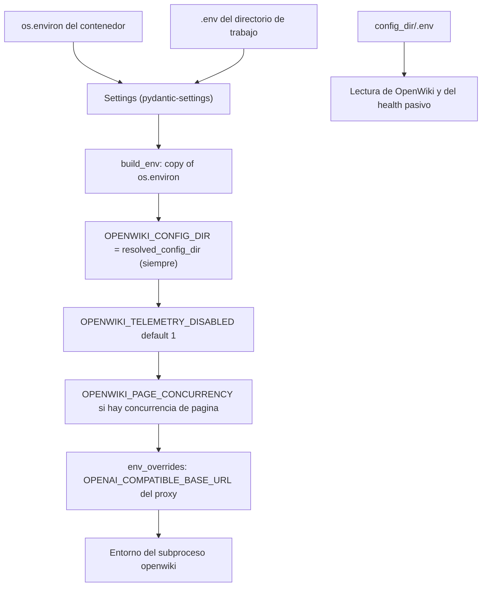

# Configuración y variables de entorno

Todo el estado configurable del servicio vive en la clase `Settings` de
`app/core/config.py`, una `BaseSettings` de `pydantic-settings`. Ese archivo es la
única superficie de configuración: nada más en `app/` lee variables de entorno
para tomar decisiones (las credenciales del proveedor son la excepción
deliberada, ver abajo).

```python
model_config = SettingsConfigDict(
    env_file=".env",
    env_file_encoding="utf-8",
    extra="ignore",
)
```

Tres consecuencias operativas de esa declaración:

- **El entorno gana sobre el `.env` del proyecto.** El `.env` que lee
  `pydantic-settings` es el del directorio de trabajo (`.`, es decir `/app` en la
  imagen, o la raíz del repo en desarrollo), no el del config dir de OpenWiki.
  Una variable exportada en el contenedor siempre reemplaza el valor del archivo.
- **`extra="ignore"`**: las variables desconocidas se ignoran en silencio. Cualquier
  `OPENWIKI_*`, `OPENAI_API_KEY`, etc. que solo interese al CLI puede convivir en
  el mismo entorno sin provocar errores de validación.
- Las variables de OpenWiki que **no** son del servicio no se declaran aquí; se
  reenvían al subproceso tal cual (ver
  [/openwiki/integrations/model-providers.md](/openwiki/integrations/model-providers.md)).

## Tabla por dominio

Los nombres de campo son los de `Settings`; la variable de entorno es el mismo
nombre en mayúsculas.

### Invocación del CLI

| Variable | Default | Efecto |
| --- | --- | --- |
| `OPENWIKI_BIN` | `openwiki` | Comando del CLI. `split_command` lo divide en argv (con `shlex.split` y, en Windows, `posix=False`), de modo que admite `"python" "script.py"` — es lo que usan los tests con el CLI simulado. Si el binario no existe, `run_openwiki` lanza `OpenWikiRunError` en vez de fallar con un traceback. |
| `OPENWIKI_CONFIG_DIR` | — (forzado) | Directorio de estado de OpenWiki (credenciales, install id). El servicio **siempre** lo sobrescribe; ver «Variables que el servicio fuerza». |

### Almacenamiento

| Variable | Default | Efecto |
| --- | --- | --- |
| `DATA_DIR` | `/data` (Linux/contenedor) · `./data` (Windows) | Raíz del estado persistente: `openwiki.db`, `jobs/` y, por defecto, el config dir de OpenWiki. Se resuelve con `_default_data_dir()`, que en `os.name == "nt"` devuelve `Path.cwd() / "data"` para que el desarrollo en Windows no escriba en `C:\data`. |

### Límites de job

| Variable | Default | Efecto |
| --- | --- | --- |
| `JOB_TIMEOUT_MINUTES` | `45` | Timeout de una generación. `run_openwiki` lo convierte a segundos y mata el proceso al superarlo, dejando `openwiki exceeded the N minute timeout and was killed` en el log. |
| `MAX_UPLOAD_MB` | `200` | Tamaño máximo de `POST /wikis/upload`. `save_upload` corta el stream en cuanto lo supera, borra el archivo parcial y el endpoint responde `413`. |
| `MAX_EXTRACTED_MB` | `1024` | Tamaño **descomprimido** máximo de un zip/tar subido. `extract_archive` suma `file_size`/`size` de todas las entradas antes de extraer, así que el límite protege frente a bombas de compresión además de frente a archivos grandes. |
| `DEFAULT_PAGE_CONCURRENCY` | `2` | Valor de `OPENWIKI_PAGE_CONCURRENCY` cuando la wiki no trae `concurrency` propia. El valor por job (`concurrency` en `POST /wikis`, 1–8) tiene prioridad; esta es solo la caída. |
| `JOB_RETENTION_HOURS` | `0` | `0` conserva las wikis terminadas indefinidamente. Con `>0`, el `lifespan` de la API llama a `purge_expired` al arrancar y borra fila, workspace, logs y zip de las wikis en estado terminal acabadas hace más de N horas. |
| `LOG_TAIL_DEFAULT` | `50` | Declarado en `Settings` pero **sin consumidores**: `GET /wikis/{id}/logs` usa su propio default de query (`tail=50`, máximo `2000` en `MAX_LOG_TAIL`). Cambiarlo no altera la respuesta de la API. |

### Pool de workers

| Variable | Default | Efecto |
| --- | --- | --- |
| `RUN_LOCAL_WORKER` | `false` | Arranca un `WorkerLoop` dentro del proceso de la API desde el `lifespan` de `create_app()`. Solo para un contenedor / desarrollo / tests. |
| `WORKER_ID` | hostname del contenedor | Identidad del worker en la cola (`claimed_by`) y en la tabla `workers`. Con cadena vacía o solo espacios, `WorkerLoop` cae a `socket.gethostname()`. |
| `MAX_CONCURRENT_JOBS` | `1` | Generaciones simultáneas **por contenedor**: crea ese número de tareas `_runner`. La concurrencia a escala se da con réplicas (`--scale worker=N`), no subiendo este valor. |
| `WORKER_POLL_SECONDS` | `2.0` | Espera entre intentos de `claim_next` cuando la cola está vacía. |
| `WORKER_PROGRESS_SECONDS` | `2.0` | Frecuencia del heartbeat y del progreso leídos de `openwiki/.run.json` mientras corre la generación. |
| `WORKER_LEASE_SECONDS` | `180` | Si un claim no recibe heartbeat durante este tiempo, la API lo reencola (`recover_stale`) y otro worker lo reanuda en el mismo workspace. |
| `WORKER_REAP_SECONDS` | `30` | Periodo del barrido `_reap_loop` de la API, que reencola claims caducados y poda workers olvidados. |

### Health del modelo

| Variable | Default | Efecto |
| --- | --- | --- |
| `MODEL_CHECK_TTL_SECONDS` | `30` | Ventana de caché de `GET /health/model` en `ModelStatusCache`. `0` desactiva la caché: cada llamada golpea al proveedor. El TTL se evalúa con `max(value, 0)`, así que un valor negativo se comporta como `0`. |
| `MODEL_CHECK_TIMEOUT_SECONDS` | `20` | Timeout de la prueba activa. Al agotarse, el resultado es `status: error` con `model did not answer within Ns`. |

### Proxy OpenAI-compatible

| Variable | Default | Efecto |
| --- | --- | --- |
| `OPENAI_COMPATIBLE_BASE_URL` | — | Base URL real del gateway. El servicio no la pasa al CLI directamente: cuando hay cabeceras extra, apunta el CLI al proxy y el proxy reenvía a esta URL. |
| `OPENAI_COMPATIBLE_EXTRA_HEADERS` | — | Objeto JSON de cabeceras que OpenWiki no sabe enviar. Se parsea y valida en `parse_extra_headers`; si no incluye `User-Agent`, se añade `openwiki-service/<versión>`. |
| `COMPAT_PROXY_PORT` | `9100` | Puerto loopback del proxy (`0` elige uno libre, lo que usan los tests). El proxy escucha solo en `127.0.0.1` dentro del proceso que lo arranca. |

### Seguridad

| Variable | Default | Efecto |
| --- | --- | --- |
| `ALLOW_LOCAL_GIT` | `false` | Habilita clonar rutas locales y `file://`. Con `false`, `validate_git_url` rechaza `file://` con `file:// URLs are disabled (set ALLOW_LOCAL_GIT=true to enable)` y cualquier URL sin esquema con `source.url must be an http(s) or ssh git URL`. **Solo desarrollo**: activarlo en producción convierte la API en un lector del sistema de archivos del contenedor. |

### Push

| Variable | Default | Efecto |
| --- | --- | --- |
| `PUSH_AUTHOR_NAME` | `openwiki-service` | Identidad del commit que crea `push`. `publish_wiki` la pasa como `git -c user.name=...`, sin depender de la config global del contenedor. |
| `PUSH_AUTHOR_EMAIL` | `openwiki-service@localhost` | Email del mismo commit. |

### Artefacto

| Variable | Default | Efecto |
| --- | --- | --- |
| `WIKI_ARTIFACT_DIR` | `.openwiki` | Nombre de la carpeta raíz dentro de `wiki.zip` y del árbol que commitea `push`. **No** renombra el workspace: OpenWiki siempre escribe `openwiki/`. Ver [/openwiki/concepts/wiki-artifact-and-paths.md](/openwiki/concepts/wiki-artifact-and-paths.md). |

## Credenciales del proveedor: una omisión intencionada

`Settings` declara explícitamente que **no** declara `OPENAI_API_KEY`,
`ANTHROPIC_API_KEY` ni ninguna otra credencial:

```python
#: Provider credentials (``OPENAI_API_KEY``, ``ANTHROPIC_API_KEY``, ...) are not
#: declared here on purpose: they stay in the process environment and are
#: forwarded to the OpenWiki subprocess untouched.
```

El motivo es que el servicio no habla con el proveedor: solo construye el entorno
del subproceso. `build_env` copia `os.environ` y sobrescribe **únicamente**
variables propias del servicio, así que declarar las credenciales crearía una
segunda fuente de verdad, obligaría a reenviarlas explícitamente y haría que un
error de tipeo en el nombre de un campo rompiera el arranque en lugar de la
llamada al modelo. Tampoco hay almacén de credenciales: `/health` puede informar
*si* existe una credencial y *de dónde* sale, pero nunca su valor.

## Invariantes de validación

Los `field_validator` de `Settings` convierten errores de configuración en fallos
de arranque, en vez de en comportamiento raro en tiempo de ejecución:

| Campo | Regla | Motivo |
| --- | --- | --- |
| `default_page_concurrency` | `1 <= value <= 8` | Es el valor por defecto de `OPENWIKI_PAGE_CONCURRENCY`, y el mismo rango que valida `WikiCreate.concurrency` (`ge=1, le=8`) y el formulario de upload. Un valor fuera de rango se rechazaría igual al construir el job, así que se corta antes: la API y el CLI comparten una única cota superior. |
| `job_timeout_minutes`, `max_upload_mb`, `max_concurrent_jobs`, `model_check_timeout_seconds`, `worker_lease_seconds`, `worker_reap_seconds` | `value >= 1` (`_check_positive`) | Son todos cantidades de las que depende que el sistema progrese. `job_timeout_minutes=0` mataría cada generación al instante, `worker_lease_seconds=0` reencolaría claims vivos y `model_check_timeout_seconds=0` haría imposible cualquier prueba. |
| `worker_poll_seconds`, `worker_progress_seconds` | `value > 0` (`_check_positive_seconds`) | Un intervalo de `0` convierte el bucle de sondeo o el heartbeat en un busy-loop que satura SQLite; se aceptan flotantes, no solo enteros. |
| `compat_proxy_port` | `0 <= value <= 65535` | Rango de puerto TCP, con `0` como «elige un puerto libre» (lo que usan los tests). Un valor fuera de rango fallaría dentro de `uvicorn` en vez de al arrancar. |
| `wiki_artifact_dir` | `strip()`, no vacío, distinto de `.` y `..`, sin `/` ni `\` | Debe ser un **nombre simple de carpeta**: el valor se convierte en el nombre de la entrada raíz dentro del zip (`f"{root_name}/..."`) y en un pathspec de `git add`. Aceptar separadores permitiría escribir fuera del zip o commitear rutas arbitrarias del workspace. |
| `push_author_name`, `push_author_email` | `strip()`, no vacío | Van dentro de `git -c user.name=...`; un valor vacío produce un commit con identidad inválida y git falla de forma opaca. |

`tests/test_wiki_state.py` cubre la invariante del artefacto de forma directa:
`Settings(wiki_artifact_dir=".openwiki")` es válido y `"bad/name"` lanza
`ValueError`.

## Rutas derivadas

Tres propiedades de `Settings` traducen configuración a rutas. Los consumidores
importan la propiedad en vez de componer rutas a mano:

| Propiedad | Valor | Consumidor |
| --- | --- | --- |
| `data_dir` | `DATA_DIR` o el default por plataforma | `JobStore(settings.data_dir)` en `create_app()` y en `app/worker/__main__.py` |
| `jobs_dir` | `data_dir / "jobs"` | Conveniencia; `JobStore` calcula el mismo valor en `__init__` y crea el directorio |
| `resolved_config_dir` | `openwiki_config_dir` o `data_dir / ".openwiki-config"` | `build_env` (lo exporta como `OPENWIKI_CONFIG_DIR`) y `model_status` (lee `<config_dir>/.env`) |

El `<config_dir>/.env` es el mecanismo de credenciales «de instalación» de
OpenWiki: `load_openwiki_env` lo parsea con un lector `KEY=VALUE` mínimo y luego
aplica `os.environ` encima, así que el entorno gana también en esta capa.

## Precedencia y variables forzadas

Hay tres capas de resolución, y conviene no confundirlas:



*Resolución en tres capas: el entorno del contenedor gana sobre el `.env` del proyecto para `Settings`, y `build_env` fuerza solo variables propias antes de lanzar el CLI.*

Lo que el servicio **fuerza** sobre el entorno heredado del subproceso:

- `OPENWIKI_CONFIG_DIR` — siempre, con `settings.resolved_config_dir`. Es lo que
  mantiene el estado de OpenWiki dentro del volumen persistente en lugar del
  home del usuario del contenedor.
- `OPENWIKI_TELEMETRY_DISABLED` — se pone a `1` solo si el entorno no lo trae ya
  definido (`env.get(..., "1")`), de modo que desactivar telemetría es el default
  pero sigue siendo anulable mediante la capa de entorno.
- `OPENWIKI_PAGE_CONCURRENCY` — solo cuando hay un valor de concurrencia, que es
  el `concurrency` del job si existe y, si no, `DEFAULT_PAGE_CONCURRENCY`.
- `OPENAI_COMPATIBLE_BASE_URL` — solo cuando el worker arrancó el proxy de
  cabeceras; el valor es `proxy.base_url` (`http://127.0.0.1:<puerto>/<path>`),
  nunca la URL real del gateway.

Como `build_env` parte de `os.environ` y aplica las anulaciones al final, el orden
efectivo es: entorno del contenedor → variables del servicio → overrides del
worker. Cualquier variable de OpenWiki que el usuario ponga en el entorno llega
intacta al CLI.

## Arranque: dónde se valida la configuración

La configuración no solo se valida al construir `Settings`; hay dos puntos de
fallo temprano relevantes para operación:

- `create_app()` llama a `parse_extra_headers` cuando
  `OPENAI_COMPATIBLE_EXTRA_HEADERS` está definido, **antes** de construir nada más.
  Un JSON inválido aborta la construcción de la app (`ValueError`), en vez de
  aparecer como 500 en la primera petición proxeada.
  `tests/test_provider_proxy.py::test_create_app_rejects_invalid_extra_headers`
  fija ese comportamiento.
- `WorkerLoop.start()` vuelve a parsear el mismo valor antes de decidir si levanta
  el proxy, y solo lo levanta si además hay `OPENAI_COMPATIBLE_BASE_URL`. Por eso
  el contenedor `worker` y el worker in-process (activado por `RUN_LOCAL_WORKER`)
  arrancan el proxy de la misma forma: la propiedad del proxy es del worker, no de
  la API, y `create_app()` expone su handle en `app.state.proxy` solo cuando el
  worker es in-process.

`GET /health` publica además una vista sin secretos de configuración operativa:
`openwiki_bin`, si el binario está en el `PATH` (`openwiki_found`), `data_dir`,
las estadísticas del pool y el bloque `model` pasivo.

## Configuración en la imagen y en Compose

Parte de la configuración efectiva no está en `.env` sino en el build y el compose,
lo que explica diferencias entre desarrollo y contenedor:

- `Dockerfile` fija `DATA_DIR=/data`, `OPENWIKI_CONFIG_DIR=/data/.openwiki-config` y
  `OPENWIKI_TELEMETRY_DISABLED=1` como `ENV` de la imagen, de modo que los valores
  coinciden con lo que `build_env` forzaría igualmente.
- `OPENWIKI_VERSION` es un **build arg** (default `0.6.0`), no una variable de
  runtime: actualizar el CLI es reconstruir la imagen, sin tocar el código del
  servicio.
- `docker-compose.yml` reafirma `DATA_DIR: /data` en ambos servicios y define
  `JOB_TIMEOUT_MINUTES: ${JOB_TIMEOUT_MINUTES:-60}` para el worker, es decir **60
  minutos de default en Compose frente a los 45 de `Settings`**. Es una divergencia
  fácil de olvidar al diagnosticar timeouts.
- `env_file` apunta a `.env` con `required: false`, así que el stack arranca sin
  archivo de entorno (y fallará en `/health/model` con `not_configured`, no al
  construir la app).

Los tests evitan depender de variables del entorno del desarrollador construyendo
`Settings` explícitamente en el fixture `settings` de `tests/conftest.py`
(`OPENWIKI_BIN` apuntando al CLI simulado, `RUN_LOCAL_WORKER` y `ALLOW_LOCAL_GIT`
activados, intervalos reducidos) y el CLI falso no necesita proveedor de modelos.

## Errores frecuentes

- **Cambiar `WIKI_ARTIFACT_DIR` esperando que renombre el workspace.** No lo hace;
  solo afecta al zip y al commit.
- **Bajar `WORKER_LEASE_SECONDS` por debajo de `WORKER_PROGRESS_SECONDS`.** El
  heartbeat y el barrido compiten: con `2s` de progreso y, p. ej., `1s` de lease
  cualquier generación se reencolaría continuamente.
- **Poner `JOB_TIMEOUT_MINUTES=0` «para no tener timeout».** El validador lo
  rechaza; el timeout es la única protección frente a un CLI colgado dentro de un
  claim vivo.
- **Definir `OPENAI_COMPATIBLE_EXTRA_HEADERS` sin `OPENAI_COMPATIBLE_BASE_URL`.** No
  se levanta proxy alguno (no hay upstream al que reenviar); `/health` sigue
  listando los nombres de cabecera, lo que puede dar la falsa impresión de que la
  inyección está activa.
- **Esperar que `/health/model` respete `COMPAT_PROXY_PORT`.** La prueba activa
  habla con el upstream real enviando las mismas cabeceras extra, no a través del
  proxy.

## Páginas relacionadas

- [/openwiki/concepts/wiki-artifact-and-paths.md](/openwiki/concepts/wiki-artifact-and-paths.md) — `WIKI_ARTIFACT_DIR` frente al `openwiki/` que exige el CLI y el layout de `jobs/`.
- [/openwiki/integrations/model-providers.md](/openwiki/integrations/model-providers.md) — variables del proveedor, capas de resolución y el proxy de cabeceras.
- [/openwiki/integrations/openwiki-cli.md](/openwiki/integrations/openwiki-cli.md) — qué variables recibe el subproceso y cómo se invoca.
- [/openwiki/operations/deployment.md](/openwiki/operations/deployment.md) — imagen, Compose, escalado por réplicas y valores de entorno por servicio.

## Tests enfocados

- `tests/test_wiki_state.py` — invariante de `wiki_artifact_dir` (acepta
  `.openwiki`, rechaza `bad/name`) junto al resto del estado de ejecución.
- `tests/test_provider_proxy.py` — rechazo de `OPENAI_COMPATIBLE_EXTRA_HEADERS`
  inválido en `create_app` y, en `test_wikis_point_openwiki_at_the_proxy`, que el
  subproceso recibe la URL del proxy (`compat_proxy_port=0`) y no la upstream.
- `tests/test_model_status.py::test_environment_overrides_config_dir_env` — la
  precedencia entorno-sobre-`config_dir/.env` y las fuentes reportadas por
  `/health`.
- `tests/conftest.py` — el fixture `settings` es el ejemplo canónico de una
  configuración de desarrollo completa sin proveedor real.
