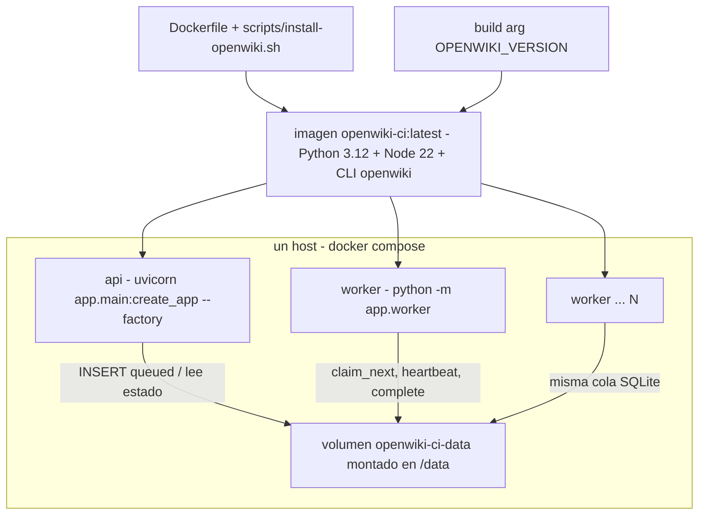

# Despliegue: imagen Docker, compose y escalado

El servicio se empaqueta como **una sola imagen** que se ejecuta de **dos formas**:
el contenedor `api` sirve HTTP y el contenedor `worker` genera las wikis. Ambos
comparten la misma imagen, el mismo volumen y el mismo contrato de datos, descrito
en [/openwiki/architecture/overview.md](/openwiki/architecture/overview.md) y
[/openwiki/architecture/job-store.md](/openwiki/architecture/job-store.md).



*Una imagen, dos comandos: la API y los workers solo se encuentran en el volumen compartido.*

## La imagen: qué queda horneado

`Dockerfile` parte de `python:3.12-slim` y añade Node 22 porque el CLI de OpenWiki
es un paquete npm:

- **Paquetes del sistema**: `ca-certificates curl gnupg git` y Node 22 instalado
  desde el repositorio de NodeSource (`NODE_MAJOR=22`). `git` sirve para clonar
  repositorios; `curl` es el que usa el `HEALTHCHECK`.
- **CLI OpenWiki horneado**: `scripts/install-openwiki.sh` se copia a
  `/usr/local/bin` y hace `npm install --global openwiki@${OPENWIKI_VERSION}`. El
  script reintenta una vez tras instalar `build-essential`, porque
  `better-sqlite3` puede necesitar compilar cuando no existe binario precompilado
  para el ABI de Node. Termina comprobando la instalación con
  `npm ls --global --depth=0 openwiki`.
- **Servicio Python**: `COPY pyproject.toml README.md ./`, `COPY app ./app` y
  `pip install .` — el paquete se instala, no se monta en caliente.
- **Usuario no privilegiado**: `useradd --create-home --uid 10001 appuser`; `/app`
  y `/data` pasan a ser suyos (`chown -R appuser:appuser`) y el contenedor arranca
  con `USER appuser`.
- **git y propietarios ajenos**: `git config --system --add safe.directory '*'`.
  Los repositorios montados o clonados pueden pertenecer a otro usuario y git solo
  honra `safe.directory` desde la configuración de sistema o global; sin esta línea
  un `git clone`/`openwiki` fallaría con `dubious ownership`. Fuera de Docker hay
  que replicarlo a mano con `git config --global --add safe.directory <ruta>`.

El entorno de la imagen fija las rutas de estado:

| Variable | Valor en la imagen | Efecto |
| --- | --- | --- |
| `DATA_DIR` | `/data` | Estado persistente: `openwiki.db`, `jobs/`, logs y `wiki.zip`. |
| `OPENWIKI_CONFIG_DIR` | `/data/.openwiki-config` | Credenciales e identidad del CLI, dentro del volumen. |
| `OPENWIKI_TELEMETRY_DISABLED` | `1` | Telemetría del CLI desactivada. |
| `PYTHONDONTWRITEBYTECODE`, `PYTHONUNBUFFERED`, `PIP_NO_CACHE_DIR` | `1` | Imagen limpia y logs sin búfer. |

El valor por defecto de `data_dir` en `Settings` coincide con esta decisión: `/data`
en Linux y `./data` en Windows, donde no hay contenedor.

### Build arg `OPENWIKI_VERSION`

La versión del CLI vive en el `ARG OPENWIKI_VERSION=0.6.0` del `Dockerfile` y se
inyecta al script como variable de entorno. Actualizar OpenWiki es reconstruir la
imagen, sin tocar código del servicio; los comandos exactos están en
[Actualizar OpenWiki](#actualizar-openwiki) y el contrato con el CLI en
[/openwiki/integrations/openwiki-cli.md](/openwiki/integrations/openwiki-cli.md).
`.dockerignore` deja fuera `.git`, `.venv`, `data`, `tests`, `__pycache__`,
`.pytest_cache`, `.env` y `*.egg-info`, de modo que un `.env` o un volumen local no
se cuelan en el contexto de build.

### Arranque, puerto y healthcheck

- `EXPOSE 8000` y `CMD ["uvicorn", "app.main:create_app", "--factory", "--host", "0.0.0.0", "--port", "8000"]`.
  El flag `--factory` es obligatorio: `app.main:create_app` es una función fábrica,
  no un objeto `app`; los modos de ejecución local se detallan abajo.
- `HEALTHCHECK --interval=15s --timeout=5s --start-period=15s --retries=3 CMD curl -fsS http://127.0.0.1:8000/health || exit 1`.
  El endpoint es barato y nunca llama al proveedor de modelos; su contenido (pool de
  workers, configuración del modelo) se detalla en
  [/openwiki/operations/observability-and-recovery.md](/openwiki/operations/observability-and-recovery.md).
  Esto solo tiene sentido para el contenedor `api`; por eso el servicio `worker` del
  compose desactiva el healthcheck heredado (ver abajo).

## `docker-compose.yml`: servicios `api` y `worker`

El compose construye la imagen una vez y la usa en los dos servicios:

| Aspecto | `api` | `worker` |
| --- | --- | --- |
| Imagen | `openwiki-ci:latest`, con `build.context: .` y `args.OPENWIKI_VERSION: ${OPENWIKI_VERSION:-0.6.0}` | `openwiki-ci:latest` (sin `build`, reutiliza la imagen) |
| Comando | el `CMD` de la imagen (`uvicorn ... --factory`) | `["python", "-m", "app.worker"]` |
| Puerto | `8000:8000` | ninguno |
| Healthcheck | el de la imagen (`curl /health`) | `disable: true` |
| Volumen | `openwiki-ci-data:/data` | `openwiki-ci-data:/data` |
| Reinicio | `restart: unless-stopped` | `restart: unless-stopped` |
| Dependencias | — | `depends_on: [api]` |

Detalles que importan en operación:

- **Misma imagen, comando distinto.** El worker no redefine `build`: si se cambia
  `OPENWIKI_VERSION`, hay que reconstruir y recrear ambos servicios para que no
  queden contenedores con una versión antigua del CLI.
- **Healthcheck desactivado en el worker.** El `HEALTHCHECK` de la imagen sondea
  `http://127.0.0.1:8000/health`, un puerto que el worker no escucha; sin
  `disable: true` cada réplica aparecería como `unhealthy` y en un orquestador que
  reinicia ante fallo entraría en un bucle de reinicios.
- **`.env` opcional en ambos.** `env_file` usa la forma larga con
  `required: false`, así que el stack arranca aunque no exista `.env` (útil para
  `RUN_LOCAL_WORKER=true` sin proveedor configurado) — pero una generación real
  fallará si no hay proveedor de modelos. El reparto de variables está en
  [/openwiki/operations/configuration.md](/openwiki/operations/configuration.md).
- **Ajustes propios del worker.** El compose le pasa
  `MAX_CONCURRENT_JOBS: ${MAX_CONCURRENT_JOBS:-1}` y
  `JOB_TIMEOUT_MINUTES: ${JOB_TIMEOUT_MINUTES:-60}`. Ojo al segundo: el compose
  usa **60** minutos por defecto mientras `Settings.job_timeout_minutes` vale
  **45**; fuera del compose rige 45.
- **`restart: unless-stopped`** en ambos: un `docker compose restart`/reinicio del
  host no deja el stack caído, y `docker compose down --scale worker=0` no es
  necesario para parar workers (basta con bajar réplicas).
- **Sin `depends_on` en sentido inverso**: `worker` espera al `api` solo para
  ordenar el arranque. No hay dependencia de runtime, como se explica abajo.

### Cómo se comunican `api` y `worker`: solo el volumen

Los contenedores **no se llaman entre sí**. El único canal es el volumen
`openwiki-ci-data` montado en `/data` en ambos:

- `<data_dir>/openwiki.db` — SQLite en modo **WAL** con dos tablas: `wikis` (cola y
  estado) y `workers` (liveness). El reparto de claims es atómico
  (`BEGIN IMMEDIATE` + `UPDATE ... WHERE status='queued'`), así que cualquier
  número de réplicas puede reclamar sin coordinación externa.
- `<data_dir>/jobs/<wiki_id>/` — workspace del clon (`repo/`), `logs.txt` y el
  `wiki.zip` resultante. La API **lee** esos ficheros para `/wikis/{id}/logs` y
  `/wikis/{id}/download`; el worker los escribe.
- `<data_dir>/.openwiki-config/` — estado del CLI OpenWiki (credenciales,
  identidad), compartido por todas las generaciones.

Consecuencias operativas directas:

- **La API no genera nada**, así que se puede reiniciar o redeployar sin matar
  generaciones en curso: los workers siguen con sus subprocesos.
- **Los workers no necesitan la API viva** para terminar lo reclamado; si la API
  cae, dejan de reencolarse claims caducados hasta que vuelva.
- **Los leases son el mecanismo de recuperación**: si un worker muere, la API
  reencola su claim tras `WORKER_LEASE_SECONDS` (`recover_stale` en el reaper del
  `lifespan`) y otro worker la retoma en el mismo workspace, porque el estado del
  plan vive en `openwiki/.run.json` dentro de `jobs/<wiki_id>/repo/`. Detalles en
  [/openwiki/architecture/worker-pool.md](/openwiki/architecture/worker-pool.md).
- Al ser una sola base SQLite local, el volumen **no se puede compartir entre
  hosts** de forma segura (ver [Un host, y cómo pasar a multi-host](#un-host-y-cómo-pasar-a-multi-host)).

## Comandos operativos

### Arrancar, escalar y observar

```bash
# arranque inicial (construye la imagen y levanta 2 workers)
docker compose up --build -d --scale worker=2

# escalar workers en caliente (misma imagen, misma cola)
docker compose up -d --scale worker=4

# ver el estado de los contenedores y sus réplicas
docker compose ps

# sonda barata: nunca llama al proveedor de modelos
# pool.workers = workers vistos en los últimos 120 s
curl http://localhost:8000/health
```

`docker compose up -d --scale worker=N` es la palanca de escalado: cada réplica
reclama de la misma cola SQLite sin coordinación añadida. La concurrencia por
contenedor es `MAX_CONCURRENT_JOBS` (por defecto `1`); subirlo multiplica
subprocesos del CLI, `git clone` y uso de disco dentro de la misma caja, por eso la
vía recomendada es añadir réplicas. `pool.workers` en `/health` cuenta filas
recientes de la tabla `workers` (TTL 120 s, `prune_workers` olvida a los 3600 s), y
un worker ocupado en una generación larga deja de contarse hasta que vuelve a
sondear la cola: es un contador de workers libres recientes, no de procesos vivos.

### Construir fijando la versión del CLI

```bash
docker compose build --build-arg OPENWIKI_VERSION=0.7.0
docker compose up -d
```

### Modo de un solo contenedor (dev)

Para desarrollo o pruebas sin réplicas de worker, la API puede hospedar un worker
dentro de su propio proceso:

```bash
# descomenta RUN_LOCAL_WORKER: "true" en el servicio api, o exporta la variable
docker compose up -d          # sin --scale worker
```

`RUN_LOCAL_WORKER=true` arranca un `WorkerLoop` en el `lifespan` de `create_app()`
(guardado en `app.state.worker`) y lo detiene en el `finally` junto con el reaper.
Es el mismo bucle y el mismo pipeline que usan los contenedores de worker, por lo
que dev y tests ejercitan la ruta de producción; la limitación es que escalar
implica entonces escalar la API, no solo el worker.

### Ejecución local sin Docker

```bash
# con uv (https://docs.astral.sh/uv/)
uv venv --python 3.12
uv pip install -e ".[test]"

# API + un worker in-process (dev)
RUN_LOCAL_WORKER=true uv run uvicorn app.main:create_app --factory --reload

# o en dos procesos, como en Docker (el worker reclama de la cola SQLite)
uv run uvicorn app.main:create_app --factory
uv run python -m app.worker
```

El flag `--factory` debe estar siempre presente: `app.main:create_app` es la
fábrica. En local, `DATA_DIR` cae a `./data` (o al path que exportes) y, si git
rechaza un repositorio por `dubious ownership`, hace falta el
`git config --global --add safe.directory <ruta>` que la imagen configura a nivel
de sistema.

## Actualizar OpenWiki

```bash
# fija la nueva versión en el build (recomendado)
docker compose build --build-arg OPENWIKI_VERSION=0.7.0
docker compose up -d

# o directamente con la última publicada
docker compose build --build-arg OPENWIKI_VERSION=latest
```

El `build arg` solo cambia el paquete npm que se instala dentro de la imagen. No hay
que tocar código del servicio mientras el CLI mantenga `openwiki --init -p`; si la
interfaz del CLI cambia, el único archivo a modificar es
`app/services/wiki_runner.py`, como se documenta en
[/openwiki/integrations/openwiki-cli.md](/openwiki/integrations/openwiki-cli.md).
`OPENWIKI_VERSION=latest` es cómodo pero no reproducible: para producción conviene
fijar la versión y reconstruir de forma deliberada.

## Un host, y cómo pasar a multi-host

El diseño asume **un solo host con un volumen local**:

- La cola es `app/core/storage.py`, un `JobStore` sobre SQLite (`openwiki.db`, WAL)
  con una conexión por proceso.
- Los artefactos son un árbol de directorios local (`jobs/<wiki_id>/`) que la API
  lee y el worker escribe.
- Por eso `docker compose --scale worker=N` escala **réplicas en la misma caja**,
  no un clúster.

Para escalar entre hosts hay que sustituir el backend de la cola: reimplementar
`app/core/storage.py` sobre Postgres manteniendo los mismos métodos
(`claim_next`, `heartbeat`, `complete`, `recover_stale`, `stats`, ...) y aportar un
volumen compartido para `jobs/`. Los invariantes que esa implementación debe
preservar son los que hoy hace SQLite: entrega atómica y exclusiva de un claim,
latido que caduca el lease, cierre condicionado al `claim_id` (un claim obsoleto no
puede cerrar una fila reencolada) y reencolado de claims sin heartbeat. Ese
contrato está descrito en [/openwiki/architecture/job-store.md](/openwiki/architecture/job-store.md).

## Usuario `appuser` y `safe.directory`

Dos detalles del contenedor que suelen morder al montar volúmenes propios:

- El proceso corre como `appuser` (UID `10001`, sin privilegios). Si montas un
  directorio del host en `/data` en lugar de usar el volumen nombrado, debe ser
  escribible por ese UID; un bind mount propiedad de `root` produce fallos al crear
  `openwiki.db` o `jobs/`. El `chown -R appuser:appuser /data /app` de la imagen
  solo aplica a la capa de imagen, no al volumen montado encima.
- `git config --system --add safe.directory '*'` es deliberadamente permisivo:
  dentro del contenedor todos los repositorios son clones efímeros propiedad de
  `appuser` o de un montaje de otro propietario, y git exige confiar en ellos para
  no abortar por `dubious ownership`. Fuera de Docker no existe y hay que
  configurarlo por ruta.

## Qué cubre la suite de tests

Como el despliegue real no se puede arrancar desde los tests, la cobertura ataca
las piezas que sostienen el compose:

- `tests/conftest.py` construye `Settings` con `openwiki_bin` apuntando a
  `tests/fixtures/fake_openwiki.py`, `allow_local_git=True` y
  `run_local_worker=True` (además de reducir los intervalos de sondeo, heartbeat y
  timeout), de modo que los tests de la API recorren el pipeline completo con el
  worker in-process: la misma ruta que el modo de un solo contenedor.
- `tests/test_worker_queue.py` valida el contrato de la cola que comparten `api` y
  `worker`: claim atómico y exclusivo entre conexiones distintas al mismo
  `openwiki.db`, heartbeat/cancel/complete con `claim_id` obsoleto, reencolado de
  claims caducados, `stats` y `prune_workers`, y migración de registros legados.
- `tests/test_health.py` comprueba que `/health` responde `status: ok` con
  `pool.workers` contando al worker local, que es lo que sondea el `HEALTHCHECK` de
  la imagen.

## Puntos de extensión

- **Nueva versión del CLI**: `--build-arg OPENWIKI_VERSION=x.y.z`; no hay cambio de
  código salvo que la interfaz del CLI cambie.
- **Más capacidad**: `--scale worker=N` sobre la misma imagen y el mismo volumen.
  Solo cambia `MAX_CONCURRENT_JOBS` si quieres más generaciones por caja.
- **Otro backend de cola/estado**: sustituir `app/core/storage.py` por una
  implementación con los mismos métodos (Postgres) y añadir un volumen de
  artefactos compartido: es el camino a multi-host.
- **Un solo contenedor**: `RUN_LOCAL_WORKER=true` sin réplicas de `worker`.
