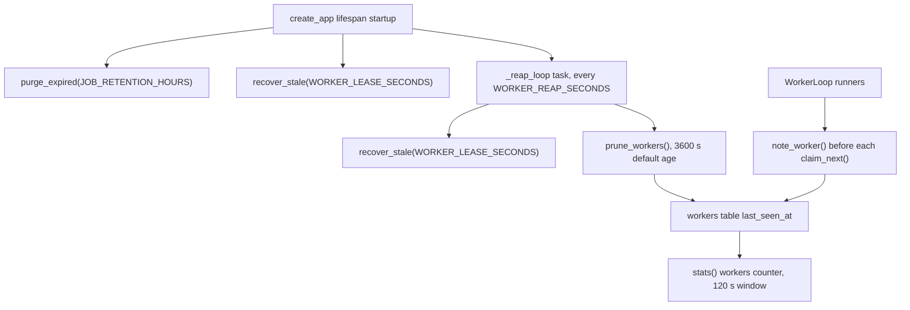

# Observabilidad, mantenimiento y límites conocidos

El servicio es deliberadamente silencioso: la API solo encola, lee estado y reencola claims obsoletas,
mientras que los workers escriben todo lo que saben en la fila de SQLite y en el fichero de log de cada
wiki. Por eso cada señal de diagnóstico de esta página tiene exactamente un propietario y una ubicación
de almacenamiento, y observar el sistema nunca requiere conectarse a un proceso worker.

El ciclo de vida de una wiki (`queued → fetching → generating → finalizing → done`, o
`failed`/`cancelled`) y la maquinaria de claim/lease se documentan en
[/openwiki/architecture/job-store.md](/openwiki/architecture/job-store.md); esta página cubre lo que esos
mecanismos exponen en tiempo de ejecución, lo que hay que mantener de forma periódica y lo que el MVP no
hace.

## `GET /health`: la instantánea pasiva

`GET /health` está diseñado para poder sondearse sin coste: nunca contacta con el proveedor del modelo, así
que no cuesta nada y no puede bloquearse por una red externa. `routers/health.py` construye la respuesta a
partir de `Settings`, el `JobStore` compartido y la descripción pasiva del modelo:

```json
{
  "status": "ok",
  "version": "<service version>",
  "openwiki_bin": "openwiki",
  "openwiki_found": true,
  "data_dir": "/data",
  "pool": { "queued": 0, "running": 1, "workers": 2 },
  "model": { "...": "describe_model(settings)" }
}
```

| Campo | Origen | Lectura |
| --- | --- | --- |
| `status` | constante `"ok"` | Solo liveness del proceso API; no implica que el modelo funcione. |
| `version` | `app.__version__` | Versión del servicio, no la del CLI de OpenWiki. |
| `openwiki_bin` / `openwiki_found` | `Settings.openwiki_bin` + `shutil.which` sobre su primer token argv (vía `split_command`) | Detecta un CLI mal configurado o ausente sin ejecutarlo. |
| `data_dir` | `Settings.data_dir` | Confirma el volumen montado que comparten los workers. |
| `pool` | `store.stats()` | Profundidad de la cola y workers **vistos recientemente**, ver abajo. |
| `model` | `describe_model(settings)` | Metadatos de proveedor/modelo/credencial, ver abajo. |

### `pool`: profundidad de cola y liveness de los workers

`JobStore.stats()` ejecuta una única consulta SQL y devuelve tres contadores:

- `queued` — filas con `status='queued'`.
- `running` — filas cuyo estado está en `RUNNING_STATUSES` (`fetching`, `generating`, `finalizing`).
- `workers` — filas de la tabla `workers` cuyo `last_seen_at` cae dentro de `worker_ttl_seconds`, que por
  defecto son **120 segundos**. `GET /health` llama a `stats()` sin argumentos, así que 120 s es la
  ventana efectiva.

Cada proceso worker refresca su propia fila con `note_worker()` antes de cada intento de `claim_next()`
(y también en `WorkerLoop.start()`), por lo que `workers` es un indicador de liveness, no un recuento de
réplicas: `docker compose ps` sigue siendo el comando correcto para eso. Dos workers en un mismo host que
mueran simultáneamente desaparecerán de este contador al cabo de dos minutos.

### `model`: configuración sin secretos

`describe_model()` refleja el entorno que OpenWiki lee realmente — el entorno del proceso superpuesto a
`<OPENWIKI_CONFIG_DIR>/.env`, ganando el entorno — y solo informa metadatos:

- `provider`, `provider_source` (`environment` / `config` / `default`);
- `model` y `model_source`;
- `credential_env`, `credential_present`, `credential_source` — **nunca** el valor de la credencial;
- `base_url` (pasado por `redact_url`) y `base_url_source`;
- `base_url_warning` / `suggested_base_url` cuando la base URL incluye incorrectamente una ruta de endpoint
  (por ejemplo `https://host/v1/chat/completions` en vez de `https://host/v1`);
- `extra_headers` como lista ordenada de **nombres** más `extra_headers_error`, para la configuración de
  gateway-proxy con `OPENAI_COMPATIBLE_EXTRA_HEADERS`;
- `probe_supported`, `note` (por qué un proveedor no puede sondearse) y `active_check_endpoint`.

## `GET /health/model`: la sonda activa

La comprobación activa es el único endpoint que gasta una llamada al proveedor; envía la petición de
completado más pequeña posible y confirma credenciales y conectividad de extremo a extremo. Los estados se
mapean a códigos HTTP así:

| `status` | HTTP | Significado |
| --- | --- | --- |
| `ok` | `200` | El proveedor respondió con contenido. |
| `unsupported` | `200` | La autenticación del proveedor no es una API key (Bedrock IAM, Copilot, ChatGPT login, Gemini Enterprise ADC) o el proveedor es desconocido. |
| `error` | `503` | Error HTTP, completado vacío (típico de gateways solo-streaming), respuesta HTML en lugar de JSON, o timeout. |
| `not_configured` | `503` | Falta una variable obligatoria; `detail` indica exactamente cuál. |

Los resultados se memoizan por instancia de aplicación mediante `ModelStatusCache` durante
`MODEL_CHECK_TTL_SECONDS` (`30` por defecto, `0` desactiva la caché); `?force=true` omite la caché, y la
respuesta incluye `cached`, `checked_at`, `latency_ms` y un `detail` redactado. Como una sonda cuesta una
llamada, mantén la caché activa al integrar esto en un health check de un orquestador. La matriz de
proveedores, las pistas de diagnóstico y la interacción con el proxy se detallan en
[/openwiki/workflows/model-health-check.md](/openwiki/workflows/model-health-check.md).

## Diagnóstico por wiki

`GET /wikis/{id}` devuelve la proyección `WikiView` de una fila, que es la superficie de depuración más
útil para una generación. `wiki_to_view()` mapea deliberadamente los nombres internos de `job` a los
nombres públicos de `wiki` y redacta la URL de git.

| Campo de `WikiView` | Columna de la fila | Qué te dice |
| --- | --- | --- |
| `status` | `status` | Posición en el ciclo de vida; los estados terminales son `done`, `failed`, `cancelled`. |
| `worker` | `claimed_by` | Qué worker (por defecto, el hostname del contenedor) reclamó la wiki por última vez. |
| `attempts` | `attempts` | Se incrementa en cada `claim_next()`; **no** lo reinician `retry` ni la recuperación de leases, así que cuenta en un único número los reintentos del usuario *y* los claims reclamados. |
| `progress` | `progress` | Cadena legible procedente del propio plan de OpenWiki, refrescada por el heartbeat del worker. |
| `pages` / `size_bytes` | `pages` / `size_bytes` | Se escriben cuando se empaqueta la wiki; `pages` también se informa durante `finalizing`. |
| `push_result` | `push_result` | Resultado del push opcional de vuelta al repositorio de origen. |
| `error` | `error` | Detalle terminal del fallo, truncado a 500 caracteres. |
| `created_at` / `started_at` / `finished_at` | mismos nombres | `started_at` lo fija el primer claim y se conserva entre reintentos (`COALESCE`), así que data el primer intento. |

El truncado de `error` ocurre donde se captura la excepción, no en el esquema: `WorkerLoop._run` escribe
`str(exc)[:500]` para fallos de dominio y `f"{type(exc).__name__}: {exc}"[:500]` para los inesperados, de
modo que un traceback desbocado nunca puede inflar la fila ni una respuesta de listado. `push_result`
también trunca su propio `detail` a 500 caracteres.

### De dónde sale `progress`

`progress` **no** lo inventa el worker; se lee del plan que OpenWiki persiste en el workspace.
`read_run_state()` parsea `openwiki/.run.json` y resume el plan en
`{phase, total, completed, pending, current}`, devolviendo `None` si el fichero falta o no se puede
parsear (una escritura a medias se tolera, nunca es fatal). `format_progress()` renderiza entonces
`"<completed>/<total> pages · <phase>"`, omitiendo la fase cuando no existe, y recurre a
`"<n> pages written"` mediante `packer.count_pages()` mientras el plan aún no existe.

`WorkerLoop._track` repite esa lectura cada `WORKER_PROGRESS_SECONDS` (2 s por defecto) en una tarea de
fondo y la envía con el heartbeat, así que:

- `progress` es también el **heartbeat**: si la fila deja de actualizarse durante `WORKER_LEASE_SECONDS`
  (180 s), el claim se considera muerto y la API lo reencola;
- una respuesta de heartbeat con `ok=False` significa que el lease se perdió (reclamado o completado en
  otro sitio) y el worker detiene la generación; `cancel=True` significa que se solicitó una cancelación.
  Ambos activan el evento de cancelación del pipeline;
- las transiciones de fase las reporta el propio pipeline mediante `heartbeat(status=...)` (`generating`
  tras la selección de modo, `finalizing` antes del empaquetado), que es la razón de que `status` y
  `progress` puedan aparecer ligeramente desincronizados durante un reinicio.

### Logs

`GET /wikis/{id}/logs?tail=N` es un tail en texto plano de `<data_dir>/jobs/<wiki_id>/logs.txt`. `tail` por
defecto es 50 y está limitado por `MAX_LOG_TAIL = 2000`; el endpoint lee el fichero con `deque(maxlen=tail)`
para que un log de varios megabytes nunca se cargue entero. Si el fichero de log no existe, devuelve un
cuerpo `200` vacío — útil porque una wiki puede estar `queued` sin log todavía.

Las líneas del log tienen dos garantías:

- **Timestamp** — cada línea escrita por el logger del pipeline o por la bomba del stream del CLI empieza
  con `[HH:MM:SS]` en UTC.
- **Redacción** — `redact_text()` enmascara las credenciales `user:password@` de las URLs, los valores de
  las cabeceras `Authorization`/`Private-Token` y el token propio de la wiki antes de escribir.
  `run_openwiki` recibe el token como `secrets` y aplica el mismo filtro a cada línea de stdout/stderr del
  CLI que va streameando.

El log también registra los eventos significativos que no son del modelo: la línea de comandos resuelta y
el `cwd`, el anuncio `openwiki plan: N pages planned, phase=...`,
`! openwiki killed: generation cancelled` y
`! openwiki exceeded the <N> minute timeout and was killed`. Trata el fichero como el registro
append-only de una wiki; se crea con la primera llamada de log y solo rota al borrar la wiki.

### `push_result`

Cuando se solicita `push` para un origen git, el objeto terminal `push_result` usa uno de los cuatro estados
de `PushResult`:

| Estado | Producido por | Notas |
| --- | --- | --- |
| `pushed` | `publisher.publish_wiki` | Lleva `branch` y `commit`. |
| `no_changes` | `publisher.publish_wiki` | El `HEAD` local ya coincide con la punta de la rama remota. |
| `skipped` | pipeline | `push.enabled: false`; se registra sin tocar el repositorio. |
| `failed` | `WorkerLoop._run` ante `publisher.PushError` | Fija `status=failed`, `error="push failed: ..."` y `push_result.detail`; el `wiki.zip` producido antes del push sigue siendo descargable. |

Todas las variantes llevan `branch` (cuando se conoce), `commit` (cuando se conoce), `detail` y `at` (UTC).
Un push fallido es, por tanto, un resultado recuperable y sin pérdida: la documentación generada existe y
`POST /wikis/{id}/retry` reanuda desde el workspace y reintenta el push.

## Mantenimiento periódico

Tres operaciones de mantenimiento mantienen acotado el estado compartido. Dos se ejecutan dentro del
proceso API; ninguna toca una generación en curso.



Las tareas de mantenimiento del arranque y periódicas de la API, y las escrituras de liveness de los
workers de las que dependen.

| Tarea | Disparador | Variable de ajuste | Efecto |
| --- | --- | --- | --- |
| `purge_expired` | Arranque del lifespan de `create_app()`, una vez | `JOB_RETENTION_HOURS` (`0` = desactivado, el valor por defecto) | Borra las filas `done`/`failed`/`cancelled` cuyo `finished_at` es anterior a la ventana de retención, junto con su workspace, logs y zip, vía `delete()`. |
| `recover_stale` | Arranque del lifespan **y** cada tick de `_reap_loop` | `WORKER_LEASE_SECONDS` (lease) y `WORKER_REAP_SECONDS` (periodo) | Reencola las filas en ejecución sin heartbeat dentro del lease, limpiando `claimed_by`, `claim_id`, `claimed_at`, `last_seen_at` y `cancel_requested` pero conservando `attempts`. |
| `prune_workers` | Cada tick de `_reap_loop`, justo después de `recover_stale` | Se llama con la edad por defecto de 3600 s | Borra las filas de `workers` que no se han visto en una hora, para que el registro no acumule hostnames de contenedores retirados. |

Algunas consecuencias operativas:

- `recover_stale` es la **única** forma automática de que una fila `fetching`/`generating`/`finalizing`
  vuelva a `queued`. Es idempotente y segura de ejecutar mientras se reinicia la API, que es la razón de que
  el lifespan la invoque explícitamente antes de arrancar el reaper.
- La relación sensata es `WORKER_LEASE_SECONDS >> WORKER_PROGRESS_SECONDS`: con los valores por defecto
  (180 s frente a 2 s) un worker puede perder aproximadamente noventa heartbeats consecutivos antes de ser
  declarado muerto. Bajar el lease hace la recuperación más rápida y más probables los falsos positivos.
- `prune_workers()` **nunca** es la causa de que se recupere un claim en ejecución; el prune solo elimina la
  entrada de liveness del registro, no el claim.
- La retención es borrado, no archivado. Si la wiki generada tiene valor, descarga el zip antes de que
  expire o deja `JOB_RETENTION_HOURS=0`.

## Rutas de recuperación

La mecánica de recuperación está documentada por completo en
[/openwiki/workflows/cancel-retry-and-resume.md](/openwiki/workflows/cancel-retry-and-resume.md); desde el
punto de vista de un operador, las señales son:

- **Cancel** — `POST /wikis/{id}/cancel` devuelve `cancelled` de inmediato para una wiki `queued`, o
  `cancelling` para una en ejecución. La cancelación de una ejecución en curso es cooperativa: el worker se
  entera en el siguiente heartbeat, mata el subproceso del CLI, y `_run` guarda `status=cancelled` con el
  texto del error.
- **Retry** — `POST /wikis/{id}/retry` solo acepta filas `failed`/`cancelled` (si no, `409`) y resetea
  `error`, `progress`, `finished_at` y todo el claim de vuelta a `queued`. `attempts` se conserva.
- **Pérdida de lease** — no hay nada que llamar; `recover_stale` reencola la fila y el siguiente worker
  continúa en el mismo workspace. El intento anterior simplemente deja de escribir, porque `complete()`
  solo se aplica cuando el `claim_id` aún coincide (`complete` devuelve `False` en caso contrario y el
  worker ignora ese resultado).
- **Apagado de un worker** — un runner cancelado deliberadamente **no** escribe un estado terminal, así que
  la wiki permanece en ejecución hasta que el reaper la reencola. Esto es lo que hace seguro
  `docker compose restart worker`.

### Si se pierde el workspace

Todo excepto la base de datos vive bajo `<data_dir>/jobs/<wiki_id>/`. Si se pierde el volumen o se borra el
directorio de una wiki:

- la fila sigue existiendo, así que `GET /wikis/{id}` sigue funcionando, pero el fichero de log ha
  desaparecido (respuesta vacía) y `wiki.zip` también (`404 wiki is not ready`);
- para un **origen git**, `retry` vuelve a reclamar la wiki y `run_pipeline._fetch` re-clona el repositorio
  desde cero — el token sigue en la fila, así que no hay que reenviar nada;
- para un **archivo subido**, el propio archivo de extracción era el directorio de la wiki: el pipeline lanza
  `IngestionError("the uploaded archive is no longer available; submit the wiki again")` y la wiki solo se
  puede arreglar volviendo a enviar el archivo;
- el estado de reanudación de OpenWiki (`openwiki/.run.json`) desaparece con el workspace, así que una
  generación git reiniciada parte de un clon nuevo y, según el origen, desde cero o desde una actualización
  incremental.

## Seguridad y límites conocidos (MVP)

Los límites declarados provienen del propio README del servicio y de las rutas de código que hay detrás:

- **Sin autenticación de la API.** Todos los endpoints, incluidos `POST /wikis` y `DELETE /wikis/{id}`,
  están abiertos. Ejecuta el servicio en una red privada o detrás de un reverse proxy que autentique; añadir
  un bearer token es el siguiente paso previsto.
- **Cola de un solo host.** La coordinación es un fichero SQLite (`<data_dir>/openwiki.db`, WAL) en un
  volumen compartido. Soporta un host con muchos contenedores; multi-host requiere sustituir
  `app/core/storage.py` por una implementación sobre Postgres que exponga los mismos métodos (`claim_next`,
  `heartbeat`, `complete`, `recover_stale`, ...).
- **El PAT se persiste.** El token de un repo privado se guarda dentro de la columna JSON `source` de la
  fila de la wiki en el volumen de datos, fuera de los logs y de las respuestas de la API (`WikiView.source_url`
  va redactado y el token nunca se proyecta). Esto es lo que permite reintentar sin reenviar credenciales, y
  también significa que la base de datos es un artefacto que contiene secretos.
- **`push` escribe en tu repositorio.** Con un token con permiso de escritura, la generación commitea
  `WIKI_ARTIFACT_DIR/` y hace push de `HEAD:refs/heads/<branch>`; revisa la rama destino. Un push fallido
  deja la wiki en `failed` con el detalle en `push_result`, pero con el zip descargable.
- **`ALLOW_LOCAL_GIT=true`** permite que `source.url` sea una ruta local o una URL `file://`.
  `validate_git_url` las rechaza con `file:// URLs are disabled (set ALLOW_LOCAL_GIT=true to enable)` cuando
  el flag está desactivado; activarlo en producción convierte la API en un lector del sistema de ficheros
  del contenedor. Mantenlo en `false` fuera de desarrollo.
- **Fronteras de confianza no testeadas.** La suite de tests ejecuta un CLI falso y un worker en proceso,
  así que la sonda contra un gateway real, el escalado multi-host y los despliegues autenticados los
  verifican los operadores, no los tests.

El despliegue, el escalado y la disposición de compose se cubren en
[/openwiki/operations/deployment.md](/openwiki/operations/deployment.md); todas las variables nombradas en
esta página están catalogadas en
[/openwiki/operations/configuration.md](/openwiki/operations/configuration.md).

## Tests focalizados

- `tests/test_worker_queue.py` — `test_stats_count_recent_workers` fija el contador de liveness de estilo 120 s,
  `test_prune_workers` cubre `prune_workers(0)` eliminando una fila del registro,
  `test_stale_claims_are_requeued` cubre que `recover_stale` deja intacto un claim reciente y reencola uno
  antiguo conservando `attempts`, y `test_complete_with_stale_claim_is_ignored` fija el `complete`
  condicionado al claim.
- `tests/test_wiki_state.py` — `test_read_run_state_summarizes_plan`,
  `test_read_run_state_tolerates_garbage` y `test_format_progress` fijan las cadenas exactas de `progress` y
  la tolerancia a un `openwiki/.run.json` ausente o mal formado.
- `tests/test_health.py::test_health` verifica la forma de `/health` y que el worker en proceso se cuenta
  (`pool.workers == 1`).
- `tests/test_model_status.py` cubre el bloque pasivo, la caché, la redacción de errores del proveedor y los
  diagnósticos de base URL; `tests/test_push.py` cubre `pushed` / `no_changes` / `skipped` y la ruta de fallo
  del push que mantiene la wiki descargable.
