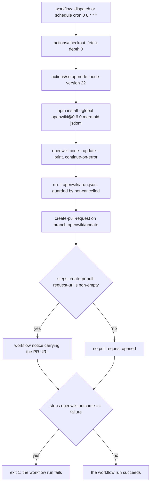

# Repository wiki refresh workflow (GitHub Actions)

`.github/workflows/openwiki-update.yml` is a CI job that regenerates **this
repository's own** `openwiki/` wiki and opens a pull request with the result. It
is not part of the service in `app/`: it calls the OpenWiki CLI directly on a
GitHub-hosted runner, with no API, no queue and no worker pool.

That distinction matters because this repository ships both things:

| | `.github/workflows/openwiki-update.yml` | The OpenWiki service shipped in `app/` |
| --- | --- | --- |
| What runs the CLI | `openwiki code --update --print` on `ubuntu-latest` | `python -m app.worker` inside containers |
| Topology | one runner, one run per job, no queue | SQLite queue in a shared volume + N worker replicas |
| Trigger | `schedule` + `workflow_dispatch` | `POST /wikis` (plus cancel/retry) |
| Cross-run resume | the artifacts committed to the branch (`.last-update.json`, `.page-manifest.json`, `.claims/`) | the surviving workspace plus `openwiki/.run.json` as a page queue |
| Output | a pull request on branch `openwiki/update` | `wiki.zip` download and an optional `push` to the source repo |
| Failure surface | a red workflow run (`exit 1`) | the wiki row becomes `failed` |

The service's own scheduling, queueing and resumption are documented in
[/openwiki/architecture/overview.md](/openwiki/architecture/overview.md) and
[/openwiki/concepts/wiki-lifecycle.md](/openwiki/concepts/wiki-lifecycle.md);
this page covers only the CI path.

## Triggers, permissions and the pipeline

The job runs daily at 08:00 UTC (`cron: "0 8 * * *"`) and on manual
`workflow_dispatch`. It requests exactly the two scopes the later steps need:
`contents: write` to push the `openwiki/update` branch and `pull-requests: write`
to open and update the pull request.



*End-to-end shape of the CI refresh: the CLI runs with `continue-on-error`, cleanup and the PR still happen, and only the last step decides the run's colour.*

| Step | Mechanism | Why it is there |
| --- | --- | --- |
| `Check out repository` | `actions/checkout@… # v4` with `fetch-depth: 0` | `--update` needs the commit it last documented (see below) |
| `Set up Node.js` | `actions/setup-node@… # v4`, `node-version: "22"` | the CLI needs Node 22, the same major the Docker image pins as `NODE_MAJOR=22` |
| `Install OpenWiki` | `npm install --global openwiki@0.6.0 mermaid@11.16.0 jsdom@29.1.1` | exact CLI pin; `mermaid`/`jsdom` are optional and add high-fidelity validation of Mermaid diagrams |
| `Run OpenWiki` | `openwiki code --update --print`, `continue-on-error: true` | a failed generation must not prevent cleanup and the PR |
| `Remove transient OpenWiki run state` | `rm -f -- openwiki/.run.json` | keeps resume state out of the PR |
| `Create OpenWiki update pull request` | `peter-evans/create-pull-request@… # v7` | commits the whitelisted paths onto `openwiki/update` |
| `Annotate OpenWiki update pull request` | `::notice` with the PR URL | surfaces the PR in the run summary |
| `Propagate OpenWiki failure` | `exit 1` when `steps.openwiki.outcome == 'failure'` | makes a failed generation a failed workflow run |

Every `uses:` is pinned to a full commit SHA with a human-readable version
comment, which is this repository's convention for third-party actions.

The CLI step has no `working-directory`, so it runs in the checkout root and the
wiki lands in that directory's `openwiki/` folder — the same hardcoded directory
the service calls `NATIVE_WIKI_DIR`.

## Credentials and model configuration

The provider configuration is passed as **step env** for the CLI subprocess, not
through the service's `Settings`. The workflow uses OpenRouter with the
`deepseek/deepseek-v4.1-flash` model:

```yaml
env:
  OPENWIKI_PROVIDER: openrouter
  OPENROUTER_API_KEY: ${{ secrets.OPENROUTER_API_KEY }}
  OPENWIKI_MODEL_ID: "deepseek/deepseek-v4.1-flash"
  OPENWIKI_LANGSMITH_API_KEY: ${{ secrets.OPENWIKI_LANGSMITH_API_KEY }}
  LANGSMITH_API_KEY: ${{ secrets.LANGSMITH_API_KEY }}
  LANGCHAIN_PROJECT: openwiki
  LANGCHAIN_TRACING_V2: "true"
```

- `OPENWIKI_LANGSMITH_API_KEY` is **required** for the LangSmith connector's
  code-mode pull to authenticate against additional workspaces; extra workspaces
  are added as `OPENWIKI_LANGSMITH_API_KEY_2`, `_3`, … repo secrets plus matching
  env entries.
- `LANGSMITH_API_KEY`, `LANGCHAIN_PROJECT=openwiki` and
  `LANGCHAIN_TRACING_V2=true` are optional and trace the workflow's own OpenWiki
  run.
- Missing or renamed secrets fail the CLI step (which is tolerated) rather than
  the job configuration, because secrets are invisible until used.

In the service the same class of variables reaches the CLI by a different route:
`build_env` copies `os.environ` and overrides only service-owned variables, so
provider credentials are never declared in `Settings`. See
[/openwiki/integrations/model-providers.md](/openwiki/integrations/model-providers.md).

## `fetch-depth: 0` is not optional

Update mode is incremental: OpenWiki diffs the current `HEAD` against the commit
it documented last time, which it records in `openwiki/.last-update.json`. A
shallow clone does not contain that commit, so the diff would be empty and the
run would report no changes while silently regenerating little or nothing. The
workflow therefore checks out the full history:

```yaml
- uses: actions/checkout@34e114876b0b11c390a56381ad16ebd13914f8d5 # v4
  with:
    fetch-depth: 0
```

This is the exact CI counterpart of `ingestion.ensure_full_history` in the
service, which runs `git fetch --unshallow` before an `update` run for the same
reason and is documented in
[/openwiki/integrations/openwiki-cli.md](/openwiki/integrations/openwiki-cli.md).

## Why `openwiki/.run.json` is deleted before the PR

`openwiki/.run.json` is OpenWiki's durable **resume** state: the plan, the phase
and the per-page status of the current run. It is machine state, not wiki
content, so it must never be committed — the service enforces the same rule with
the git pathspec `:(exclude)<artifact_dir>/.run.json` when it pushes the wiki
back, and `tests/test_push.py` asserts that `.openwiki/.run.json` is absent from
the pushed tree.

The workflow has no pathspec mechanism: `create-pull-request` commits what the
whitelist in `add-paths` matches. It therefore deletes the file from the
checkout first, with a step that runs even when the CLI run failed:

```yaml
- name: Remove transient OpenWiki run state
  if: ${{ !cancelled() }}
  run: rm -f -- openwiki/.run.json
```

The failed-run case is precisely when the file exists and is most likely to be
committed, which is why the step is not conditioned on success. A consequence
worth knowing: because `.run.json` never travels in the PR, cross-run
resumption relies on the artifacts that **do** travel — `.last-update.json`,
`.page-manifest.json` and `.claims/` — which is what makes the next scheduled
run incremental rather than a full rebuild. See
[/openwiki/concepts/wiki-artifact-and-paths.md](/openwiki/concepts/wiki-artifact-and-paths.md)
for what each artifact contains.

## What the pull request contains

```yaml
with:
  add-paths: |
    openwiki
    AGENTS.md
    CLAUDE.md
    .github/workflows/openwiki-update.yml
  branch: openwiki/update
  commit-message: "docs: update OpenWiki"
  title: "docs: update OpenWiki"
```

- `openwiki` (the wiki tree: pages, `.claims/`, `.last-update.json`,
  `.page-manifest.json`) and the OpenWiki-managed scaffolding — `AGENTS.md`,
  `CLAUDE.md` and the workflow file itself — are the **only** paths the PR can
  touch, so unrelated edits in the working tree can never leak into it. The
  `openwiki` entry is not an arbitrary choice: it is the fixed directory name the
  CLI writes to, the same one the service pins as `NATIVE_WIKI_DIR`.
- The scaffolding is included deliberately, unlike the service's push-back,
  which commits only `WIKI_ARTIFACT_DIR` and leaves `AGENTS.md`, `CLAUDE.md` and
  CI files exactly as the source repository had them. Here OpenWiki owns those
  files, so it must be able to rewrite them.
- The branch is always `openwiki/update`, so successive runs converge on the
  same PR instead of piling up branches.

Failure semantics are encoded in the same block: the PR body echoes
`${{ steps.openwiki.outcome }}` and states that when the outcome is `failure`
the PR intentionally preserves only the pages completed before the failure, and
that merging it makes that progress the baseline for the next scheduled run.
That is consistent with the two guards: the cleanup step and the PR step both
use `if: ${{ !cancelled() }}`, so a failed or timed-out generation still gets a
PR, while the last step re-raises the failure:

```yaml
- name: Propagate OpenWiki failure
  if: ${{ steps.openwiki.outcome == 'failure' }}
  run: exit 1
```

## Contracts this workflow fixes

The workflow commits the wiki, not the source; the source is the baseline it
regenerates from. That implies three contracts for anyone working in this
repository:

1. **Do not hand-edit `openwiki/`.** `AGENTS.md` states it explicitly: "Do not
   hand-edit generated OpenWiki pages unless explicitly asked; prefer updating
   source code/docs and letting OpenWiki regenerate." A hand edit outside the
   generation pipeline is either overwritten by the next run or becomes an
   inconsistency between the prose and the claims it cites.
2. **`AGENTS.md` and `CLAUDE.md` are OpenWiki-owned inside their markers.** The
   agent-facing rules live between `<!-- OPENWIKI:START -->` and
   `<!-- OPENWIKI:END -->` in `AGENTS.md` (retrieval is just-in-time; source and
   tests are authoritative; the scheduled workflow refreshes the wiki), and
   `CLAUDE.md` contains nothing but `@AGENTS.md` inside the same markers so
   Claude Code inherits that block instead of duplicating it. Because both files
   are in `add-paths`, the workflow may rewrite them; content outside the markers
   is not its business.
3. **The language and writing rules come from `openwiki/INSTRUCTIONS.md`.** The
   workflow passes no language flag: the checked-in brief is what OpenWiki
   reads, and it fixes the output language, the rule to keep code identifiers,
   file paths, commands and API names untouched, and the preference for
   architecture and data flow over line-by-line commentary. This is the same
   precedence rule as `prepare_instructions` in the service, where a
   user-authored brief always wins and a generated one is written only when the
   repository ships none.

Alongside these, OpenWiki owns the per-page bookkeeping it needs to stay
incremental (`.page-manifest.json` provenance, `.claims/` evidence,
`.last-update.json`), so those files should be treated as outputs too.

## Operating and upgrading the workflow

- **CLI version.** The workflow pins `openwiki@0.6.0` from npm while the service
  image pins the CLI separately through `ARG OPENWIKI_VERSION=0.6.0` and
  `scripts/install-openwiki.sh`. Upgrading must therefore be done twice, and the
  two pins can drift; keep them equal so a page validated in CI is generated by
  the same CLI version the service runs.
- **This is the repository's only CI job, and it does not run the tests.**
  Nothing invokes `uv run pytest`, so the suite stays a manual gate described in
  [/openwiki/testing/strategy.md](/openwiki/testing/strategy.md), and a red run
  here can only mean a failed or partial wiki generation — never a test failure.
- **No `concurrency` group.** Nothing serializes runs, so a `workflow_dispatch`
  can overlap the 08:00 UTC schedule; both runs target the same
  `openwiki/update` branch, because that name is hardcoded in `add-paths`.
- **Mermaid validation.** Keeping `mermaid` and `jsdom` installed enables
  high-fidelity diagram validation; dropping them leaves diagrams validated with
  a lower-fidelity parser and syntax errors can reach a merged page.
- **Failing runs.** A red run with a freshly opened PR is the designed outcome of
  a partial generation. Review the PR diff, then merge it if the pages are sound:
  that turns the partial result into the baseline for the next run. If the CLI
  failed immediately, there is usually nothing to merge.
- **Manual runs.** `workflow_dispatch` reproduces the scheduled behaviour
  exactly; it is the way to force a refresh after a documentation change without
  waiting for 08:00 UTC.
- **Secrets.** Only the workflow's own env block needs updating when a provider
  or model changes; the service reads its configuration from `.env` /
  container environment, documented in
  [/openwiki/operations/configuration.md](/openwiki/operations/configuration.md).

## Related pages

- [/openwiki/concepts/wiki-artifact-and-paths.md](/openwiki/concepts/wiki-artifact-and-paths.md) — what each artifact in the PR contains and who owns it.
- [/openwiki/integrations/openwiki-cli.md](/openwiki/integrations/openwiki-cli.md) — the CLI contract, `ensure_full_history` and `prepare_instructions`.
- [/openwiki/operations/deployment.md](/openwiki/operations/deployment.md) — the container image that pins the same CLI version for the service.
- [/openwiki/testing/strategy.md](/openwiki/testing/strategy.md) — the manual test gate that no CI job runs.
- [/openwiki/quickstart.md](/openwiki/quickstart.md) — entry point and map of the wiki.
