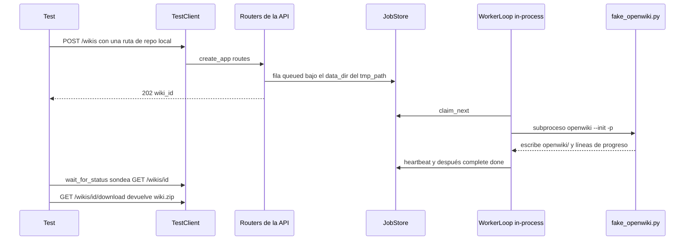

# Estrategia de pruebas y arnés simulado

La suite se apoya en una sola idea: hacer que el **pipeline de producción real** sea
ejecutable sin proveedor de modelos, sin red y sin una instalación de OpenWiki. Cada
test que toca una wiki recorre el mismo camino que producción — `create_app` →
`JobStore` → `WorkerLoop` → `pipeline.run_pipeline` → subproceso — y solo se simulan
los bordes: el CLI en `OPENWIKI_BIN` y el cliente HTTP del proveedor. No hay mock de
`pipeline`, `wiki_runner`, `packer` ni `publisher`, así que una regresión en la cola
que los une rompe la suite en lugar de esconderse detrás de un stub.

De ahí la propiedad operativa más importante: **la suite no necesita ninguna API key
ni acceso a red**, porque `OPENWIKI_BIN` apunta a `tests/fixtures/fake_openwiki.py` y
el único tráfico de modelo del camino automatizado va por un transporte httpx falso.

El arnés tiene, por tanto, tres responsabilidades:

1. **Apuntar el servicio a un script en lugar del CLI** mediante `OPENWIKI_BIN` (ver
   [/openwiki/integrations/openwiki-cli.md](/openwiki/integrations/openwiki-cli.md)
   para saber qué posee esa frontera).
2. **Ejecutar un worker dentro del proceso de la API** (`RUN_LOCAL_WORKER=true`) para
   que un solo `TestClient` haga el ciclo completo encolar → generar → descargar, el
   mismo modo in-process que se usa en desarrollo local.
3. **Dar a cada test un `data_dir` aislado** bajo el `tmp_path` de pytest, para que el
   estado SQLite, los workspaces, los logs y los zips nunca se filtren entre tests.



El camino extremo a extremo que un test recorre con el CLI simulado.

## Comandos

`pyproject.toml` declara el extra de test y los valores por defecto de pytest
(`testpaths = ["tests"]`, `addopts = "-q"`), así que la suite completa se ejecuta con:

```bash
uv venv --python 3.12
uv pip install -e ".[test]"
uv run pytest                 # todo
uv run pytest tests/test_api_wikis.py -q
uv run pytest -k "push or cancel"
```

La misma sección del README documenta además las dos formas de levantar el servicio a
mano (`RUN_LOCAL_WORKER=true uv run uvicorn app.main:create_app --factory --reload`
para un proceso, o `uv run python -m app.worker` al lado), lo que resulta útil cuando
un fallo de test necesita inspección interactiva. Conviene saber que el repositorio
**no** tiene ningún job de CI que ejecute pytest: el único workflow bajo
`.github/workflows/` es la actualización programada de la wiki de OpenWiki, que
instala el CLI real con `npm install --global openwiki@0.6.0` y llama a
`openwiki code --update --print`; no toca la suite.

## Fixtures compartidas (`tests/conftest.py`)

| Fixture / helper | Qué aporta y por qué |
| --- | --- |
| `settings` | Un `Settings` construido para tests: `data_dir` bajo `tmp_path`, `openwiki_bin` fijado a `f'"{sys.executable}" "{FAKE_OPENWIKI}"'`, `allow_local_git=True`, `run_local_worker=True`, `max_concurrent_jobs=1`, `worker_poll_seconds=0.1`, `worker_progress_seconds=0.1`, `job_timeout_minutes=2`, `default_page_concurrency=1`. |
| `client` | `TestClient(create_app(settings))` usado como context manager, de modo que el lifespan arranca de verdad el reaper de claims caducados y el `WorkerLoop` local, y los apaga al terminar el test. Sin el bloque `with` nunca se reclamaría nada. |
| `make_git_repo` | Factoría que escribe `src/main.py`, `README.md` (y opcionalmente un `openwiki/` o `.openwiki/` existente con `.claims/`, `index.md` y `.last-update.json`), y después hace `git init` + un commit con `user.email` / `user.name` en línea. Devuelve la ruta; hace `pytest.skip` cuando `git` no está en `PATH`. |
| `make_remote_repo` | Factoría para un **destino de push**. `bare=True` (por defecto) inicializa un origin bare, sube la rama semilla y apunta `HEAD` a ella. `bare=False` devuelve la semilla no bare con la rama en checkout, donde git rechaza el push — la fixture existe específicamente para producir un fallo de push real. |
| `wait_for_status` | Sondea `GET /wikis/{wiki_id}` cada 0.1 s hasta que el estado está en `{"done", "failed", "cancelled"}` (timeout por defecto 30 s) y devuelve el payload; afirma que cada respuesta es 200, así que un endpoint de lectura roto falla ruidosamente. |
| `wait_for_state` | Sondea cada 0.05 s (timeout por defecto 15 s) hasta que la wiki alcanza un estado **no terminal concreto**: así los tests atrapan `generating` antes de cancelar o antes de encolar una segunda wiki detrás de una lenta. |
| `_git` / `git_available` / `_write_sample_files` | Helpers a nivel de módulo, importados también directamente por los tests (`from tests.conftest import _git, wait_for_status`) para inspeccionar los repositorios de las fixtures (por ejemplo `ls-tree -r --name-only` sobre el origin después de un push). `tests/__init__.py` existe para que `tests` sea un paquete y esas importaciones funcionen. |

Por qué importan los valores de temporización: las fixtures colapsan deliberadamente
`worker_poll_seconds` / `worker_progress_seconds` a 0.1 s y limitan
`max_concurrent_jobs` a 1, para que las aserciones basadas en sondeo sigan siendo
rápidas y la cola se comporte de forma determinista cuando un test encola más wikis
que workers. `job_timeout_minutes=2` mantiene corto un CLI que se cuelgue en lugar de
esperar los 45 minutos de producción. `allow_local_git=True` es lo que hace que las
rutas de `make_git_repo` se puedan clonar; producción lo deja en `false` por defecto
(ver [/openwiki/operations/configuration.md](/openwiki/operations/configuration.md)).

`OPENWIKI_BIN` se pasa como **línea de comandos entrecomillada**, no como nombre de
programa desnudo; `split_command` la vuelve a convertir en argv
(`["<python>", "tests/fixtures/fake_openwiki.py"]`), que es exactamente por lo que
`/health` informa `openwiki_found` a partir del primer token.

## El CLI falso: materializar el contrato

`tests/fixtures/fake_openwiki.py` no es el stub de una función Python: es un script
independiente que suplanta al binario `openwiki`, así que los tests verifican el
*contrato de proceso*: argv, directorio de trabajo, entorno, flujo de salida y los
archivos que quedan en el workspace.

Dado un directorio de trabajo, hace lo siguiente:

- crea `openwiki/` con un archivo de claims `.claims/quickstart.json`, para que todo
  lo que recorre el directorio de claims (los tests de push los commitean) vea el
  layout esperado;
- escribe **`.fake-args.json`** con `sys.argv[1:]` — el canal de aserción de los flags
  `--init` / `--update` / `-p`, que los tests de la API leen de vuelta desde el zip
  descargado (`.openwiki/.fake-args.json`, porque `pack_wiki` renombra la raíz del
  archivo a `wiki_artifact_dir`);
- escribe **`.fake-env.json`** con las claves de `DUMPED_ENV_KEYS`
  (`OPENAI_COMPATIBLE_BASE_URL`, `OPENWIKI_PAGE_CONCURRENCY`, `OPENWIKI_PROVIDER`),
  el canal de aserción del entorno que construye `wiki_runner.build_env` — incluida
  la concurrencia de páginas y la URL del proxy loopback;
- escribe `index.md` con frontmatter OKF más `architecture.md`, e imprime
  `openwiki: page 1/2 index.md`, `openwiki: page 2/2 architecture.md` y
  `openwiki: run complete` en stdout, que el runner marca con timestamp y redacta
  hacia `logs.txt` — el origen de las aserciones sobre el formato del log.

Dos variables de entorno controlan fallo y lentitud, ambas fijadas desde los tests con
`monkeypatch.setenv` (esto funciona porque el subproceso del CLI hereda
`os.environ.copy()`):

| Variable | Efecto |
| --- | --- |
| `FAKE_OPENWIKI_FAIL=1` | Imprime `error: simulated provider failure` en stderr y sale con código 2, así que el job termina `failed`, con una mención a "exit" en `error` y sin zip descargable. |
| `FAKE_OPENWIKI_SLEEP=<seconds>` | Duerme antes de hacer nada, creando la ventana que los tests necesitan para observar `generating`, pedir una cancelación o encolar una segunda wiki detrás de la primera. |

Como el falso es determinista para un argv/env dados, dos ejecuciones sobre la misma
fuente producen una salida byte a byte idéntica: esa propiedad es de la que depende el
test que afirma `push_result.status == "no_changes"`.

Los canales `.fake-args.json` y `.fake-env.json` son el patrón de aserción preferido
de la suite: los tests leen del zip descargado o del job dir en disco lo que el
proceso recibió, en lugar de inspeccionar objetos Python internos, de modo que la
interfaz verificada queda en la frontera de proceso y entorno.

## Simular el proveedor de modelos

Existen dos mecanismos independientes, y sirven a propósitos distintos.

- **Tests de probe automatizados** sustituyen el cliente HTTP del probe por completo:
  `tests/test_model_status.py` monkeypatchea `model_status._make_client` con una
  factoría que devuelve `httpx.AsyncClient(transport=httpx.MockTransport(handler))` y
  cuenta llamadas, que es como se distingue el cacheo frente a `?force=true`. El mismo
  archivo escribe archivos `<config_dir>/.env` para probar la precedencia del entorno
  del proceso sobre el directorio de configuración.
- **`tests/fixtures/fake_openai_server.py`** es una ayuda manual, lanzada a mano
  (`python fake_openai_server.py [port]`, puerto por defecto 9000). Responde a las
  formas mínimas `POST .../responses` y `POST .../chat/completions` que entiende el
  probe y, con `FAKE_REQUIRE_SESSION=1`, reproduce OpenCode Go devolviendo `400` si
  falta `x-opencode-session`. Es material de referencia para reproducir una
  configuración de gateway, no parte de la ejecución automatizada.

El camino del proxy se prueba configurando `openai_compatible_base_url` +
`openai_compatible_extra_headers` con `compat_proxy_port=0`, afirmando que
`app.state.proxy.base_url` es una URL loopback, y después leyendo
`.openwiki/.fake-env.json` del zip descargado para demostrar que el subproceso del CLI
recibió la URL del proxy y no la del upstream.

## Mapa de cobertura

| Archivo de test | Comportamiento verificado |
| --- | --- |
| `tests/test_api_wikis.py` | Superficie completa de la API a través del CLI falso: 202 → `done`, contenido del zip descargado, idioma de `INSTRUCTIONS.md`, logs con timestamp, listado, e2e de subida, validación `422` (scheme, URL vacía, token sobre SSH, `mode` inválido, extensión de archivo desconocida), borrado `204`/`404`, ids desconocidos y con forma de traversal, reporte de fallo y descarga `404` mientras no está listo, retry tras un fallo, cancelación de una wiki en ejecución (`cancelling` → `cancelled`) con retry exitoso, cancelación de una wiki en cola, validación `409`/`404` de cancel/retry, selección automática de `init`/`update` vía `.fake-args.json`, un `update` explícito que cae a `init` con una línea de log, adopción de `.openwiki/`, y persistencia de estado más reanudación tras caída entre dos instancias de `create_app` que comparten `data_dir`. |
| `tests/test_worker_queue.py` | Comportamiento unitario de `JobStore`: claim atómico y exclusivo visible para un segundo `JobStore` sobre la misma base de datos, heartbeat/cancel/complete, completado con un claim id caducado que se ignora, reencolado de claims caducados, cancel/retry mientras está en cola, stats y pruning de workers, y migración del `job.json` heredado. |
| `tests/test_ingestion.py` | Validación de fuentes y seguridad de la extracción: esquemas de URL aceptados, rutas locales como opt-in, coincidencia de sufijos de archivo, cabeceras de token por forge, rechazo de zip con path traversal / rutas absolutas / límite de tamaño, normalización de una carpeta raíz única, rechazo de symlinks en tar, `ensure_git_repo` idempotente, y clonado de una rama y de un commit SHA crudo. |
| `tests/test_push.py` | `publisher` contra remotos locales reales: commit en la rama clonada con el autor configurado y el mensaje por defecto, rama y mensaje personalizados, `no_changes` cuando la wiki es idéntica, requisito de `auth.token` para HTTPS, rechazo de SSH, rechazo de rama inválida, un fallo de push que deja la wiki descargable, checkout detached que exige `push.branch`, push deshabilitado que se salta, y ejecuciones `--update` que traen la historia completa (sin `.git/shallow`). |
| `tests/test_wiki_state.py` | Los parsers del workspace de OpenWiki en aislamiento: validación de `wiki_artifact_dir`, `adopt_hidden_wiki`, renombrado de raíz y conteo de páginas de `pack_wiki`, `decide_mode` para toda combinación, y `read_run_state` / `format_progress` incluyendo basura y `.run.json` parcial. |
| `tests/test_model_status.py` | Sección de modelo pasiva de `/health` (valores por defecto, `.env` del config dir, precedencia del entorno, origen de la credencial, aviso de base URL) y el probe activo `/health/model`: éxito con cacheo y `force`, redacción de credenciales en errores, detección de completion vacío, diagnóstico de no configurado y de base URL ausente, proveedores no soportados, la Messages API de Anthropic, pistas de 404 HTML y de `/v1` ausente, rutas de endpoint duplicadas, cabeceras extra que llegan al upstream, y nombres de cabecera listados sin valores. |
| `tests/test_provider_proxy.py` | `parse_extra_headers` (User-Agent por defecto, override configurado, rechazo de JSON/formas inválidas), `create_app` que falla rápido con cabeceras malformadas, inyección de cabeceras y preservación de ruta en la app de reenvío, rechazo de rutas fuera de la base configurada, y el cableado extremo a extremo del proxy en una ejecución de wiki. |
| `tests/test_health.py` | `/health` devuelve `status=ok`, una versión y los contadores del pool, y `/` anuncia `/docs`. |

## Fronteras: lo que los tests no demuestran

El arnés es deliberadamente una **frontera de confianza**, no una prueba de corrección
en producción. Lo no cubierto por diseño, y por tanto a verificar a mano antes de una
release:

- **Un proveedor de modelos real** — los tests del probe afirman forma de la petición,
  cabeceras y diagnóstico de errores, nunca que un proveedor real responda; el CLI
  falso no llama a ningún modelo.
- **El CLI OpenWiki real** — argv (`--init`/`--update`/`-p`), el layout `openwiki/` y
  `.run.json` quedan fijados como contrato, así que un cambio del CLI que respete ese
  contrato es invisible para los tests.
- **Operación multi-host** — `JobStore` se ejercita sobre un único sistema de
  archivos; la ruta documentada de sustitución por Postgres no tiene cobertura.
- **`/docs`** — solo se afirma el anuncio JSON de la URL, no que Swagger UI renderice.
- **Forges reales y clones por red** — todos los tests de clone/push usan rutas
  locales y URIs tipo `file://`, así que el comportamiento de autenticación específico
  de cada forge solo está cubierto a nivel de construcción de cabeceras.
- **`tests/fixtures/fake_openai_server.py`** y los flujos guiados por navegador a su
  alrededor siguen siendo herramienta manual.

## Extender la suite

Para extenderla, añade un test con fixtures en el archivo correspondiente y reutiliza
`client` + `make_git_repo` / `make_remote_repo` más `wait_for_status`; recurre a
`monkeypatch.setenv("FAKE_OPENWIKI_...")` solo cuando el escenario necesite de verdad
un CLI que falle o que sea lento, y prefiere los canales `.fake-args.json` /
`.fake-env.json` antes que aserciones sobre objetos Python internos.

## Páginas relacionadas

- [/openwiki/architecture/job-store.md](/openwiki/architecture/job-store.md)
- [/openwiki/quickstart.md](/openwiki/quickstart.md)
- [/openwiki/workflows/generation-from-git.md](/openwiki/workflows/generation-from-git.md)
- [/openwiki/workflows/model-health-check.md](/openwiki/workflows/model-health-check.md)
