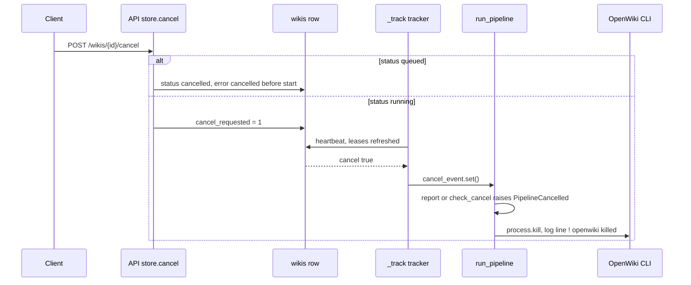
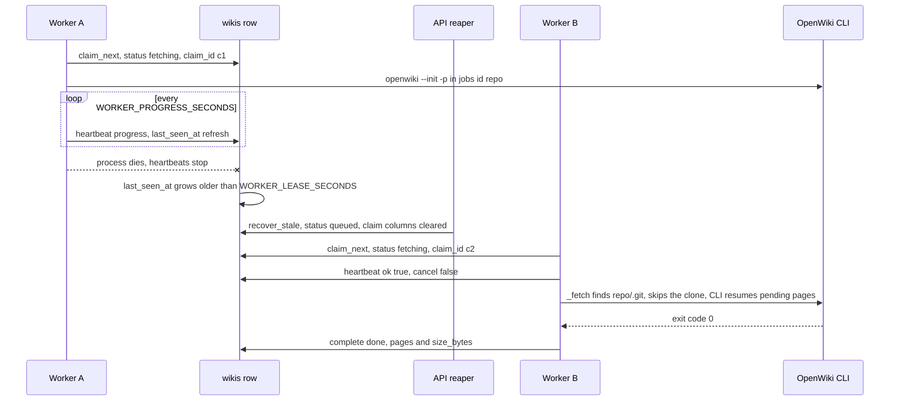

# Cancelar, reintentar y reanudar una generación

Tres mecanismos permiten que una generación sobreviva a una decisión del usuario o a un worker muerto, y
cada uno tiene un único propietario:

| Mecanismo | Propietario | Disparador | Efecto sobre la fila |
| --- | --- | --- | --- |
| Cancel | API (`POST /wikis/{id}/cancel`) + heartbeat del worker | un operador o un cliente decide parar | `cancelled`, inmediato si está en cola, cooperativo si está en ejecución |
| Retry | API (`POST /wikis/{id}/retry`) | una wiki terminal (failed/cancelled) se reencola a mano | vuelve a `queued`, resultado limpio, claim limpio |
| Recuperación de lease | reaper de la API (`recover_stale`) | un worker deja de mandar heartbeats | vuelve a `queued`, claim limpio, `attempts` conservado |

Los tres convergen en el mismo invariante: la fila de `wikis` en `<DATA_DIR>/openwiki.db` es la única
verdad del ciclo de vida, y reencolar nunca significa rehacer el trabajo — el workspace y el propio plan
de OpenWiki sobreviven en el volumen compartido. El modelo de estados en sí está en
[/openwiki/concepts/wiki-lifecycle.md](/openwiki/concepts/wiki-lifecycle.md), el contrato del store en
[/openwiki/architecture/job-store.md](/openwiki/architecture/job-store.md), y el bucle de worker que
observa todo esto en [/openwiki/architecture/worker-pool.md](/openwiki/architecture/worker-pool.md).

## Cancelar: inmediato si está en cola, cooperativo si está en ejecución

`POST /wikis/{id}/cancel` es un envoltorio fino del router alrededor de `JobStore.cancel`, y la parte
interesante es que el propio store decide cuánto trabajo implica cancelar:

| Estado de la fila | Efecto de `JobStore.cancel` | Respuesta de la API |
| --- | --- | --- |
| `queued` | `status='cancelled'`, `finished_at=now`, `error="cancelled before start"` | `200` `{"wiki_id", "status": "cancelled"}` |
| `fetching` / `generating` / `finalizing` | solo `cancel_requested=True`; el estado no se toca | `200` `{"wiki_id", "status": "cancelling"}` |
| terminal (`done`/`failed`/`cancelled`) | nada | `409` (`not_running`) |
| id desconocido | nada | `404` (`not_found`) |

De esa división se siguen dos propiedades:

- **Un cancel de una wiki en cola es una transacción pura.** No interviene ningún worker, la fila acaba
  en un estado terminal que `claim_next` ya no puede recoger (solo selecciona `status='queued'`), y la
  wiki no se puede generar nunca después. La única vuelta atrás es `retry`.
- **Un cancel de una wiki en ejecución es una petición, no una acción.** La API escribe un flag y
  responde `"cancelling"`; que la generación pare de verdad, y cuándo, depende de que un worker vivo lo
  note. Nada en la API puede interrumpir el proceso de un worker.

### Cómo llega el flag al worker: el heartbeat es el canal de control

El worker no recibe una señal; *observa la fila*. `JobStore.heartbeat` es el único intercambio que a la
vez refresca el lease y reporta el flag: vuelve a leer `(wiki_id, claim_id)`, confirma que la fila sigue
en `RUNNING_STATUSES`, actualiza `last_seen_at` (más los opcionales `status`, `progress` y `pages`) y
devuelve `{"ok", "cancel", "status"}` con `cancel` tomado de `cancel_requested`.

Dos escritores consumen esa respuesta dentro de un worker:

- `WorkerLoop._track` — la tarea de fondo que sondea cada `WORKER_PROGRESS_SECONDS` (2 s por defecto): si
  ve `cancel` pone el `cancel_event` compartido y termina, cerrando el bucle de heartbeat.
- `pipeline.run_pipeline` — su helper `check_cancel()` lanza `PipelineCancelled("cancelled by user")`
  entre etapas, y su helper `report()` hace lo mismo cada vez que un heartbeat responde `cancel=True`.

Como el flag solo lo leen esos dos caminos, la cancelación cooperativa tiene una latencia acotada pero no
nula: como máximo un periodo de heartbeat (2 s por defecto) más el tiempo hasta que el pipeline alcanza
el siguiente punto de `check_cancel()`/`report()`, y en la práctica el heartbeat inmediatamente siguiente
una vez que el CLI está corriendo.



*La ruta de cancelación cooperativa de una wiki en ejecución: la API solo pone un flag, y el worker lo
descubre en su siguiente heartbeat.*

### Matar el subproceso del CLI

`run_openwiki` lanza el CLI como `openwiki --init|--update -p` con su stdout/stderr volcados en
`<DATA_DIR>/jobs/<wiki_id>/logs.txt`. Mientras el proceso corre, `wait_for_process` espera a dos futuros
concurrentes con `asyncio.wait(..., return_when=FIRST_COMPLETED)`: el bombeo de logs y
`cancel_event.wait()`. Cuando gana el futuro de cancelación, llama a `process.kill()`, espera al proceso y
añade la línea

```text
! openwiki killed: generation cancelled
```

al log antes de lanzar `OpenWikiRunCancelled`. El pipeline lo convierte en `PipelineCancelled`, y
`WorkerLoop._run` cierra el intento con `complete(status="cancelled", error=str(exc))`. Así que una wiki
cancelada es un estado terminal de primera clase con un motivo, no una fila perdida.

Mismo camino de código, disparador distinto:

- `asyncio.CancelledError` (apagado del worker) también mata el proceso — el comentario del código es
  explícito en que nunca debe dejar un huérfano detrás — pero se re-lanza en vez de retornar, y el claim
  queda en ejecución para el reaper.
- superar `JOB_TIMEOUT_MINUTES` también mata el proceso, escribe
  `! openwiki exceeded the <N> minute timeout and was killed` y lanza `OpenWikiRunError`, es decir el
  intento acaba `failed` (reintentable) en lugar de `cancelled`.

### Dos consecuencias que conviene conocer antes de confiar en cancel

- **Cancelar mata el CLI y no empaqueta nada.** `check_cancel()` corre antes de `pack_wiki`, así que un
  intento cancelado no deja `wiki.zip`; `GET /wikis/{id}/download` responde `404 wiki is not ready` hasta
  que un intento posterior complete.
- **Una petición de cancelación no puede alcanzar a un worker muerto.** Si el proceso ya no está, nadie
  lee `cancel_requested`, y `recover_stale` (que reencola el claim) deja `cancel_requested=0` — la wiki
  se *reanuda*, no se cancela. No hay forma soportada de cancelar un claim huérfano salvo dejarlo
  terminar y borrar después la fila terminal.

## Los dos disparadores de reencolado

Una fila vuelve de un estado en ejecución a `queued` exactamente por dos caminos, y se diferencian en
quién decide:

### 1. Retry explícito: `POST /wikis/{id}/retry`

`JobStore.retry` es deliberadamente estricto: solo acepta filas `failed` o `cancelled`
(`"not_retryable"` → `409` para cualquier otra, incluida `done`, y `404` para un id desconocido). El
reencolado limpia a la vez el *resultado* y el *claim*:

- `status='queued'`, `error=None`, `progress=None`, `finished_at=None`, `cancel_requested=False`;
- `claimed_by`, `claim_id`, `claimed_at` y `last_seen_at` a nulo, así que cualquier heartbeat rezagado del
  poseedor anterior es rechazado (`heartbeat` filtra por `claim_id`);
- `attempts` **no** se reinicia, y no se toca nada en disco.

El endpoint responde `202` con el mismo cuerpo `WikiAccepted` que un envío nuevo (`status: "queued"`,
enlaces a status/logs/download), que es la razón de que un retry le parezca a un cliente un trabajo nuevo
sobre el mismo `wiki_id`. `tests/test_api_wikis.py::test_failed_wiki_can_be_retried` recorre exactamente
ese camino: un CLI que falla produce `failed`, se arregla el entorno, `retry` devuelve `202 queued` y la
wiki termina `done` con un zip descargable.

### 2. Recuperación de lease: `recover_stale` desde `_reap_loop` y el arranque

La API no genera nada, pero es la autoridad de recuperación. `JobStore.recover_stale(lease_seconds)` es un
**único UPDATE condicional** sobre los estados en ejecución:

```sql
UPDATE wikis SET status='queued', claimed_by=NULL, claim_id=NULL, claimed_at=NULL,
                 last_seen_at=NULL, cancel_requested=0
 WHERE status IN ('fetching','generating','finalizing')
   AND (last_seen_at IS NULL OR last_seen_at < :cutoff)
```

Como es una sola sentencia construida a partir de `last_seen_at`, es idempotente y segura de ejecutar
desde varias réplicas de la API. `attempts` sobrevive, así que el contador sigue significando «claims
entregados» tanto a través de reintentos del usuario como de recuperaciones de caída.

Se llama desde dos sitios de `app/main.py`:

- **Arranque** — dentro del context manager `lifespan`, justo después de
  `purge_expired(JOB_RETENTION_HOURS)` y antes de crear la tarea del reaper. Esto es lo que hace que un
  reinicio de la API (o de todo el stack de compose) recupere los claims huérfanos del proceso anterior;
  registra `requeued N stale wiki claim(s) at startup`.
- **Periódicamente** — la tarea `_reap_loop` llamada `openwiki-reaper` duerme `WORKER_REAP_SECONDS` (30 s
  por defecto), llama a `recover_stale(settings.worker_lease_seconds)`, registra
  `requeued N stale wiki claim(s)` cuando hizo algo, y después llama a `prune_workers()` (edad por defecto
  1 h). Todo el cuerpo está envuelto en `contextlib.suppress(Exception)`, así que un error transitorio de
  base de datos nunca mata el reencolado periódico.

`prune_workers()` solo olvida entradas del registro de vitalidad `workers`; nunca toca un claim. La
mecánica del barrido es propiedad de [/openwiki/architecture/job-store.md](/openwiki/architecture/job-store.md);
la vista para operadores está en
[/openwiki/operations/observability-and-recovery.md](/openwiki/operations/observability-and-recovery.md).

### Las dos perillas: `WORKER_LEASE_SECONDS` y `WORKER_REAP_SECONDS`

Ambas son campos de `Settings`, es decir variables de entorno (`app/core/config.py`), y ambas están
validadas para ser ≥ 1:

| Variable | Default | Significado | Efecto sobre la recuperación |
| --- | --- | --- | --- |
| `WORKER_LEASE_SECONDS` | `180` | antigüedad de `last_seen_at` a partir de la cual una fila en ejecución cuenta como huérfana | cuánto bloquea la cola el claim de un worker muerto |
| `WORKER_REAP_SECONDS` | `30` | periodo del barrido de claims obsoletos de la API | granularidad de la recuperación, más una ventana sin barrido |
| `WORKER_PROGRESS_SECONDS` | `2.0` | periodo de `_track`, es decir la frecuencia efectiva de refresco del lease | cuántos heartbeats se pueden perder antes de que el lease expire |

La relación sana es `WORKER_LEASE_SECONDS >> WORKER_PROGRESS_SECONDS`: con los valores por defecto un
worker puede perder aproximadamente noventa heartbeats consecutivos antes de que su claim se declare
muerto, que es el margen que evita que una llamada lenta al modelo o un `git fetch` lento sea barrido. La
latencia de detección en el peor caso de un worker matado a lo bruto es por tanto de unos
`WORKER_LEASE_SECONDS + WORKER_REAP_SECONDS`, y `WORKER_LEASE_SECONDS` es la perilla que intercambia
velocidad de recuperación por falsos positivos — un lease más corto que una ráfaga de heartbeats lentos
puede reencolar a un worker *vivo*, y como un claim reencolado es inmediatamente reclamable (y `_fetch`
reutiliza cualquier workspace que ya tenga `.git`), el intento antiguo puede correr brevemente junto a su
sucesor hasta que nota `ok=False`.

## Por qué perder el lease es terminal para ese intento

`claim_id` es un token de propiedad, no contabilidad. `claim_next` sella un `uuid4().hex` nuevo en cada
entrega, y ambos caminos de escritura filtran por el par `(wiki_id, claim_id)`:

- `heartbeat` primero selecciona la fila de ese par; si la fila ya no está o su estado salió de
  `RUNNING_STATUSES`, devuelve `{"ok": False, "cancel": True}` **sin escribir nada**. Eso es precisamente
  lo que ocurre tras un barrido, porque `recover_stale` pone `claim_id` a nulo.
- `complete` solo actualiza
  `WHERE wiki_id=? AND claim_id=? AND status IN ('fetching','generating','finalizing')` y devuelve `False`
  cuando no encaja nada.

El comportamiento del consumidor es lo que hace que el intento desplazado pare de forma limpia en vez de
corromper el estado:

- `pipeline.report()` trata `ok=False` como fatal y lanza `PipelineCancelled("the worker lease was lost")`,
  así que ninguna etapa posterior escribe en una fila que ahora pertenece a otro. `_track` reacciona a la
  misma señal poniendo `cancel_event`, que se propaga a `run_openwiki` y mata el subproceso del CLI a
  través del camino de cancelación descrito más arriba.
- `WorkerLoop._run` ignora el `False` que devuelve `complete(...)`: el estado terminal pertenece a quien
  tiene el claim vivo, así que el worker desplazado se queda callado.

Dos casos límite hacen legible la semántica:

- Un lease perdido se reporta como **`cancelled`**, no como `failed` — para el intento que fue desplazado
  el trabajo ni está terminado ni está roto, y `cancelled` es reintentable.
- Si el proceso fue matado a lo bruto (SIGKILL, contenedor recreado, `docker compose restart worker`), no
  escribe **ningún** estado terminal: `_run` re-lanza `asyncio.CancelledError` en un apagado ordenado, y
  un proceso matado simplemente desaparece. La fila mantiene su estado en ejecución hasta que
  `recover_stale` la reencola. Ese es exactamente el escenario que reproduce
  `tests/test_api_wikis.py::test_active_wikis_are_resumed_after_a_restart` forzando
  `status="generating"` con `claimed_by="crashed-worker"`, `claim_id="deadbeef"`, `last_seen_at=None` y
  ningún `wiki.zip`.

## Cómo reanuda el siguiente worker en lugar de empezar de cero

Reencolar es barato porque no se limpia nada al fallar. Cuando un worker nuevo reclama la fila reencolada
recibe un `claim_id` nuevo, `cancel_requested=0`, `attempts+1` y un `started_at` preservado (`COALESCE`).
A partir de ahí, dos capas de estado duradero llevan el trabajo hacia delante.



*Cronología de un worker que muere a mitad de generación: el reaper reencola el claim huérfano y un
segundo worker reanuda el mismo workspace en lugar de clonar de nuevo.*

### Nivel 1 — el workspace superviviente

Lo primero que hace `pipeline._fetch` es comprobar `repo_dir / ".git"`:

```python
if (repo_dir / ".git").exists():
    log("repository workspace already present; resuming the generation")
    return
```

El clonado (source git) o la extracción (upload) se saltan por completo, así que un worker distinto con un
`claim_id` nuevo continúa en `<DATA_DIR>/jobs/<wiki_id>/repo`. Solo un `.git` ausente dispara una
obtención nueva, y cualquier directorio no-git sobrante se borra antes. Consecuencias:

- Para un **source git**, una reanudación no necesita nada del llamante: el token vive en la columna JSON
  `source` de la fila, así que incluso un reclonado desde cero tras perder el volumen funciona con las
  credenciales guardadas.
- Para un **source upload**, la reanudabilidad depende del directorio del job: el archivo se guardó como
  `<job_dir>/upload<ext>` y el pipeline lo vuelve a leer cuando falta el workspace. Si el archivo ya no
  está, el intento falla con `IngestionError("the uploaded archive is no longer available; submit the
  wiki again")` — la única recuperación es volver a enviar el archivo.
- `DELETE /wikis/{id}` elimina todo el directorio `jobs/<wiki_id>/`, así que borrar una fila también tira
  la reanudabilidad de esa wiki.

### Nivel 2 — `openwiki/.run.json` como cola de páginas de OpenWiki

Dentro del workspace, el CLI persiste su propio plan. `wiki_runner.read_run_state(repo_dir)` parsea
`openwiki/.run.json` a `{phase, total, completed, pending, current}` contando
`plan.pages[*].status == "complete"`, y es deliberadamente tolerante: un fichero ausente, no parseable o
con forma extraña devuelve `None` o un resumen a cero en lugar de lanzar una excepción, porque se sondea
mientras el CLI todavía lo está escribiendo (la misma tolerancia está fijada por `tests/test_wiki_state.py`).

Dos hechos importan para la recuperación:

- **El servicio nunca escribe este fichero.** Solo lo *lee*, cada `WORKER_PROGRESS_SECONDS`, en un hilo,
  para rellenar la columna `progress` (`2/7 pages · generating`, recurriendo a `packer.count_pages` →
  `N pages written` mientras el plan está vacío). `openwiki/.run.json` es estado de reanudación
  transitorio, que es también la razón de que el publicador lo excluya del commit del push.
- Cuando un claim reencolado vuelve a ejecutar el CLI en ese workspace, OpenWiki retoma las **páginas
  inacabadas** de ese plan en vez de regenerar desde cero. La contribución del servicio es simplemente no
  destruir el workspace; la semántica de reanudación pertenece al CLI.

El modo de ejecución resuelto se recalcula en cada intento, porque el reencolado no registra qué modo
usar: `decide_mode(repo_dir, requested)` devuelve `update` cuando existe `openwiki/index.md` e `init` en
caso contrario, `auto` se resuelve igual, y un `update` explícito degrada a `init` cuando el source no
trae docs (registrando `no existing wiki found in the source; falling back to --init`). El valor resuelto
se escribe de vuelta con `store.update(wiki_id, mode=mode)`, de modo que `GET /wikis/{id}` siempre reporta
qué se ejecutó realmente. En modo `update` el pipeline llama además a `ensure_full_history`, porque un
clon `--depth 1` no contiene el commit registrado en `openwiki/.last-update.json` que necesita el diff
incremental.

### Qué sirve mientras tanto una wiki reintentada

`GET /wikis/{id}/download` solo exige que exista `wiki.zip` — no comprueba el estado. Una wiki `failed` o
`cancelled` cuyo intento anterior ya había empaquetado un zip sigue sirviendo ese archivo antiguo mientras
un retry regenera la wiki, porque `pack_wiki` escribe `wiki.zip.tmp` y luego sustituye el destino de forma
atómica. Un primer intento que nunca llegó a empaquetar sigue respondiendo
`404 wiki is not ready (status=...)`.

## Operar las rutas de recuperación

| Acción | Llamada | Precondiciones | Resultado observable |
| --- | --- | --- | --- |
| Cancelar una wiki en cola | `POST /wikis/{id}/cancel` | estado `queued` | `200 cancelled`, terminal de inmediato |
| Cancelar una wiki en ejecución | `POST /wikis/{id}/cancel` | un worker vivo mandando heartbeats | `200 cancelling`, luego `cancelled` cuando el worker mata el CLI |
| Retry | `POST /wikis/{id}/retry` | estado `failed` o `cancelled` | `202 queued`, workspace y `.run.json` reutilizados |
| Recuperar un worker muerto | nada que llamar | ninguna (automático) | `docker compose restart worker` es seguro: el claim se reencola tras `WORKER_LEASE_SECONDS` |

Señales de triaje aproximadas:

- Un `cancelling` que nunca pasa a `cancelled` significa que ningún worker está leyendo el flag — mira el
  `worker` (`claimed_by`) y los `attempts` de la fila, y espera que el reaper la reanude en vez de
  cancelarla.
- Una wiki que salta de `queued → fetching` repetidamente con un `attempts` creciente es o bien workers en
  bucle de caída o bien un lease demasiado corto para la carga; `WORKER_LEASE_SECONDS` y
  `WORKER_REAP_SECONDS` son las perillas a inspeccionar.
- `error` se trunca a 500 caracteres solo en las ramas que terminan en `failed`, así que una pérdida de
  lease aparece como el mensaje legible `the worker lease was lost` o `cancelled by user` en lugar de un
  traceback (la rama `cancelled` guarda `str(exc)` sin truncar).

## Tests enfocados

`tests/test_worker_queue.py` es la especificación a nivel de store de estas semánticas:

- `test_stale_claims_are_requeued` — un claim fresco lo deja en paz `recover_stale(180)`, mientras que una
  fila con `last_seen_at` antiguo se reencola con `claim_id is None` y `attempts` preservado.
- `test_complete_with_stale_claim_is_ignored` — `complete` con un `claim_id` equivocado devuelve `False` y
  deja la fila en ejecución; el claim real sí completa y guarda `pages`.
- `test_heartbeat_cancel_and_complete` — fija el canal de control: un heartbeat normal devuelve
  `{"ok": True, "cancel": False, "status": "generating"}`, y después de que `cancel` devuelva
  `"cancelling"` el siguiente heartbeat responde `cancel is True`.
- `test_queued_cancel_and_retry` — el camino inmediato para una fila nunca reclamada: `cancelled` →
  `queued`.

`tests/test_api_wikis.py` recorre los mismos flujos de extremo a extremo a través de la API con el CLI
falso (`tests/fixtures/fake_openwiki.py`, cuyos interruptores `FAKE_OPENWIKI_SLEEP` / `FAKE_OPENWIKI_FAIL`
hacen determinista una generación lenta o fallida, y cuyos ajustes de `tests/conftest.py` usan
`run_local_worker=True`, `worker_poll_seconds=0.1` y `worker_progress_seconds=0.1`):

- `test_cancel_running_wiki_and_retry_resumes` — espera a `generating`, cancela, comprueba que la fila
  llega a `cancelled` con `cancelled` en el `error`, y luego reintenta y espera a `done`. Es el camino
  cooperativo más la reanudación en un solo test.
- `test_cancel_queued_wiki` — una segunda wiki esperando detrás de un worker ocupado se cancela de
  inmediato (`cancelled`, no `cancelling`) mientras la primera sigue terminando `done`.
- `test_cancel_and_retry_validation` — `409` al cancelar o reintentar una wiki `done` y `404` para ids
  desconocidos.
- `test_failed_wiki_can_be_retried` — una salida distinta de cero del CLI da `failed`, después `retry`
  devuelve `202 queued` y la wiki completa con un zip descargable.
- `test_active_wikis_are_resumed_after_a_restart` — el camino del worker muerto: una fila en ejecución
  forzada con `last_seen_at=None` y sin `wiki.zip` es reencolada por el `recover_stale` de arranque de una
  segunda instancia de `create_app` y termina `done`. `test_completed_wikis_survive_a_restart` es su
  contraparte no-recuperación (una wiki terminada sigue siendo descargable).

`tests/test_wiki_state.py` fija la señal de reanudación que el worker parsea para el progreso
(`read_run_state`, `format_progress`), que es el mismo fichero que OpenWiki usa para continuar.
