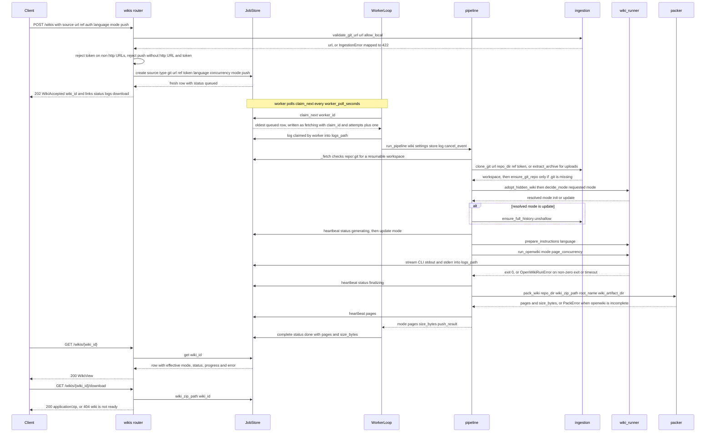
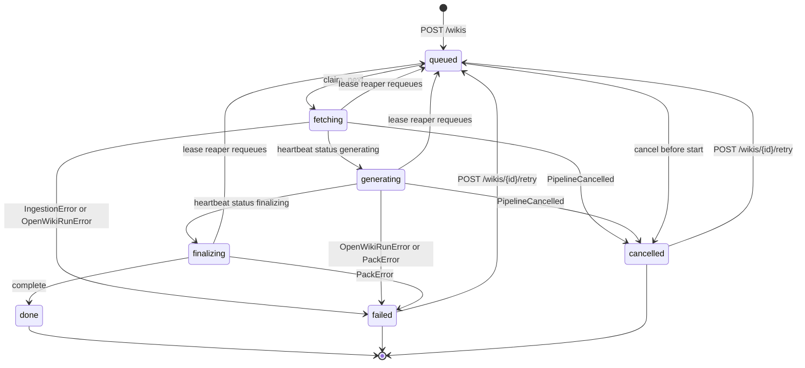

# Flujo: generar una wiki desde un repositorio git

Esta página sigue una **generación con origen git** desde la petición HTTP que la
crea hasta el `wiki.zip` que descarga un cliente. Es la vista operativa de la misma
maquinaria cuyos detalles internos viven en
[/openwiki/architecture/pipeline.md](/openwiki/architecture/pipeline.md) (una
generación reclamada), [/openwiki/concepts/wiki-lifecycle.md](/openwiki/concepts/wiki-lifecycle.md)
(estados, claims, retry y requeue) y
[/openwiki/concepts/wiki-artifact-and-paths.md](/openwiki/concepts/wiki-artifact-and-paths.md)
(dónde vive cada artefacto y cómo `openwiki/` se convierte en `.openwiki/` dentro del zip).

La API nunca genera nada: valida, encola, sirve estado y vuelve a entregar claims
caducados. El trabajo ocurre en contenedores worker (`python -m app.worker`) o, en
desarrollo y en las pruebas, en el worker en proceso habilitado por
`RUN_LOCAL_WORKER=true`. Ambos ejecutan el mismo `WorkerLoop` y el mismo
`run_pipeline`, y se coordinan únicamente a través del volumen de datos compartido
(la cola SQLite más `jobs/`).

| Etapa | Responsable | Qué puede escribir en la fila de `wikis` |
| --- | --- | --- |
| Validación y encolado | `app/routers/wikis.py` → `JobStore.create` | `queued`, `source`, `language`, `concurrency`, `mode`, `push`, `created_at` |
| Claim | `WorkerLoop._runner` → `JobStore.claim_next` | `fetching`, `claimed_by`, `claim_id`, `claimed_at`, `last_seen_at`, `attempts+1`, `started_at` |
| Fetch y ejecución | `app/services/pipeline.py` con `ingestion` + `wiki_runner` | `generating`, `mode` resuelto, `pages`, `finalizing` (todo vía `heartbeat`) |
| Empaquetado | `app/services/packer.py` | `pages`, `size_bytes` (vía `complete`) |
| Escritura terminal | `WorkerLoop._run` → `JobStore.complete` | `done` / `failed` / `cancelled`, `error`, `push_result`, `finished_at` |
| Observación | `GET /wikis/{id}`, `/logs`, `/download` | solo lectura |

## La petición completa como secuencia



*Una generación git: el router solo crea una fila, el worker es dueño de todas las transiciones de estado y el endpoint de descarga lee lo que el worker haya empaquetado.*

## Ciclo de vida de la fila



*Estados de una fila: los tres estados de ejecución (`fetching`, `generating`, `finalizing`) son los únicos que el worker puede cerrar, y solo `queued` puede ser reclamado.*

## 1. Envío: lo que el router rechaza antes de que exista una fila

`POST /wikis` recibe un cuerpo `WikiCreate` (`app/schemas.py`) y hace toda la
validación *antes* de `store.create`, de modo que una petición rechazada nunca deja
un job detrás:

| Comprobación | Mecanismo | Fallo |
| --- | --- | --- |
| Forma de la URL | `ingestion.validate_git_url(payload.source.url, allow_local=settings.allow_local_git)` | `422` con el mensaje del `IngestionError` (URL vacía, `ftp://`, una ruta local con `ALLOW_LOCAL_GIT=false`) |
| Transporte del token | un `source.auth.token` solo se acepta para URLs `http://`/`https://` | `422` `auth.token is only supported for http(s) git URLs` |
| Push por SSH | `push.enabled` con una URL `git@`/`ssh://` | `422` `push requires an http(s) URL; SSH keys are not available in the service` |
| Push por `git://` | la misma comprobación para el esquema `git://` | `422` `push is not supported over the git:// protocol` |
| Push anónimo | URL `http(s)` con `push` pero sin token | `422` `push requires source.auth.token (a PAT with write access)` |
| `mode` | `Literal["auto", "init", "update"]` en `WikiCreate` | `422` de la validación del modelo de petición (por ejemplo `"banana"`) |
| `concurrency` | límite `1..8` | `422` |
| `language` | de `2` a `32` caracteres | `422` |

En caso de éxito el router guarda
`{"type": "git", "url": <url validada>, "ref": ..., "token": ...}` junto con
`language`, `concurrency`, `mode` y las opciones de `push` serializadas, y responde
**`202 Accepted`** con un `WikiAccepted`: `wiki_id`, `status: "queued"` y
`links` = `{status, logs, download}`. `202` significa *aceptado*, nunca *generado*:
la respuesta la produce únicamente `store.create`, y puede que ningún worker haya
visto todavía la fila. El token permanece en la fila para que un retry pueda clonar
de nuevo sin que el cliente lo reenvíe, y la vista pública solo expone la URL
redactada — consulta [/openwiki/integrations/git-hosting.md](/openwiki/integrations/git-hosting.md)
para la regla de usuario por forge que hay detrás de ese token.

Los archivos subidos usan la ruta hermana `POST /wikis/upload`, que escribe el
cuerpo en streaming en `jobs/<wiki_id>/upload<suffix>` y se describe en
[/openwiki/workflows/upload-and-extraction.md](/openwiki/workflows/upload-and-extraction.md);
todo lo que hay después del paso de fetch es idéntico para ambos tipos de origen.

## 2. Claim: cómo una fila `queued` pasa a ser trabajo de alguien

Un runner de `WorkerLoop` itera indefinidamente: `note_worker(worker_id)`, después
`claim_next(worker_id)` y luego, o bien duerme `WORKER_POLL_SECONDS` (no hay
trabajo), o bien ejecuta la wiki reclamada. `claim_next` es la única transición
fuera de `queued`, y es atómica: `BEGIN IMMEDIATE`, un
`SELECT ... WHERE status='queued' ORDER BY created_at LIMIT 1` y un
`UPDATE ... WHERE wiki_id=? AND status='queued'` condicional. Si un segundo worker
pierde la carrera, la actualización no afecta a ninguna fila y la llamada devuelve
`None`.

Esa única llamada escribe todo aquello de lo que depende el resto del flujo:

| Columna | Valor | Por qué importa después |
| --- | --- | --- |
| `status` | `fetching` | el primer estado en ejecución; el reaper ya puede reencolar la fila |
| `claimed_by` | `worker_id` (`WORKER_ID`, si no el hostname del contenedor) | se expone como `worker` en `GET /wikis/{id}` |
| `claim_id` | `uuid4().hex` nuevo | el token de propiedad: `heartbeat` y `complete` filtran por él |
| `last_seen_at` | ahora | el lease contra el que compara el reaper |
| `attempts` | `attempts + 1` | cuenta los claims entregados, no los fallos |
| `started_at` | `COALESCE(started_at, now)` | el primer arranque sobrevive a cualquier requeue |

Después, `WorkerLoop._run` escribe la línea de log `claimed by worker <id>` a través
de `pipeline.make_logger(store.logs_path(wiki_id), secrets=...)`, lanza la tarea de
latido `_track`, que sondea `openwiki/.run.json` para obtener el progreso, y llama a
`run_pipeline`. Toda escritura de estado posterior pertenece al worker, nunca a la API.

## 3. Fetch: clonado superficial y atajo de reanudación

`run_pipeline` empieza con `_fetch`, cuya primera acción es una comprobación de
sistema de archivos:

```python
if (repo_dir / ".git").exists():
    log("repository workspace already present; resuming the generation")
    return
```

Ese atajo es lo que abarata el retry y el requeue, y es la razón de que el mismo
`wiki_id` entregado a un worker *distinto* continúe en
`<DATA_DIR>/jobs/<wiki_id>/repo` en lugar de clonar otra vez. Solo la ausencia de
`.git` provoca un fetch nuevo, y cualquier directorio no-git sobrante se borra antes
con `shutil.rmtree`. Como el atajo se basa en el sistema de archivos,
`DELETE /wikis/{id}` (que elimina todo el directorio `jobs/<wiki_id>/`) también
descarta la capacidad de reanudar.

Para un origen git el fetch es una sola llamada:

```python
await ingestion.clone_git(source.get("url", ""), repo_dir, ref=ref, token=...)
```

`clone_git` es siempre superficial y sin tags (`git clone --depth 1 --no-tags`,
timeout de 600 s): el servicio solo necesita la punta de una revisión. Con un `ref`
intenta primero `--branch <ref> --single-branch`; como `--branch` no puede hacer
checkout de un SHA de commit sin procesar, un `IngestionError` ahí se traga, se
borra el destino parcial y el fallback hace un clon superficial normal seguido de
`git fetch --depth 1 origin <ref>` y `git checkout FETCH_HEAD`. Un fallo en el
fallback no se traga: se propaga como `IngestionError` y la wiki termina `failed`.
La matriz de clonado y fallback de ref está documentada en
[/openwiki/integrations/git-hosting.md](/openwiki/integrations/git-hosting.md).

Por último se ejecuta `ingestion.ensure_git_repo(repo_dir)`: devuelve `False`
inmediatamente para un clon real (`.git` existe) y solo para un árbol ingerido sin
`.git` crea un repositorio con un único commit inicial — OpenWiki versiona la
evidencia de sus Claims mediante git, así que un workspace sin repositorio es
inservible. Cuando lo crea, el pipeline registra
`source had no .git; initialized a git repository with an initial commit`.

## 4. Selección de modo: adoptar una wiki oculta y elegir `init` o `update`

Antes del CLI se ejecutan dos pasos cuyo orden importa:

1. **Adopción.** `adopt_hidden_wiki(repo_dir, settings.wiki_artifact_dir)` renombra
   un directorio de wiki versionado (`WIKI_ARTIFACT_DIR`, convencionalmente
   `.openwiki/`) al `openwiki/` fijo que lee el CLI, y el pipeline registra
   `adopted .openwiki/ as openwiki/ for incremental updates`. No hace nada cuando el
   directorio de artefacto *es* `openwiki/`, cuando `openwiki/` ya existe o cuando no
   hay wiki oculta.
2. **Resolución de modo.** `decide_mode(repo_dir, requested_mode)` busca entonces
   `openwiki/index.md`.

```python
requested_mode = str(wiki.get("mode") or "auto")
mode = decide_mode(repo_dir, requested_mode)
```

La adopción debe preceder a la decisión: ese orden es exactamente lo que permite que
un repositorio que entrega `.openwiki/` se resuelva como `update` (incremental) en
lugar de degradarse a un `--init` completo. La tabla de resolución es:

| `mode` solicitado | `openwiki/index.md` presente | Modo resuelto |
| --- | --- | --- |
| `auto` (por defecto) | sí | `update` |
| `auto` | no | `init` |
| `update` | sí | `update` |
| `update` | no | `init` — fallback, registrado como `no existing wiki found in the source; falling back to --init` |
| `init` | cualquiera | `init` |

El modo resuelto se **persiste**, no solo se usa localmente:

```python
report(status="generating")
store.update(wiki_id, mode=mode)
```

`report(...)` es `store.heartbeat(wiki_id, claim_id, status="generating")`, así que
la fila pasa de `fetching → generating` y la columna `mode` se sobrescribe con el
valor efectivo. Por eso `GET /wikis/{id}` informa `mode: "init"` para una petición
que pidió `update` sobre un origen sin documentar: la API muestra lo que realmente se
ejecutó. Las otras dos consecuencias de `update` son:

- `ensure_full_history(repo_dir, url=..., token=...)` ejecuta
  `git fetch --quiet --unshallow origin` cuando existe `.git/shallow`, porque
  `--update` compara `HEAD` con el commit registrado en `openwiki/.last-update.json`
  y un clon `--depth 1` no contiene ese commit. El pipeline registra
  `fetched the full history so --update can diff against the last documented commit`
  cuando realmente hizo fetch. (Detalle de la decisión de negocio:
  `wiki_runner.decide_mode`.)
- `prepare_instructions(repo_dir, language)` escribe `openwiki/INSTRUCTIONS.md`
  cuando se pidió un `language` y el origen no trae ya uno: un brief escrito por el
  usuario siempre gana, y sin idioma no hay archivo. El archivo pasa a formar parte
  del árbol de la wiki, así que viaja dentro del zip empaquetado.

## 5. La ejecución del CLI

```python
concurrency = wiki.get("concurrency") or settings.default_page_concurrency
log(f"starting openwiki --{mode} -p (page concurrency: {concurrency})")
await run_openwiki(repo_dir, settings=..., log_path=store.logs_path(wiki_id),
                   mode=mode, page_concurrency=concurrency, secrets=secrets,
                   env_overrides=env_overrides, cancel_event=cancel_event)
```

- El comando es `OPENWIKI_BIN` dividido en argv más `--<mode> -p`, lanzado con
  `cwd=repo_dir` y `stdin=DEVNULL`, y con **stderr fusionado en stdout**. Cada línea
  se escribe en `logs_path` con sello UTC `[HH:MM:SS]` y pasa por `redact_text`, por
  lo que el log que sigue un cliente es también la propia salida del CLI.
- `page_concurrency` llega al CLI como `OPENWIKI_PAGE_CONCURRENCY` dentro del entorno
  que construye `build_env`; el esquema de la petición limita el valor a `1..8` y
  `Settings.default_page_concurrency` se valida en el mismo rango. Las credenciales
  del proveedor deliberadamente *no* se declaran en `Settings`: permanecen en el
  entorno del proceso y se reenvían sin tocar.
- La ejecución está acotada por `JOB_TIMEOUT_MINUTES`: al expirar, el proceso se mata,
  el log recibe `! openwiki exceeded the ... minute timeout and was killed` y se lanza
  `OpenWikiRunError`.
- Una salida distinta de cero lanza `OpenWikiRunError("openwiki exited with code N (see the job
  logs)")`. Un `cancel_event` activado mata al hijo y lanza `OpenWikiRunCancelled`,
  que el pipeline vuelve a lanzar como `PipelineCancelled`.

El contrato completo de frontera con el CLI (composición de argv, precedencia del
entorno, `NATIVE_WIKI_DIR`, semántica one-shot de `-p`) está en
[/openwiki/integrations/openwiki-cli.md](/openwiki/integrations/openwiki-cli.md).

Mientras corre el CLI, `run_pipeline.report(...)` y `WorkerLoop._track` escriben la
misma fila: `report` fija el estado y `_track` fija `progress` a partir de
`openwiki/.run.json` (`2/7 pages · generating`, con un recuento de `**/*.md` como
alternativa). En cualquiera de los dos casos, un heartbeat fallido (`ok=False`, es
decir, el lease fue reclamado por el reaper) o una marca de cancelación se convierten
en `PipelineCancelled("the worker lease was lost")` /
`PipelineCancelled("cancelled by user")`.

## 6. Empaquetado

Cuando el CLI termina, el pipeline informa `finalizing` y comprime el workspace en un
hilo:

```python
pages, size = await asyncio.to_thread(
    packer.pack_wiki, repo_dir, store.wiki_zip_path(wiki_id),
    root_name=settings.wiki_artifact_dir,
)
report(pages=pages)
log(f"wiki ready: {pages} pages, {size} bytes")
```

`pack_wiki` renombra la raíz del archivo sin tocar la disposición del workspace: cada
entrada se escribe como `f"{root_name}/{path.relative_to(wiki).as_posix()}"`, así que
un `openwiki/` del workspace pasa a ser `.openwiki/…` dentro del zip. Se niega a
producir un artefacto parcial — `PackError("openwiki/ directory was not produced")`
cuando falta el directorio y `PackError("openwiki/index.md is missing; the run did not
complete")` cuando falta la página de entrada — y escribe `wiki.zip.tmp` antes de
sustituir `wiki.zip` de forma atómica, de modo que una ejecución anulada no puede
dejar un archivo a medio escribir para que `/download` lo sirva. `pages` cuenta las
entradas `.md`; `size_bytes` es el tamaño del archivo. Las transformaciones de rutas
se detallan en
[/openwiki/concepts/wiki-artifact-and-paths.md](/openwiki/concepts/wiki-artifact-and-paths.md).

Si la wiki se envió con `push`, el paso opcional de publicación se ejecuta **después**
del empaquetado (y solo para orígenes git): `push.enabled: false` produce
`push_result.status = "skipped"`; en caso contrario `publisher.publish_wiki` renombra
`openwiki/` al directorio de artefacto, lo confirma (excluyendo el `.run.json`
transitorio) y hace push. Un push fallido informa la wiki como `failed` con
`push_result.status = "failed"` **pero mantiene descargable el zip ya empaquetado**.

## 7. El estado terminal y lo que puede observar el cliente

`WorkerLoop._run` traduce el resultado del pipeline en una única llamada
`store.complete(wiki_id, claim_id, ...)`, condicional al `claim_id` que siga vivo:

| Resultado | Fila escrita |
| --- | --- |
| El pipeline retornó | `done`, con `pages`, `size_bytes`, `push_result` |
| `PipelineCancelled` (cancelación del usuario o lease perdido) | `cancelled` con el motivo en `error` |
| `publisher.PushError` | `failed`, `error="push failed: ..."`, `push_result.status="failed"` |
| `ingestion.IngestionError`, `OpenWikiRunError`, `packer.PackError` | `failed` con el mensaje (truncado a 500 caracteres) |
| Cualquier otra `Exception` | `failed` con un mensaje tipo `TypeError: ...` — un runner nunca debe morir |
| `asyncio.CancelledError` (apagado del worker) | nada: el claim sigue en ejecución y el reaper de la API lo reencola |

La cancelación previa al cierre depende del estado: `POST /wikis/{id}/cancel` cierra
una fila `queued` de inmediato como `cancelled` con `error="cancelled before start"`,
mientras que una fila en ejecución solo se marca con `cancel_requested` y se informa
como `cancelling`, dejando al worker cerrarla como `cancelled` en su siguiente
latido; una fila ya terminal devuelve `409` con `wiki is not running`, y un id
desconocido `404`.

Los endpoints de lectura exponen después el resultado:

- **`GET /wikis/{id}`** renderiza la fila a través de `wiki_to_view`, exponiendo
  `status`, `source_url` redactada, `ref`, `language`, el `mode` **efectivo**,
  `worker` (`claimed_by`), `attempts`, `progress`, `pages`, `size_bytes`, `error`,
  `push_result`, `created_at`, `started_at` y `finished_at`. Los ids desconocidos o
  mal formados nunca tocan el sistema de archivos: `is_valid_wiki_id` comprueba
  primero `^[0-9a-f]{32}$`, así que tanto `/wikis/deadbeef` como intentos de
  traversal tipo `/wikis/..%2Fescape` devuelven `404`.
- **`GET /wikis/{id}/logs?tail=N`** (`1..2000`, por defecto `50`) devuelve las últimas
  `N` líneas del único archivo de log escrito por el worker como `text/plain`, o un
  cuerpo vacío antes de que se haya registrado nada.
- **`GET /wikis/{id}/download`** exige que existan la fila *y* el `wiki.zip`. En caso
  contrario responde `404` con `wiki is not ready (status=...)`, lo que cubre tanto
  "sigue en ejecución" como "la ejecución falló antes de empaquetar". Un éxito es un
  `FileResponse` con `media_type="application/zip"` y nombre de archivo
  `openwiki-{wiki_id}.zip`.

Una wiki `done` no es la única descargable: como la comprobación de descarga es
puramente la existencia de `wiki.zip`, una wiki *reintentada* cuyo intento anterior
empaquetó correctamente sigue sirviendo ese archivo antiguo hasta que el nuevo
intento lo sustituya.

## Casos límite que definen este flujo

| Situación | Comportamiento observable | Dónde queda fijado |
| --- | --- | --- |
| El CLI sale con código distinto de cero | wiki `failed`, `error` contiene `exit`, `GET …/download` → `404` | `test_git_wiki_failure_is_reported` |
| La ejecución sigue en curso | `GET …/download` → `404` con `not ready` hasta que termina el empaquetado | `test_wiki_is_not_available_while_running` |
| Se reintenta una wiki `failed` | `POST …/retry` → `202` `queued`, el siguiente intento **reanuda** en el workspace superviviente, acaba `done`, descarga `200` | `test_failed_wiki_can_be_retried` |
| Se cancela una wiki en ejecución y se reintenta | `cancelling` → `cancelled` (con motivo), luego `retry` → `done` | `test_cancel_running_wiki_and_retry_resumes` |
| El origen versiona su wiki como `.openwiki/` | la adopción registra `adopted .openwiki/ as openwiki/`, el modo se resuelve como `update`, el CLI recibe `--update`, la raíz del zip es `.openwiki/` | `test_hidden_wiki_is_adopted_for_incremental_updates` |
| `auto` contra un repo que entrega una wiki en `openwiki/` | `mode: "update"` en la fila y `--update` en el argv del CLI | `test_auto_mode_uses_update_when_the_source_ships_a_wiki` |
| `update` explícito sin wiki | `mode: "init"` en la fila y `falling back to --init` en los logs | `test_explicit_update_without_wiki_falls_back_to_init` |
| Un `mode` inválido | `422` antes de que exista ninguna fila | `test_invalid_mode_is_rejected` |
| Un token en una URL SSH | `422` | `test_token_requires_https_url` |
| Una wiki terminada y otra interrumpida entre reinicios | las filas `done` y su zip sobreviven; una fila forzada en ejecución con un claim muerto se reencola y termina | `test_completed_wikis_survive_a_restart`, `test_active_wikis_are_resumed_after_a_restart` |

## Configuración que da forma a este flujo

| Variable | Por defecto | Efecto sobre el flujo git |
| --- | --- | --- |
| `ALLOW_LOCAL_GIT` | `false` | permite orígenes de ruta local / `file://`; mantiene las peticiones de producción en http(s)/ssh |
| `JOB_TIMEOUT_MINUTES` | `45` | límite de tiempo real del subproceso del CLI |
| `DEFAULT_PAGE_CONCURRENCY` | `2` | `OPENWIKI_PAGE_CONCURRENCY` cuando la petición omite `concurrency` (ambos validados `1..8`) |
| `WIKI_ARTIFACT_DIR` | `.openwiki` | nombre de la raíz del zip y del directorio adoptado antes de la ejecución / confirmado por el push |
| `WORKER_POLL_SECONDS` | `2.0` | retardo entre intentos de `claim_next` cuando la cola está vacía |
| `WORKER_PROGRESS_SECONDS` | `2.0` | periodo de progreso/latido mientras corre el CLI |
| `WORKER_LEASE_SECONDS` | `180` | tras este tiempo sin latido la API reencola la fila (otro worker la reanuda) |
| `RUN_LOCAL_WORKER` | `false` | ejecuta el mismo pipeline dentro del proceso de la API (contenedor único, desarrollo, pruebas) |

## Pruebas centradas

- `tests/test_api_wikis.py` es la especificación de extremo a extremo de esta página:
  ejecuta generaciones reales a través de la API con `tests/fixtures/fake_openwiki.py`
  como `OPENWIKI_BIN`: rechazos de validación (`422` para `ftp://`, URL vacía, token
  con URL SSH, `mode` inválido), el camino feliz
  (`test_git_wiki_end_to_end` comprueba `pages >= 2`, raíz del zip `.openwiki/`,
  `.openwiki/INSTRUCTIONS.md` con el idioma solicitado y logs con sello temporal),
  los casos de fallo/descarga/cancelación/retry de la tabla anterior, la selección de
  modo con adopción de wiki oculta, y la supervivencia a reinicios.
- `tests/conftest.py` construye los fixtures que lo hacen posible: un repositorio git
  local (`make_git_repo`, con wiki opcional en `openwiki/` o `.openwiki/`), una
  instancia de `Settings` que apunta `openwiki_bin` al CLI falso con
  `run_local_worker=True`, y los sondeadores `wait_for_status` / `wait_for_state` que
  permiten a las pruebas observar `fetching`, `generating` y los estados terminales.
- `tests/test_ingestion.py` cubre las primitivas de fetch de las que depende este
  flujo: validación de URL, coincidencia de sufijos de archivo, la cabecera de token
  por forge, las rutas de rama y de SHA de commit de `clone_git`, y la idempotencia de
  `ensure_git_repo`.
- `tests/test_push.py` cubre el paso opcional posterior al empaquetado, incluido
  `test_update_wikis_fetch_the_full_history`, que comprueba tanto el unshallow (sin
  `.git/shallow`) como la línea de log de una ejecución `update` que hace push.
- `tests/test_wiki_state.py` prueba de forma unitaria `decide_mode`,
  `adopt_hidden_wiki` y `pack_wiki`, es decir, las tres decisiones deterministas que
  el pipeline toma entre el fetch y el estado terminal.
