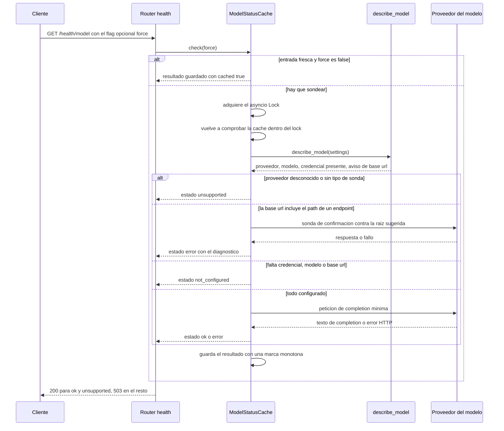
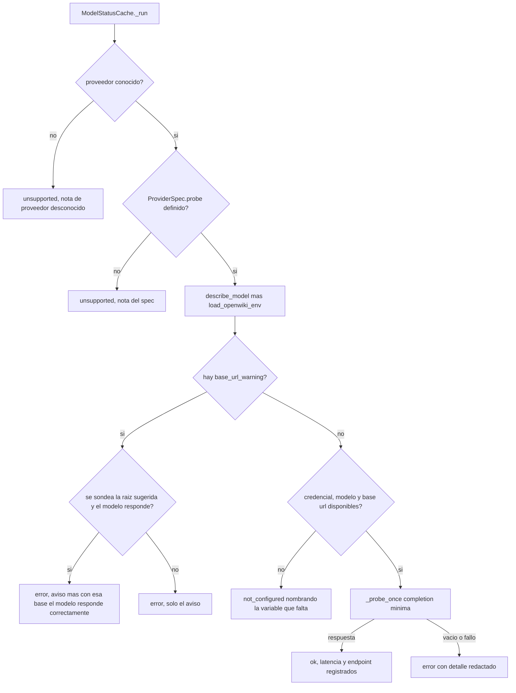

# Comprobación de estado del modelo: `/health`, `/health/model` y la sonda activa

Dos endpoints responden a la pregunta "¿este servicio es utilizable?", y están
deliberadamente separados por coste. `GET /health` es una instantánea barata que
nunca toca la red; `GET /health/model` gasta una llamada mínima al proveedor para
demostrar que las credenciales y la conectividad funcionan de extremo a extremo.
Ambos los implementa `app/routers/health.py`, mientras que todo el conocimiento de
proveedores vive en `app/services/model_status.py` (el resumen pasivo de la
configuración y la sonda activa), y el resultado de la sonda se memoiza en
`ModelStatusCache`, una instancia por aplicación creada en `app/main.py`
(`app.state.model_cache`).

La matriz de proveedores, el apilado de credenciales y el proxy que inyecta
cabeceras se describen en
[/openwiki/integrations/model-providers.md](/openwiki/integrations/model-providers.md);
esta página es la vista de endpoints y diagnóstico del mismo subsistema.

| Endpoint | Coste | Dueño de la respuesta |
| --- | --- | --- |
| `GET /health` | ninguno — nunca llama a un modelo | `describe_model(settings)`, `JobStore.stats()`, `Settings` |
| `GET /health/model` | una llamada mínima al proveedor, cacheada durante `MODEL_CHECK_TTL_SECONDS` | `ModelStatusCache.check()`, que a su vez llama a `describe_model` y a `_probe_once` |

Ninguno de los dos endpoints declara un modelo de respuesta de
`app/schemas.py`: `health()` devuelve un `dict` plano y `health_model()` devuelve
un `JSONResponse` construido a mano, así que la forma documentada aquí es el
contrato real y en el esquema OpenAPI ambos cuerpos aparecen como objetos libres.

## `GET /health`: la instantánea pasiva

`health()` es un handler síncrono que lee `request.app.state.settings` y
`request.app.state.store` y devuelve un `dict` plano, de modo que un orquestador
puede sondearlo tan a menudo como quiera:

| Campo | Valor |
| --- | --- |
| `status` | constante `"ok"` — solo liveness del proceso de la API |
| `version` | `app.__version__` (la versión del servicio, no la del CLI de OpenWiki) |
| `openwiki_bin` | el comando del CLI configurado tal cual se escribió |
| `openwiki_found` | `shutil.which(argv[0])` tras `split_command(settings.openwiki_bin)`, así que un comando como `"python" "fake_openwiki.py"` se comprueba como `python` |
| `data_dir` | `str(settings.data_dir)` — el volumen compartido |
| `pool` | `store.stats()` |
| `model` | `describe_model(settings)` |

El bloque `model` nunca contiene un secreto. Informa de:

- `provider` y `provider_source` — `environment`, `config` o `default`;
- `model` y `model_source`;
- `credential_env`, `credential_present` y `credential_source` — el *nombre* de la
  variable y si está definida, nunca su valor;
- `base_url` (a través de `redact_url`) y `base_url_source`;
- `base_url_warning` y `suggested_base_url` cuando la URL configurada incluye
  incorrectamente el path de un endpoint;
- `extra_headers` (solo nombres, ordenados) y `extra_headers_error` para la
  configuración de gateway `openai-compatible`;
- `probe_supported`, `note` y `active_check_endpoint` (`"/health/model"`).

`provider_source` es `environment` cuando `OPENWIKI_PROVIDER` está en
`os.environ`, `config` cuando se encontró en `<config_dir>/.env` y `default`
cuando se usó el valor de reserva `openai`. Los demás campos `*_source` salen del
mismo helper y usan el valor de reserva (`default`) cuando nada los definió.

### Cómo se resuelve la configuración

Tanto `describe_model` como la sonda resuelven la configuración del proveedor
**exactamente igual que OpenWiki**: `_parse_env_file(settings.resolved_config_dir / ".env")`
se mezcla por debajo de `os.environ`, de modo que gana el entorno del proceso. El
parser es un lector mínimo de `KEY=VALUE` — se salta líneas vacías y comentarios
`#`, elimina un `export ` inicial y quita las comillas simples o dobles
envolventes — y nunca lanza excepción por un fichero ausente o ilegible.
`load_openwiki_env` es la misma mezcla que usa la sonda activa, y por eso la
sonda prueba la misma credencial que recibirá el CLI.

El nombre del proveedor es `OPENWIKI_PROVIDER` (`openai` por defecto, con
`strip()` y minúsculas), el modelo es `OPENWIKI_MODEL_ID` con reserva al modelo
por defecto del spec, y la base URL es la variable de base URL del proveedor con
reserva a la que trae el spec. Como `_run` llama a `describe_model` por su cuenta,
el bloque pasivo y la comprobación activa no pueden discrepar sobre qué proveedor
o modelo están en efecto.

## `PROVIDERS` como tabla de decisión

`ProviderSpec` es un dataclass congelado con seis campos, y `PROVIDERS` mapea un
id de proveedor a un spec. Esa tabla es la única superficie de decisión: gobierna
el informe pasivo *y* selecciona la sonda, así que añadir un proveedor es un
cambio localizado más, como mucho, una rama nueva en `_probe_once`.

| `provider` | Variable de credencial | Variable de base URL | Base URL por defecto | Modelo por defecto | Sonda |
| --- | --- | --- | --- | --- | --- |
| `openai` | `OPENAI_API_KEY` | `OPENAI_BASE_URL` | `https://api.openai.com/v1` | `gpt-5.6-terra` | `openai-responses` |
| `anthropic` | `ANTHROPIC_API_KEY` | `ANTHROPIC_BASE_URL` | `https://api.anthropic.com` | — (requiere `OPENWIKI_MODEL_ID`) | `anthropic` |
| `gemini` | `GEMINI_API_KEY` | — (fija) | `https://generativelanguage.googleapis.com` | — | `gemini` |
| `openrouter` | `OPENROUTER_API_KEY` | — (fija) | `https://openrouter.ai/api/v1` | — | `chat` |
| `openai-compatible` | `OPENAI_COMPATIBLE_API_KEY` | `OPENAI_COMPATIBLE_BASE_URL` | — (obligatoria) | — | `chat` |
| `nvidia` | `NVIDIA_API_KEY` | `NVIDIA_BASE_URL` | — (obligatoria) | — | `chat` |
| `fireworks` | `FIREWORKS_API_KEY` | `FIREWORKS_BASE_URL` | — (obligatoria) | — | `chat` |
| `baseten` | `BASETEN_API_KEY` | `BASETEN_BASE_URL` | — (obligatoria) | — | `chat` |
| `nebius` | `NEBIUS_API_KEY` | — | — | — | ninguna — `active check needs a base URL and is not implemented yet` |
| `bedrock` | — | — | — | — | ninguna — `uses IAM credentials instead of an API key` |
| `copilot` | `COPILOT_API_KEY` | `COPILOT_BASE_URL` | — | — | ninguna — `uses a GitHub OAuth token or gh session` |
| `gemini-enterprise` | — | — | — | — | ninguna — `uses Google ADC instead of an API key` |
| `openai-chatgpt` | — | — | — | — | ninguna — `uses a browser sign-in session` |

De la tabla se deducen tres consecuencias:

- Un proveedor con `probe=None` **nunca se sondea**. La `note` del spec se
  convierte en el `detail` de un resultado `unsupported`, y por eso los
  proveedores cuya autenticación no es una API key simple (IAM, sesión OAuth/`gh`,
  Google ADC, inicio de sesión por navegador) se reportan en lugar de adivinarse.
- Un id de proveedor fuera de la tabla también da `unsupported`, con
  `unknown provider '...'; cannot verify the model`, y `describe_model` informa de
  `probe_supported: False` más la misma nota con el nombre.
- `credential_env=None` significa "no hace falta API key": la comprobación de
  `not_configured` se salta para ese proveedor y la sonda se ejecuta igualmente.

## `GET /health/model`: contrato de petición y códigos HTTP

```bash
curl http://localhost:8000/health/model                 # uses the cache
curl "http://localhost:8000/health/model?force=true"    # re-probes the provider
```

El handler es un coordinador fino:

1. `force: bool = Query(False)` — la única entrada.
2. `result = await request.app.state.model_cache.check(force=force)`.
3. `status_code = 200 if result["status"] in {"ok", "unsupported"} else 503`, y el
   dict del resultado se devuelve tal cual dentro de un `JSONResponse`.

Así que el cuerpo tiene siempre la misma forma y solo cambia el código HTTP:

| `status` | HTTP | Significado |
| --- | --- | --- |
| `ok` | `200` | El proveedor respondió con contenido no vacío. |
| `unsupported` | `200` | El proveedor no tiene sonda activa implementada, o su id es desconocido. No es un error de configuración. |
| `error` | `503` | Error HTTP del proveedor, completion vacía, HTML en lugar de JSON, cabeceras extra mal formadas o timeout. |
| `not_configured` | `503` | Falta una variable obligatoria; `detail` nombra exactamente cuál. |

Cada resultado lleva `provider`, `model`, `credential_env`, `checked_at` (UTC,
`%Y-%m-%dT%H:%M:%SZ`), `latency_ms` (`None` cuando no se hizo ninguna petición),
`endpoint` (la URL de sonda redactada, `None` cuando no hubo petición), `cached` y
`detail`. `unsupported` y `not_configured` se cachean exactamente igual que las
sondas correctas, así que un `OPENWIKI_PROVIDER` inválido sigue respondiendo
`200 unsupported` durante todo el TTL salvo que se pase `force=true`.

### Secuencia de un `GET /health/model`



*La consulta a la caché ocurre antes y dentro del lock, así que llamadas concurrentes provocan como mucho una llamada al proveedor.*

## Caché, lock y `force`

`ModelStatusCache` se crea una vez por aplicación y guarda `self._cached` junto a
una marca de `time.monotonic()`:

- `check(force=False)` devuelve `{**cached, "cached": True}` cuando existe una
  entrada fresca; en caso contrario toma un `asyncio.Lock`, **vuelve a comprobar**
  la frescura dentro del lock (double-checked locking, de modo que una ráfaga de
  peticiones concurrentes produce exactamente una sonda), ejecuta la sonda y
  guarda el resultado con `cached: False`.
- La frescura es `(now - cached_at) < max(MODEL_CHECK_TTL_SECONDS, 0)`. Como el
  TTL se recorta con `max(..., 0)`, `MODEL_CHECK_TTL_SECONDS=0` — o cualquier
  valor negativo — desactiva la caché: cada llamada sondea al proveedor.
- `force=true` omite una entrada fresca y vuelve a sondear, pero sigue
  serializándose en el lock y refresca la entrada, así que es la forma de recoger
  un cambio de entorno sin esperar a que caduque `MODEL_CHECK_TTL_SECONDS`.

`MODEL_CHECK_TTL_SECONDS` vale `30` por defecto y no tiene validador (solo el
recorte); `MODEL_CHECK_TIMEOUT_SECONDS` vale `20` por defecto y está validado como
`>= 1` por `Settings._check_positive`, porque un timeout de cero haría imposible
cualquier sonda.

Dos propiedades operativas importan aquí. La caché vive **por instancia de
aplicación**, es decir, por proceso uvicorn, así que un despliegue escalado sondea
una vez por réplica y el TTL no es un presupuesto compartido. Y `_run` vuelve a
leer el entorno mezclado en cada sonda no cacheada, de modo que rotar una
credencial solo se ve cuando expira el TTL o con `?force=true`.

## La sonda: qué se envía realmente

`_probe_once` envía la completion más pequeña posible, con `PROBE_PROMPT` como
turno de usuario. Construye la base URL como
`base_override or env[base_url_env] or default_base_url`, sin barras finales,
abre un `httpx.AsyncClient` por sonda a través de `_make_client(timeout)` (la
costura que monkeypatchean los tests) y mezcla las cabeceras como
`{"Content-Type": "application/json", **auth, **extra_headers}` — las cabeceras
extra van al final, así que una cabecera de gateway configurada puede sobrescribir
cualquier cosa, incluida `Authorization`.

| Tipo de sonda | Petición | Extracción de la respuesta |
| --- | --- | --- |
| `openai-responses` | `POST {base}/responses` con `Authorization: Bearer <credential>` y `{model, input, max_output_tokens: 1024}` | `output[].content[].text` concatenado |
| `anthropic` | `POST {base}/v1/messages` con `x-api-key` y `anthropic-version: 2023-06-01`, `{model, max_tokens: 64, messages: [...]}` | `content[].text` concatenado |
| `gemini` | `POST {base}/v1beta/models/{model}:generateContent` con la key como parámetro de query `key` y `{contents, generationConfig: {maxOutputTokens: 128}}`; se quita un prefijo `models/` del id del modelo | `content.parts[].text` del primer candidato, vacío cuando no hay candidatos |
| `chat` | `POST {base}/chat/completions` con `Authorization: Bearer <credential>` y `{model, max_tokens: 256, messages: [...]}` | `choices[0].message.content` (las partes de tipo string se unen) o `choices[0].text` |

Cualquier otro valor de sonda lanza `ProbeError("active check is not implemented
for provider ...")`. `_ensure_ok` acepta como éxito cualquier status por debajo de
`400`, y a partir de ahí se parsea el cuerpo de la respuesta; un status `>= 400`
se convierte en un `ProbeError` cuyo texto es
`POST <redacted url> -> HTTP <code>: <detail>`.

La sonda habla con el **upstream** directamente, nunca a través del proxy loopback
que inyecta cabeceras, así que `/health/model` sigue probando el endpoint que la
configuración de proveedor del CLI realmente nombra. El proxy en sí y
`parse_extra_headers` están en
[/openwiki/integrations/model-providers.md](/openwiki/integrations/model-providers.md).

### Orden de decisión dentro de `_run`



*El orden importa: el aviso de base URL corta el flujo antes de las comprobaciones de "¿está configurado?", así que se reporta incluso cuando además falta una credencial.*

Como la rama del aviso se ejecuta primero, una base URL que incluye el path del
endpoint se diagnostica antes que cualquier resultado `not_configured`. Los
detalles de `not_configured` son exactos: `<CREDENTIAL_ENV> is not set`,
`OPENWIKI_MODEL_ID is not set and this provider has no known default model`, o
`<BASE_URL_ENV> is not set` — este último solo se dispara para proveedores cuya
variable de base URL no tiene valor por defecto (`openai-compatible`, `nvidia`,
`fireworks`, `baseten`).

## Diagnósticos de base URL

Tres heurísticas explican los errores de configuración habituales con gateways
compatibles con OpenAI.

**`_split_base_url` — la URL contiene por error el path del endpoint.** La función
quita las barras finales y contrasta la URL en minúsculas con
`("/chat/completions", "/responses", "/completions", "/messages")`. Si hay
coincidencia devuelve `(root, suffix)`, y `describe_model` reporta entonces un
`base_url_warning` (`<SETTING> must be the API root without <suffix>; use <root> —
the endpoint path is appended automatically`) más `suggested_base_url=root`.
`/health` muestra ese aviso sin ninguna llamada al proveedor.

**Confirmar la sugerencia.** En `_run`, cuando existe un aviso *y* se conoce un id
de modelo *y* se cumple el requisito de credencial, la comprobación sondea
`base_override=suggested` antes de aconsejarla. Un `ProbeError` o `httpx.HTTPError`
durante esa confirmación se traga (`answer = ""`); si el modelo responde, el
resultado sigue siendo `error` pero el detalle pasa a ser
`<warning> — with that base the model answers correctly` y se registra
`latency_ms`. La ruta duplicada nunca se sondea, así que el diagnóstico cuesta
exactamente una llamada al proveedor.

**`_post_with_v1_hint` — a la URL le falta `/v1`.** Ante un `404`/`405` de
`{base}{path}` donde `base` no termina ya en `/v1`, la sonda reintenta
`{base}/v1{path}` como diagnóstico; si esa llamada funciona, el `ProbeError`
lanzado dice qué URL sirve y qué variable corregir
(`set OPENAI_COMPATIBLE_BASE_URL=https://gateway.example.com/v1`). Existe porque
los SDK de OpenAI — y por tanto OpenWiki — construyen las URLs de petición como
`baseURL + path`, de modo que una base URL sin `/v1` falla exactamente así. Solo
los tipos de sonda `openai-responses` y `chat` usan este helper.

**HTML en lugar de JSON.** `_response_error` inspecciona la respuesta: cuando el
`Content-Type` contiene `html`, o el cuerpo empieza por `<`, el detalle pasa a ser
`HTML page instead of JSON` más la pista *the URL does not look like an API
endpoint; OpenAI-compatible base URLs usually end in `/v1`*. En caso contrario
extrae el mensaje del proveedor de `{"error": {"message": ...}}`,
`{"error": "..."}` o `{"message": "..."}` (truncado a 300 caracteres), con reserva
a los primeros 200 caracteres del cuerpo en crudo y, por último, a
`no error details`.

## Semántica de fallo y redacción

- **Timeout** — `httpx.TimeoutException` se convierte en `error` con
  `model did not answer within <MODEL_CHECK_TIMEOUT_SECONDS>s`.
- **Error de transporte / HTTP** — cualquier otro `httpx.HTTPError` se convierte en
  `error` con `HTTP error: ...`.
- **Completion vacía** — una respuesta `2xx` sin texto extraíble se convierte en
  `error` con `provider returned an empty completion (streaming-only gateway?)`, el
  síntoma típico de un gateway que solo soporta streaming.
- **Redacción** — los detalles de `ProbeError` y `httpx.HTTPError` pasan por
  `redact_text(text, (credential,))`, así que una clave que el proveedor repita en
  un mensaje `401` llega como `***`, y el `endpoint` reportado pasa por
  `redact_url`. El valor de la credencial nunca forma parte de ninguna respuesta.
- **Cabeceras extra mal formadas** — para `openai-compatible`, un `ValueError` de
  `parse_extra_headers` se reporta como `status: error` con el mensaje del parser,
  nunca como excepción. (`/health` informa del mismo problema como dato, mediante
  `extra_headers_error`, y lista `extra_headers` solo como **nombres** ordenados, de
  modo que un token de sesión pasado como valor de cabecera queda fuera del
  informe.)

## Operación

- El healthcheck del contenedor hace curl a `/health`, **no** a `/health/model`
  (`HEALTHCHECK ... curl -fsS http://127.0.0.1:8000/health`), y el servicio
  `worker` desactiva su healthcheck por completo. Conecta `/health/model` a una
  comprobación de readiness/alertas solo teniendo presente la caché: cada sonda es
  una llamada real al proveedor.
- `MODEL_CHECK_TTL_SECONDS=30` y `MODEL_CHECK_TIMEOUT_SECONDS=20` son los valores
  por defecto documentados en `.env.example`; subir el TTL baja la tasa de sondas y
  retrasa la detección de una credencial rotada, mientras que `0` convierte cada
  llamada en una sonda.
- En despliegues con varias réplicas, cada proceso mantiene su propia entrada
  cacheada, así que `N` réplicas pueden significar `N` llamadas al proveedor por
  ventana de TTL.
- Si el entorno falta por completo, la aplicación arranca igualmente: el fallo
  aparece como `503 not_configured` desde `/health/model` nombrando la variable que
  falta, no como un error de arranque.

## Pruebas focalizadas

- `tests/test_health.py` — `/health` devuelve `200` con una versión y
  `pool.workers == 1` (el worker en proceso), y `/` apunta a `/docs`.
- `tests/test_model_status.py` es la suite de esta página:
  - configuración pasiva — proveedor/modelo por defecto (`openai`,
    `gpt-5.6-terra`), proveedor leído de `<config_dir>/.env` con
    `credential_source == "config"`, y el entorno ganando a ese fichero;
  - sonda activa — `200 ok` con `cached: false`, la segunda llamada `cached: true`
    con una sola llamada al upstream, y `?force=true` volviendo a sondear;
  - rutas `503` — redacción de una clave repetida en un `401`, completion vacía,
    `not_configured` nombrando `OPENAI_API_KEY`, y `openai-compatible` exigiendo
    `OPENAI_COMPATIBLE_BASE_URL`;
  - `unsupported` para `bedrock` (menciona IAM) y para un id de proveedor
    desconocido;
  - formas de sonda — Anthropic llamando a `/v1/messages` con `x-api-key`, las
    cabeceras extra más el `User-Agent` por defecto `openwiki-service/` llegando al
    upstream, y `/health` listando nombres de cabecera sin valores;
  - diagnósticos — el `404` HTML, la pista de `/v1` ausente, el aviso de base URL,
    la corrección del path de endpoint confirmada (solo se sondea la base
    corregida) y la variante sin confirmar.
  La sonda se dirige a través de un `httpx.MockTransport` instalado
  monkeypatcheando `model_status._make_client`, así que ningún test necesita un
  proveedor real. `tests/fixtures/fake_openai_server.py` es el complemento manual:
  un mock mínimo de API compatible con OpenAI (`python fake_openai_server.py [port]`,
  puerto 9000 por defecto) que sirve las formas de respuesta y de chat-completions
  usadas por la sonda, y que con `FAKE_REQUIRE_SESSION=1` reproduce un gateway que
  exige `x-opencode-session`.

## Páginas relacionadas

- [/openwiki/integrations/model-providers.md](/openwiki/integrations/model-providers.md) — tabla de proveedores, flujo de credenciales y el proxy loopback que inyecta cabeceras y que la sonda evita deliberadamente.
- [/openwiki/operations/configuration.md](/openwiki/operations/configuration.md) — `MODEL_CHECK_TTL_SECONDS`, `MODEL_CHECK_TIMEOUT_SECONDS`, `OPENAI_COMPATIBLE_EXTRA_HEADERS` y el resto de `Settings`.
- [/openwiki/architecture/api-service.md](/openwiki/architecture/api-service.md) — `create_app`, `app.state` y el contrato HTTP completo.
- [/openwiki/concepts/credentials-and-redaction.md](/openwiki/concepts/credentials-and-redaction.md) — `redact_url` / `redact_text` y la regla de "nombres, nunca valores".
- [/openwiki/operations/observability-and-recovery.md](/openwiki/operations/observability-and-recovery.md) — qué más expone el servicio para diagnóstico.
