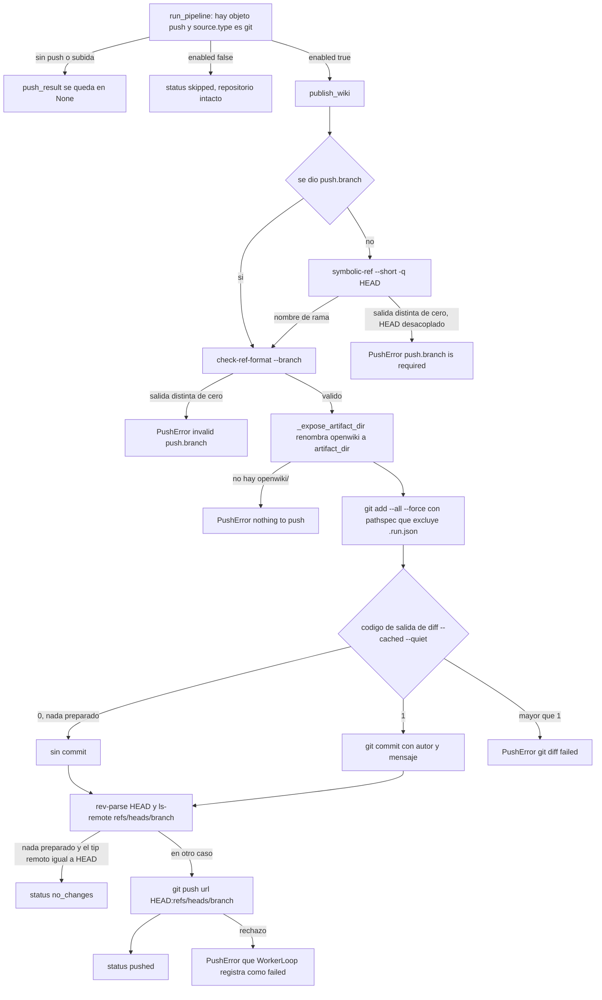
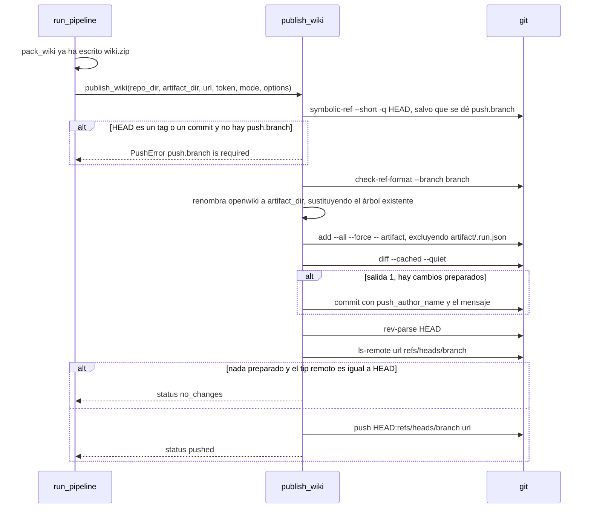

# Push-back: commitear la wiki generada al repositorio de origen

`app/services/publisher.py` es el **único** lugar del servicio que escribe en un
repositorio remoto. Se ejecuta al final de una generación, cuando el zip ya está
empaquetado, y responde a una sola pregunta: *¿la wiki que se acaba de generar ya
está en el repositorio de origen y, si no lo está, se commitea y se empuja?*

Todo el flujo es una función, `publish_wiki`, más tres helpers que se reparten una
decisión cada uno:

| Helper | De qué decide |
| --- | --- |
| `_target_branch` | a qué rama se empuja y si una rama se puede resolver siquiera |
| `_expose_artifact_dir` | renombrar el `openwiki/` fijo del CLI a `WIKI_ARTIFACT_DIR` para que el commit contenga exactamente la wiki |
| `_remote_commit` | preguntar al remoto, en solo lectura, cuál es el tip de su rama |

Solo los dos comandos de red (`ls-remote`, `push`) llevan el prefijo
`git -c http.extraHeader=…` del token; los comandos de staging y de commit son
locales y se ejecutan sin él.

## Cuándo se empuja

El bloque de push dentro de `run_pipeline` es doblemente condicional y ninguna de las
dos condiciones es negociable en tiempo de ejecución:

```python
push_options = wiki.get("push") if isinstance(wiki.get("push"), dict) else None
if push_options is not None and source.get("type") == "git":
    if not push_options.get("enabled", True):
        push_result = {"status": "skipped", "detail": "push disabled for this wiki", "at": utc_now()}
        log("push disabled for this wiki")
    else:
        push_result = await publisher.publish_wiki(...)
```

- Sin objeto `push` en el job → `push_result` se queda en `None` y el publisher no
  llega a invocarse.
- `push.enabled: false` → se registra `status="skipped"` **sin tocar el repositorio
  en absoluto** (`tests/test_push.py::test_disabled_push_is_skipped` comprueba que el
  tip de la rama remota no cambia). La configuración se conserva para poder
  reactivarla después.
- Los orígenes de subida (`source.type == "upload"`) nunca empujan: `POST
  /wikis/upload` ni siquiera acepta un campo `push`.

Todo lo demás se rechaza antes, en `POST /wikis`, como un `422` **antes de que exista
ninguna fila de job** — el router es la capa de política, el publisher es el
mecanismo:

| Envío | Respuesta |
| --- | --- |
| `push` con URL `git@`/`ssh://` | `422` — "push requires an http(s) URL; SSH keys are not available in the service" |
| `push` con URL `git://` | `422` — push no está soportado sobre `git://` |
| `push` con URL `http(s)` y sin `source.auth.token` | `422` — el push sería anónimo; hace falta un PAT con permiso de escritura |
| `push` con ruta local / URL `file://` (con `ALLOW_LOCAL_GIT=true`) | Aceptado, y no necesita token |
| `push.branch` que no es un ref válido | `422` desde el validador de Pydantic |

Estas comprobaciones se aplican dentro de `if payload.push is not None and
payload.push.enabled:`, así que solo vigilan los pushes que realmente van a ocurrir:
`push: {"enabled": false}` pasa la validación con cualquier forma de URL (incluida una
SSH) y guarda la configuración para más tarde.

`PushOptions.branch` prefiltra las formas claramente inválidas
(`_BRANCH_FORBIDDEN_CHARS` = espacio, `~`, `^`, `:`, `?`, `*`, `[`, `\`, más nada de
`-`/`/` iniciales, ni `/`/`.` finales, ni `..`, ni `@{`, ni `//`, ni cadena vacía,
`max_length=255`) y `PushOptions.message` rechaza un mensaje vacío
(`max_length=500`). Esto es *comodidad*, no la garantía — el publisher revalida con
git mismo.

El token que se usa para el push es el mismo `source.auth.token` que usó el clonado:
el pipeline lo lee una vez (`source.get("token")`) y lo pasa a `publish_wiki`, que a
su vez lo entrega a `git_auth_prefix(url, token)`. Aparece en el argv del `git`
lanzado y nunca en la URL ni en una línea de log
([/openwiki/concepts/credentials-and-redaction.md](/openwiki/concepts/credentials-and-redaction.md),
[/openwiki/integrations/git-hosting.md](/openwiki/integrations/git-hosting.md)).

## Resolución de rama: `_target_branch`

`options.get("branch")` es toda la entrada de la decisión; no hay ningún valor por
defecto de configuración distinto de «la rama que se clonó».

```python
async def _target_branch(repo_dir: Path, requested: str | None) -> str:
    if requested:
        branch = requested
    else:
        code, stdout, _ = await run_git_status(["symbolic-ref", "--short", "-q", "HEAD"], cwd=repo_dir)
        if code != 0 or not stdout.strip():
            raise PushError("push.branch is required when the source is checked out at a tag or commit")
        branch = stdout.strip()
    code, _, stderr = await run_git_status(["check-ref-format", "--branch", branch], cwd=repo_dir)
    if code != 0:
        raise PushError(f"invalid push.branch {branch!r}: {stderr.strip()}")
    return branch
```

De aquí se siguen tres comportamientos:

- **`push.branch` gana incondicionalmente.** No es «la rama que hay que hacer
  checkout» sino el ref al que se empuja el commit, así que `openwiki/update` crea
  una rama aparte adecuada para abrir un pull request y deja intacta la rama
  clonada (`tests/test_push.py::test_push_to_a_custom_branch`).
- **Un `HEAD` desacoplado necesita una rama explícita.** `git symbolic-ref --short -q
  HEAD` sale con código distinto de cero cuando `HEAD` no es un ref simbólico, que es
  exactamente la forma que deja `clone_git` para un tag o un SHA de commit (el
  fallback con `fetch FETCH_HEAD` no crea ninguna rama local). El resultado es
  `PushError("push.branch is required when the source is checked out at a tag or commit")`,
  que llega al cliente como wiki fallida: el texto exacto está fijado en
  `tests/test_push.py::test_push_of_a_detached_checkout_needs_a_branch`. Dar
  `push.branch` es, por tanto, lo que hace que un origen basado en tag sea
  empujable.
- **Git valida el nombre, no Pydantic.** `check-ref-format --branch` es el guardián
  real, y eso importa porque el objeto `push` se relee desde la fila del job (y desde
  ficheros `job.json` heredados ya migrados), donde nunca pasó por el modelo de la
  petición. Su fallo se convierte en `PushError("invalid push.branch '…': <git stderr>")`.

Se usa `run_git_status` en lugar de `run_git` para ambos comandos precisamente porque
aquí una salida distinta de cero significa algo (HEAD desacoplado, nombre inválido) en
vez de ser un error.

## `_expose_artifact_dir`: `openwiki/` → `WIKI_ARTIFACT_DIR`

El workspace contiene siempre `openwiki/`, el nombre que el CLI tiene fijado. El
commit debe contener `WIKI_ARTIFACT_DIR/` en su lugar, así que el directorio se
renombra justo antes del staging:

- falta `openwiki/` → `PushError("openwiki/ directory is missing; nothing to push")`;
- `artifact_dir == "openwiki"` → no-op inmediato;
- en cualquier otro caso, un árbol `<artifact_dir>/` preexistente (típicamente el que
  venía con el clonado) se borra — registrado como `replacing the existing .openwiki/ tree with the updated wiki`
  — y `openwiki/` se renombra encima.

Como el renombrado es una sustitución dentro del workspace, el posterior
`git add --all` registra tanto las rutas nuevas como las **borradas** bajo el
directorio de artefactos: las páginas eliminadas por una regeneración desaparecen del
commit. Este paso es el último del pipeline que muta el workspace, y el movimiento
espejo de `adopt_hidden_wiki` al principio del intento siguiente es lo que hace que el
workspace sea reanudable (ver más abajo). El modelo completo de rutas —
`NATIVE_WIKI_DIR`, `WIKI_ARTIFACT_DIR`, la raíz del zip y el invariante de que el
empaquetado ocurre *antes* del renombrado — está en
[/openwiki/concepts/wiki-artifact-and-paths.md](/openwiki/concepts/wiki-artifact-and-paths.md).

## Staging: solo el directorio de artefactos, menos `.run.json`

```python
await run_git(
    ["add", "--all", "--force", "--", artifact_dir, f":(exclude){artifact_dir}/.run.json"],
    cwd=repo_dir,
    secrets=secrets,
)
```

Este único pathspec es toda la política de commit del servicio:

- `-- <artifact_dir>` acota el staging al árbol de la wiki. El andamiaje que trae el
  repositorio de origen (`AGENTS.md`, `CLAUDE.md`, un workflow de CI) no se toca
  nunca y no es cosa de este servicio modificarlo;
  `tests/test_push.py::test_push_commits_the_wiki_to_the_cloned_branch` comprueba que
  `AGENTS.md` no está en el árbol remoto mientras que `.openwiki/index.md` y
  `.openwiki/.claims/*` sí lo están.
- `--all` hace que el staging siga el estado del workspace, así que las eliminaciones
  dentro del directorio de artefactos también se preparan — una wiki regenerada se
  sustituye a sí misma en lugar de acumular páginas.
- `--force` prepara el árbol incluso cuando las reglas de ignore del repositorio de
  origen lo saltarían normalmente (el `.openwiki` convencional de la raíz es un
  directorio oculto y bien puede estar en un `.gitignore`).
- `:(exclude)<artifact_dir>/.run.json` mantiene el estado de reanudación transitorio
  del CLI fuera del commit, igual que el propio flujo de actualización de OpenWiki:
  `.run.json` es el plan desde el que reanuda un claim reencolado, no contenido
  publicado. `tests/test_push.py` comprueba que `.openwiki/.run.json` nunca llega al
  remoto.

## Commitear o no: `diff --cached --quiet`

```python
code, _, stderr = await run_git_status(["diff", "--cached", "--quiet"], cwd=repo_dir, secrets=secrets)
if code > 1:
    raise PushError(f"git diff failed (exit {code}): {stderr.strip()}")
if code == 1:
    message = str(options.get("message") or DEFAULT_MESSAGES.get(mode, "docs: update OpenWiki wiki"))
    await run_git(["-c", f"user.name={author_name}", "-c", f"user.email={author_email}",
                   "commit", "--quiet", "--message", message], cwd=repo_dir, secrets=secrets)
    log(f"committed {artifact_dir}/: {message}")
```

`git diff --cached --quiet` usa el código de salida como dato, y por eso pasa por
`run_git_status` y no por `run_git`:

| Código de salida | Significado | Acción del publisher |
| --- | --- | --- |
| `0` | no hay nada preparado | saltarse el commit por completo |
| `1` | hay cambios preparados | commitearlos |
| `>1` | fallo real de git | `PushError("git diff failed (exit N): …")` |

Commitear solo cuando hay algo preparado es lo que hace que una generación repetida de
un repositorio sin cambios sea un no-op: el CLI falso de la suite de tests es
determinista, así que la segunda ejecución de
`tests/test_push.py::test_push_reports_no_changes_when_the_wiki_is_identical` produce
una wiki byte a byte idéntica, sin diff preparado y sin commit.

- **La identidad del autor** viene de `PUSH_AUTHOR_NAME` / `PUSH_AUTHOR_EMAIL`
  (por defecto `openwiki-service` y `openwiki-service@localhost`), pasada como
  `git -c user.name=… -c user.email=…` **por comando**, de modo que la imagen nunca
  depende de una identidad git configurada en el entorno. `Settings` rechaza un valor
  vacío tras `strip()`, porque una identidad vacía falla de forma opaca dentro de git.
- **El mensaje** es `push.message` si se da, y si no `DEFAULT_MESSAGES[mode]` —
  `docs: generate OpenWiki wiki` para `init` y `docs: update OpenWiki wiki` para
  `update`, indexado por el modo **resuelto** que pasa el pipeline (no por el
  `auto`/`update` solicitado), con `docs: update OpenWiki wiki` como fallback general.
  Tanto el mensaje como el autor están fijados en
  `tests/test_push.py::test_push_commits_the_wiki_to_the_cloned_branch`.

## `ls-remote`: decidir entre `pushed` y `no_changes`

`rev-parse HEAD` da el id del commit local; `_remote_commit` pregunta después al
remoto cuál es el tip de su rama, y los dos se comparan **en combinación con el
resultado del staging**:

```python
remote_commit = await _remote_commit(repo_dir, url, branch, token, secrets)
if code == 0 and remote_commit == commit:
    return {"status": "no_changes", "branch": branch, "commit": commit,
            "detail": f"{artifact_dir}/ is already up to date on {branch}", "at": utc_now()}
```

- `code == 0` se reutiliza de la llamada a `diff --cached --quiet` anterior: el atajo
  de `no_changes` solo es alcanzable cuando **no se preparó nada**. Una ejecución que
  sí commiteó siempre sigue hasta el push, incluso si el árbol resultante parece
  conocido.
- `_remote_commit` ejecuta `git ls-remote --quiet <url> refs/heads/<branch>` con el
  prefijo de autenticación y un timeout de 60 s, y devuelve el primer campo de la
  salida, o `None` cuando el comando falla, expira, no imprime nada (la rama aún no
  existe) o el propio `git_auth_prefix` lanza. Es deliberadamente no fatal: un remoto
  desconocido nunca bloquea un push.
- Una consulta fallida o vacía degrada por tanto hacia *empujar*: `remote_commit` es
  `None`, la comparación es falsa y el push se ejecuta (y o bien tiene éxito de forma
  idempotente o falla ruidosamente si el remoto es realmente inalcanzable).
- La comparación cubre también el caso de «el remoto retrocedió»: si la wiki está
  localmente sin cambios pero la rama remota fue reseteada o borrada, la receta
  empuja de nuevo para restaurar el estado documentado.

`ls-remote` es de solo lectura y *no* es un fetch. La visión que tiene el workspace del
remoto es la que se clonó; si otra persona empujó a `branch` mientras tanto, el commit
publicado sigue siendo descendiente del tip clonado en el caso normal, así que el push
es un fast-forward.

## El push

```python
await run_git([*git_auth_prefix(url, token), "push", "--quiet", url, f"HEAD:refs/heads/{branch}"],
              cwd=repo_dir, secrets=secrets, timeout_seconds=_PUSH_TIMEOUT_SECONDS)
```

- El refspec `HEAD:refs/heads/<branch>` empuja el commit actual **a la URL con la que
  se envió el job**, no al remoto `origin` ni en relación con la rama clonada.
  `push.branch` por tanto nombra el destino y, para un origen de tag/SHA, rescata un
  `HEAD` desacoplado.
- `_PUSH_TIMEOUT_SECONDS` es 300 s; el `ls-remote` de solo lectura recibe 60 s
  (`_REMOTE_LOOKUP_TIMEOUT_SECONDS`) y todos los demás comandos git del publisher
  heredan el valor por defecto de 300 s de `_GIT_TIMEOUT_SECONDS`.
- El push no es forzado. Una rama protegida, un token sin permiso de escritura o un
  non-fast-forward (el remoto avanzó por delante del tip clonado) son rechazos
  normales de `git push`, que `run_git` convierte en `IngestionError`.
- Cualquier `IngestionError` lanzado en cualquier punto de `publish_wiki` — incluidos
  los timeouts de git — se convierte en `PushError` por el `try/except` exterior, así
  que quien llama solo maneja un tipo de excepción:

```python
except IngestionError as exc:
    raise PushError(str(exc)) from exc
```

## Flujo de decisión: commitear y empujar



*El flujo de commit-y-push: la resolución de rama y el renombrado del artefacto preceden a cualquier staging, y el commit y el push se saltan cuando el remoto ya tiene el mismo contenido.*

## La secuencia del push



*La ruta de push-back en orden temporal: resolver la rama, renombrar el artefacto, preparar solo la wiki, commitear si hay algo y decidir entre `no_changes` y `pushed`.*

## Los cuatro estados de `push_result`

`PushResult` (`app/schemas.py`) fija el vocabulario, y lo producen tres componentes
distintos:

```python
class PushResult(BaseModel):
    status: Literal["pushed", "no_changes", "failed", "skipped"]
    branch: str | None = None
    commit: str | None = None
    detail: str | None = None
    at: str | None = None
```

| Estado | Lo produce | Lleva | Efecto sobre la fila |
| --- | --- | --- | --- |
| `pushed` | `publisher.publish_wiki` (retorno normal) | `branch`, `commit` (SHA de 40 caracteres), `detail = "pushed to <branch>"`, `at` | `done` |
| `no_changes` | `publisher.publish_wiki` (retorno temprano) | `branch`, `commit`, `detail = "<artifact_dir>/ is already up to date on <branch>"`, `at` | `done` |
| `skipped` | `run_pipeline`, cuando `push.enabled` es false | `detail = "push disabled for this wiki"`, `at` — `branch`/`commit` se quedan en `None` | `done` |
| `failed` | `WorkerLoop._run`, al capturar `publisher.PushError` | `detail = str(exc)[:500]`, `at` — sin `branch`/`commit` | `failed` con `error = "push failed: …"` |

El dict que devuelve el publisher lo retorna `run_pipeline` como `push_result`, lo
persiste `store.complete` en la columna JSON `push_result` de la fila de `wikis` y lo
revalida `wiki_to_view` a `PushResult`, así que `GET /wikis` y `GET /wikis/{id}`
exponen exactamente los campos de arriba. Nótese la asimetría: un push *fallido* no
informa de rama ni de commit, porque el fallo puede ocurrir antes de que ninguno de
los dos se conozca.

## Semántica de fallo: `failed`, pero la wiki sigue siendo descargable

El mapeo de excepciones del worker es donde un fallo de push se convierte en estado
observable:

```python
except publisher.PushError as exc:
    with contextlib.suppress(Exception):
        self.store.complete(wiki_id, claim_id, status="failed",
                            error=f"push failed: {exc}"[:500],
                            push_result={"status": "failed", "detail": str(exc)[:500], "at": utc_now()})
```

- La rama de `PushError` está ordenada antes que la rama genérica
  `(ingestion.IngestionError, OpenWikiRunError, packer.PackError)`, así que un fallo
  de push se registra con su propio `push_result` en lugar de con una cadena de error
  pelada.
- Tanto `error` como `push_result.detail` se truncan a 500 caracteres y ya vienen
  redactados, porque derivan de la salida de `run_git_status`.
- El job termina `failed`, **nunca `done`** — un push que no ocurrió no se reporta
  como éxito.
- El `wiki.zip` ya empaquetado queda intacto, así que `GET /wikis/{id}/download` sigue
  devolviendo `200` (`tests/test_push.py::test_push_failure_keeps_the_wiki_downloadable`
  usa un origen no bare con la rama en checkout, donde git rechaza el push). El
  empaquetado corre antes del push precisamente para que esto se cumpla.
- `POST /wikis/{id}/retry` reencola la wiki, y el siguiente worker **vuelve a ejecutar
  el push** (con `push` intacto en la fila) reanudando en el workspace superviviente.
  Esto es lo que hace que el camino de retry funcione aunque `_expose_artifact_dir` ya
  renombrara `openwiki/` a `.openwiki/` en el intento anterior: `run_pipeline` llama a
  `adopt_hidden_wiki(repo_dir, settings.wiki_artifact_dir)` antes de la decisión de
  modo, lo que mueve `.openwiki/` de vuelta a `openwiki/` para la siguiente ejecución
  del CLI ([cancelación y reintento](/openwiki/workflows/cancel-retry-and-resume.md)).
- Los fallos de `PushError` que ocurren *antes* del renombrado (resolución de rama)
  dejan el workspace en su forma `openwiki/` y fallan igual de limpiamente.

## Qué ve y qué configura el operador

Líneas de log escritas en `<DATA_DIR>/jobs/<wiki_id>/logs.txt` y legibles a través de
`GET /wikis/{id}/logs`:

| Línea | Cuándo |
| --- | --- |
| `replacing the existing <artifact_dir>/ tree with the updated wiki` | ya existía un árbol de wiki en la ruta del artefacto |
| `committed <artifact_dir>/: <message>` | se preparó algo y se commiteó |
| `pushing <artifact_dir>/ to <redacted url> (branch <branch>)` | está a punto de ejecutarse un push real |
| `push: <status> (branch <branch or ->)` | cualquier resultado, incluidos `no_changes` y `skipped` |

Configuración que afecta al push:

| Setting | Default | Papel |
| --- | --- | --- |
| `PUSH_AUTHOR_NAME` | `openwiki-service` | `git -c user.name=…` para el commit; debe ser no vacío |
| `PUSH_AUTHOR_EMAIL` | `openwiki-service@localhost` | `git -c user.email=…` para el commit; debe ser no vacío |
| `WIKI_ARTIFACT_DIR` | `.openwiki` | la carpeta que se renombra, se prepara y se empuja, y la raíz del zip |
| `ALLOW_LOCAL_GIT` | `false` | permite orígenes locales/`file://`, que también pueden ser destinos de push en tests y desarrollo |

Ejecutar el servicio fuera de Docker necesita además `git config --global --add
safe.directory <path>`, ya que `safe.directory` no puede pasarse por invocación y la
imagen lo fija a nivel de sistema; un rechazo por `dubious ownership` aflora como un
`PushError` construido con el stderr de git
([/openwiki/integrations/git-hosting.md](/openwiki/integrations/git-hosting.md)).

## Tests centrados

| Test | Qué fija |
| --- | --- |
| `tests/test_push.py::test_push_commits_the_wiki_to_the_cloned_branch` | Push de extremo a extremo a un origin bare: `status=pushed`, `branch=main`, `commit` de 40 caracteres, el árbol de artefactos (`.claims/` incluido) queda commiteado, `.run.json` y `AGENTS.md` no, mensaje y autor por defecto |
| `tests/test_push.py::test_push_to_a_custom_branch` | `HEAD:refs/heads/openwiki/update` crea la rama y deja `main` intacta; `push.message` se usa tal cual |
| `tests/test_push.py::test_push_reports_no_changes_when_the_wiki_is_identical` | El camino `diff --cached --quiet` + `ls-remote` devuelve `no_changes` y no mueve el remoto |
| `tests/test_push.py::test_disabled_push_is_skipped` | `enabled: false` da `skipped` y nunca toca el remoto |
| `tests/test_push.py::test_push_failure_keeps_the_wiki_downloadable` | Un push rechazado falla el job con `push_result.status="failed"` mientras `/download` sigue devolviendo `200` |
| `tests/test_push.py::test_push_of_a_detached_checkout_needs_a_branch` | Un `ref` de tag deja un `HEAD` desacoplado, así que el mensaje de fallo contiene `push.branch is required` |
| `tests/test_push.py::test_push_requires_a_token_for_https`, `::test_push_rejects_ssh_sources`, `::test_push_with_an_invalid_branch_is_rejected` | Las precondiciones `422` del router y el validador de `PushOptions.branch` |
| `tests/test_push.py::test_git_auth_prefix` | Sin token → prefijo vacío; con token → `-c http.extraHeader=Authorization: Basic …`; URL SSH con token → `IngestionError` |
| `tests/test_push.py::test_update_wikis_fetch_the_full_history` | El compañero `update` del flujo de push: una ejecución incremental hace `unshallow` del clonado para que el diff tenga el commit documentado |

Páginas relacionadas: [/openwiki/concepts/wiki-artifact-and-paths.md](/openwiki/concepts/wiki-artifact-and-paths.md)
para `openwiki/` vs `WIKI_ARTIFACT_DIR/` y `.run.json`,
[/openwiki/concepts/credentials-and-redaction.md](/openwiki/concepts/credentials-and-redaction.md)
para el transporte del token y la redacción, [/openwiki/integrations/git-hosting.md](/openwiki/integrations/git-hosting.md)
para el push como tercer contacto con el remoto y el requisito de `safe.directory`, y
[/openwiki/workflows/cancel-retry-and-resume.md](/openwiki/workflows/cancel-retry-and-resume.md)
para lo que hace con un push fallido una wiki reintentada.
