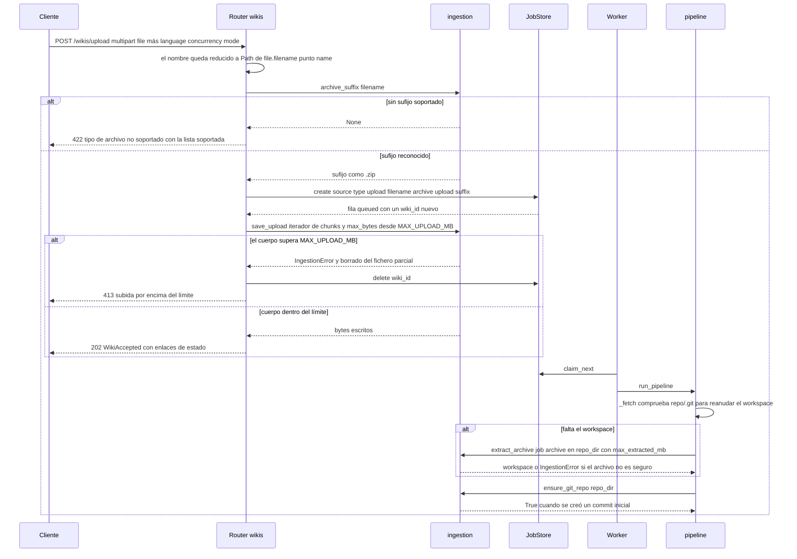

# Flujo: subir un zip/tar y extraerlo con seguridad

`POST /wikis/upload` es la segunda vía para darle un código al servicio: en lugar de una
URL git, el cliente envía un archivo como `multipart/form-data`, y el worker que más
tarde reclama el job lo extrae en el workspace. Todo lo posterior al paso de fetch es
idéntico a una generación con origen git (decisión de modo, ejecución del CLI de
OpenWiki, empaquetado, push opcional), documentado en
[/openwiki/workflows/generation-from-git.md](/openwiki/workflows/generation-from-git.md)
y [/openwiki/architecture/pipeline.md](/openwiki/architecture/pipeline.md).

La propiedad que distingue a este camino es que un archivo subido son **bytes no
confiables que el propio servicio debe convertir en un árbol de ficheros**. El diseño
reparte por eso el trabajo entre dos fronteras de confianza en procesos distintos:

| Fase | Proceso | Código | Límite que aplica |
| --- | --- | --- | --- |
| Aceptar y almacenar el cuerpo | API (`app/routers/wikis.py`) | `upload_source` → `ingestion.save_upload` | `MAX_UPLOAD_MB` sobre los bytes recibidos |
| Desempaquetar el archivo almacenado | worker (`app/services/pipeline.py`) | `_fetch` → `ingestion.extract_archive` | `MAX_EXTRACTED_MB` sobre el tamaño descomprimido declarado |

La API nunca extrae, y el worker nunca lee el cuerpo de la petición: reabre el fichero
que la API escribió en el volumen de datos compartido.

## La subida y la extracción como secuencia



*Dos procesos y un solo fichero: la API escribe el archivo bajo un tope de tamaño, el
worker lo relee, lo extrae bajo un segundo tope y después garantiza un repositorio git.*

## 1. Envío: validación del sufijo, luego la fila y luego el cuerpo

`upload_source` ordena deliberadamente sus pasos de modo que una petición rechazada no
deje nada detrás y un cuerpo largo no se almacene nunca entero en memoria:

1. **Normalización a basename.** `filename = Path(file.filename or "upload").name` elimina
   cualquier componente de directorio aportado por el cliente, así que el nombre
   almacenado no puede contener jamás un separador que escape del directorio del job.
2. **Puerta del sufijo.** `ingestion.archive_suffix(filename)` devuelve el sufijo
   reconocido o `None`; un `None` produce **`422`** con el mensaje
   `unsupported archive type; supported: ...` construido a partir de
   `SUPPORTED_ARCHIVE_SUFFIXES`. Esto ocurre *antes* de `store.create`, así que no existe
   fila de wiki para un archivo no soportado.
3. **Primero la fila, después el cuerpo.** La fila se crea con
   `source = {"type": "upload", "filename": <basename>, "archive": f"upload{suffix}"}`
   y `mode or "auto"`, y solo entonces el router transmite `_upload_chunks(file)` a
   `dest = store.job_dir(job["wiki_id"]) / f"upload{suffix}"`. El store ya es dueño de
   `jobs/<wiki_id>/` cuando se escribe el primer byte.
4. **Aplicación del tamaño durante el streaming.** `ingestion.save_upload` lee bloques de
   1 MiB (`_upload_chunks(..., chunk_size=1024 * 1024)`), cuenta los bytes escritos y,
   cuando el total acumulado supera `max_bytes = settings.max_upload_mb * 1024 * 1024`,
   cierra el descriptor, hace `dest.unlink(missing_ok=True)` y lanza `IngestionError`. El
   router lo captura, llama a `store.delete(job["wiki_id"])` — que borra la fila de SQLite
   y el directorio `jobs/<wiki_id>/` completo — y responde **`413`** con el mensaje
   `upload exceeds the <N> MB limit`.

La invariante de fallo merece enunciarse sin rodeos: **una subida rechazada no deja ni un
job encolado huérfano ni un archivo parcial**. Tanto la fila de la base de datos como el
directorio en disco desaparecen antes de que el `413` llegue al cliente, que es la razón
por la que el router puede crear la fila antes de saber si el cuerpo cabe.

El formulario multipart imita a `WikiCreate` pero no es idéntico: `language` es un
`str | None` sin restricciones, `concurrency` está acotado con `ge=1, le=8` y `mode` es
el mismo `Literal["auto", "init", "update"]`. A diferencia del modelo JSON — donde
`language` es `min_length=2, max_length=32` — el formulario de subida no impone ninguna
restricción de longitud a `language`.

### Matriz de rechazo del endpoint

| Entrada | Punto de rechazo | Respuesta |
| --- | --- | --- |
| Sufijo fuera de `SUPPORTED_ARCHIVE_SUFFIXES` (p. ej. `code.rar`) | `archive_suffix` dentro de `upload_source`, **antes** de `store.create` | `422` con `unsupported archive type; supported: ...`; no llega a existir ninguna fila |
| `concurrency` fuera de `1..8` o `mode` distinto del literal | validación del formulario multipart de FastAPI | `422` de validación, sin fila creada |
| Cuerpo mayor que `MAX_UPLOAD_MB` | `save_upload` mientras se transmite | `413` con `upload exceeds the <N> MB limit`; `store.delete` borra la fila y el directorio, así que la consulta posterior da `404` |
| Miembro con `..`, ruta absoluta POSIX o ruta absoluta Windows | `_check_member_path` durante la extracción en el worker | el job termina en `failed` con `unsafe path in archive: ...` |
| Entrada de enlace (symlink de ZIP, `issym`/`islnk` de tar) | `_extract_zip` / `_extract_tar` | el job termina en `failed` con `symlink entries are not allowed: ...` o `link entries are not allowed: ...` |
| Tamaño descomprimido declarado mayor que `MAX_EXTRACTED_MB` | suma de tamaños antes de `extractall` | el job termina en `failed` con `archive expands beyond the <N> MB limit` |
| El archivo ya no está en `job_dir` | `_fetch`, antes de extraer | el job termina en `failed` con `the uploaded archive is no longer available; submit the wiki again` |

## 2. Sufijos soportados

`SUPPORTED_ARCHIVE_SUFFIXES` es la única fuente de verdad tanto para el mensaje del
`422` como para el emparejador. `archive_suffix` pasa el nombre a minúsculas y devuelve el
sufijo **más largo** que empareja, que es lo que hace que `code.tar.gz` resuelva a
`.tar.gz` y no al candidato más corto `.tar`:

| Sufijo | Contenedor | Manejador |
| --- | --- | --- |
| `.zip` | ZIP | `_extract_zip` |
| `.tar` | tar sin comprimir | `_extract_tar` |
| `.tar.gz` | tar con gzip | `_extract_tar` |
| `.tgz` | tar con gzip | `_extract_tar` |
| `.tar.bz2` | tar con bzip2 | `_extract_tar` |
| `.tbz2` | tar con bzip2 | `_extract_tar` |
| `.tar.xz` | tar con xz | `_extract_tar` |
| `.txz` | tar con xz | `_extract_tar` |

`extract_archive` vuelve a deducir el contenedor con su propia comprobación sobre el
nombre en minúsculas en lugar de reutilizar el sufijo emparejado: despacha `.zip` a
`_extract_zip`, la familia tar a `_extract_tar` y cualquier otra cosa a `IngestionError`.
Como el nombre almacenado es siempre `upload<suffix>` con un sufijo procedente de la lista
soportada, ambas decisiones coinciden en la práctica; la segunda comprobación es una
guarda, no un router.

## 3. Extracción: las invariantes que hacen seguro un archivo

La extracción corre en el worker, dentro de `run_pipeline._fetch`, vía
`asyncio.to_thread(ingestion.extract_archive, archive, repo_dir, max_extracted_mb=settings.max_extracted_mb)`.
Consume CPU y E/S, de ahí el hilo. `extract_archive` crea `dest`, despacha al helper del
contenedor correspondiente y termina siempre con `_normalize_single_root`.

Todos los miembros del archivo pasan las mismas guardas **antes** de que se escriba un
solo byte en el workspace, porque ambos helpers hacen una pasada previa sobre la lista de
miembros y solo después llaman a `extractall`:

### Seguridad de rutas — `_check_member_path(dest_root, member_name)`

Cinco rechazos en capas, todos con `IngestionError("unsafe path in archive: ...")`:

1. `\` se normaliza primero a `/`, para que un archivo creado en Windows no pueda colar un
   separador por delante de las comprobaciones.
2. Un nombre que empieza por `/` (ruta absoluta POSIX) se rechaza.
3. Un nombre que empareja `^[A-Za-z]:` (ruta absoluta Windows, p. ej. `C:\...`) se rechaza.
4. Cualquier componente `..` en `Path(name).parts` se rechaza: el caso literal de
   path traversal.
5. Como red final, `(dest_root / name).resolve()` debe ser `dest_root.resolve()` o tenerlo
   entre sus `parents`. Las comprobaciones sobre la cadena ya cubren los payloads
   habituales; esta comprobación por resolución es la que atraparía una fuga expresada de
   alguna forma que los pasos anteriores no modelen.

### Seguridad de enlaces

Los enlaces se rechazan de plano en lugar de resolverse:

- **ZIP** — el modo Unix se recupera de `external_attr >> 16` enmascarado con `0o170000`;
  un valor de `0o120000` (symlink) lanza `symlink entries are not allowed: ...`.
- **tar** — `member.issym() or member.islnk()` lanza `link entries are not allowed: ...`,
  lo que cubre tanto enlaces simbólicos como duros. Un hardlink a `/etc/passwd` no es un
  path traversal en el espacio de nombres, así que necesita su propia comprobación.

### Seguridad de tamaño — `MAX_EXTRACTED_MB`

Ambos helpers acumulan los tamaños *declarados* (`info.file_size` en ZIP, `member.size` en
tar) y lanzan `IngestionError("archive expands beyond the <N> MB limit")` en cuanto el
total supera `max_extracted_mb * 1024 * 1024`. Es el control frente a bombas de
descompresión: se mide contra el tamaño sin comprimir, así que un archivo diminuto que
dice expandirse a terabytes se rechaza antes de que corra `extractall`. Es un límite
distinto de `MAX_UPLOAD_MB`, que medía los bytes comprimidos sobre HTTP; ambos tienen
valores por defecto generosos (200 MB y 1024 MB) y ambos se documentan en
[/openwiki/operations/configuration.md](/openwiki/operations/configuration.md).

### El filtro `data` de `tarfile`, con su fallback

Tras sus propias comprobaciones previas, `_extract_tar` extrae con
`tf.extractall(dest, members=members, filter="data")`. El filtro `data` es la pasada de
endurecimiento de la propia biblioteca estándar (revalida los tipos de miembro, rechaza
rutas absolutas o que escapan y elimina metadatos peligrosos como la propiedad y los bits
setuid). Las versiones de Python anteriores a 3.11.4 no tienen filtros de extracción y
lanzan `TypeError` con ese argumento de palabra clave, así que la llamada está envuelta y
el fallback es `tf.extractall(dest, members=members)`.

Ese fallback significa que **las comprobaciones manuales de ruta, enlace y tamaño son la
frontera de seguridad real**, no el argumento `filter`: en un intérprete antiguo son lo
único que se interpone entre un archivo y el workspace. Cualquier cosa que añada el filtro
`data` (rechazar nodos de dispositivo, FIFOs y otros tipos de miembro exóticos, por
ejemplo) es defensa en profundidad de mejor esfuerzo, no una garantía sobre la que este
código se apoye. La extracción ZIP no tiene ningún filtro de biblioteca equivalente y
siempre depende de la pasada previa manual de `_extract_zip`.

## 4. Normalización de la raíz — `_normalize_single_root`

Los archivos que produce el "descargar como zip/tar" de un forge siempre envuelven todo en
un único directorio de primer nivel (`repo-main/...`). Extraer eso tal cual convertiría la
raíz del repositorio en una carpeta anidada y confundiría a todos los pasos posteriores
que asumen que el workspace *es* la raíz del proyecto. Por eso `_normalize_single_root(dest)`
se ejecuta después de toda extracción correcta y:

- retorna de inmediato salvo que `dest` contenga **exactamente una** entrada (un archivo
  con varias entradas ya es lo bastante plano como para tratarse como raíz);
- retorna si esa única entrada es un **fichero** en vez de un directorio, o si se llama
  `.git` (subir los hijos de `.git` destruiría el repositorio);
- en caso contrario renombra cada hijo de ese directorio dentro de `dest` y hace `rmdir`
  sobre la envoltura ya vacía.

Es una normalización de un solo nivel por diseño: un archivo anidado dos carpetas adentro
conserva su estructura interna, y es responsabilidad del cliente subir un árbol con una
raíz razonable.

## 5. `ensure_git_repo`: por qué un árbol subido debe convertirse en repositorio

`_fetch` termina con `initialized = await ingestion.ensure_git_repo(repo_dir)`, para
**ambos** tipos de origen. En un clon devuelve `False` de inmediato porque `.git` ya
existe; en una subida extraída normalmente hace trabajo real:

```python
git init --quiet
git -c user.email=openwiki-service@localhost -c user.name=openwiki-service add --all
git -c user.email=... -c user.name=... commit --quiet --allow-empty -m "Import source for OpenWiki"
```

y el pipeline registra `source had no .git; initialized a git repository with an initial commit`.

La razón no es cosmética: **OpenWiki versiona con git la evidencia que respalda sus
claims.** Los claims citan el estado del repositorio en un commit, el `--update` incremental
compara el HEAD actual con el commit registrado en `openwiki/.last-update.json`, y un
workspace que no es un repositorio no le da al CLI nada con lo que versionar o comparar. Un
archivo subido no trae historia, así que el servicio fabrica la historia mínima viable —un
commit que contiene todo el árbol— con una identidad local fija (la misma identidad
`openwiki-service` que usa el camino de push). `--allow-empty` evita que un archivo vacío
haga fallar el paso, y la función es idempotente: una segunda llamada sobre un directorio
que ya tiene `.git` devuelve `False` sin ejecutar git. La propia frontera de los comandos
git (timeouts, redacción, `safe.directory`) se cubre en
[/openwiki/integrations/git-hosting.md](/openwiki/integrations/git-hosting.md).

## 6. Configuración y operación

| Ajuste | Valor por defecto | Efecto en este flujo |
| --- | --- | --- |
| `MAX_UPLOAD_MB` | `200` | `max_bytes` para `save_upload`; el umbral que produce el `413`. Está cubierto por el validador `_check_positive`, así que `0` o un valor negativo se rechaza en el arranque. |
| `MAX_EXTRACTED_MB` | `1024` | Presupuesto sin comprimir para `extract_archive`; **no** figura en la lista de `_check_positive`, así que no se valida al arrancar. |
| `DATA_DIR` | `/data` (`./data` en Windows) | Raíz de `jobs/<wiki_id>/`; el archivo y el workspace deben estar en el mismo volumen porque la API escribe y el worker lee. |
| Campos de formulario `LANGUAGE` / `CONCURRENCY` / `MODE` | `None` / `None` / `auto` | Se reenvían a la fila del job exactamente igual que en `WikiCreate`; el resto del pipeline es compartido. |

Del orden fila/cuerpo se siguen dos consecuencias operativas:

- **El archivo es estado duradero.** No se transmite directamente al extractor: se queda
  en `jobs/<wiki_id>/upload<suffix>` durante toda la vida del job, así que `GET /wikis/{id}`
  puede informar `fetching` mientras los bytes todavía están llegando y un worker puede
  reclamar más tarde un job cuyo archivo se escribió por completo minutos antes.
- **El `413` no es reintentable a través de la API.** `store.delete` eliminó la fila, así
  que el cliente obtiene `404` en cualquier consulta de estado posterior; la solución es
  enviar un archivo más pequeño.

Las subidas tampoco hacen push nunca: `run_pipeline` solo llama a
`publisher.publish_wiki` cuando `source.get("type") == "git"`, así que un origen subido no
confirma nada en ningún sitio.

## 7. Reanudación: cuándo volver a subir es la única recuperación

`_fetch` empieza con una comprobación del sistema de ficheros que corta en seco antes de
cualquier trabajo de extracción:

```python
if (repo_dir / ".git").exists():
    log("repository workspace already present; resuming the generation")
    return
```

Como `ensure_git_repo` siempre deja un `.git` detrás, una subida extraída con éxito es
reanudable: un reintento o un requeue que entregue el mismo `wiki_id` a otro worker
continúa en `jobs/<wiki_id>/repo` y el archivo nunca se relee. La extracción solo ocurre
cuando falta el workspace, que es exactamente cuando se busca el archivo:

```python
archive = job_dir / str(source.get("archive") or "")
if not archive.exists():
    raise ingestion.IngestionError(
        "the uploaded archive is no longer available; submit the wiki again"
    )
```

Ese acoplamiento define el modo de fallo de este tipo de origen. **Si el archivo desaparece
de `job_dir`, el reintento falla y la wiki debe enviarse otra vez.** El archivo y el
workspace viven en el mismo directorio, así que cualquiera de las siguientes situaciones
pierde tanto el árbol extraído como los bytes necesarios para reconstruirlo, y
`POST /wikis/{id}/retry` no puede hacer nada:

- perder o vaciar el volumen de datos (la fila de SQLite sobrevive y `GET /wikis/{id}`
  sigue respondiendo, pero `_fetch` lanza);
- cualquier limpieza que elimine `jobs/<wiki_id>/`;
- `DELETE /wikis/{id}`, que borra el directorio del job completo.

Es la asimetría más marcada con los orígenes git: una wiki git puede volver a clonarse desde
cero en un reintento porque la URL y el token viven en la columna `source` de la fila,
mientras que una subida no guarda ninguna referencia externa. El cuadro general de
recuperación está en
[/openwiki/operations/observability-and-recovery.md](/openwiki/operations/observability-and-recovery.md)
y [/openwiki/workflows/cancel-retry-and-resume.md](/openwiki/workflows/cancel-retry-and-resume.md).

## 8. Tests focalizados

| Test | Qué fija |
| --- | --- |
| `tests/test_ingestion.py::test_archive_suffix_matches_longest` | `.tar.gz` gana a `.tar`; `.rar` devuelve `None`. |
| `tests/test_ingestion.py::test_extract_zip_rejects_path_traversal` / `_rejects_absolute_path` | `../evil.txt` y `/etc/passwd` lanzan ambos `IngestionError`. |
| `tests/test_ingestion.py::test_extract_zip_enforces_size_limit` | Un miembro de 2 MiB contra `max_extracted_mb=1` lanza. |
| `tests/test_ingestion.py::test_extract_zip_normalizes_single_root_folder` | `project/README.md` y `project/src/main.py` pasan a ser `README.md` y `src/main.py` en la raíz devuelta. |
| `tests/test_ingestion.py::test_extract_tar_rejects_symlinks` | Un miembro `SYMTYPE` que apunta a `/etc/passwd` lanza. |
| `tests/test_ingestion.py::test_ensure_git_repo_initializes_and_is_idempotent` | La primera llamada devuelve `True` y crea `.git`; la segunda devuelve `False`. |
| `tests/test_api_wikis.py::test_upload_zip_end_to_end` | `202` → polling hasta `done`, `source_type == "upload"`, `filename == "code.zip"`, y el zip descargado contiene `.openwiki/index.md`. |
| `tests/test_api_wikis.py::test_upload_rejects_unknown_extension` | `code.rar` da `422` antes de que exista ningún job. |

Sin cubrir por la suite y por tanto merecedores de una comprobación manual al tocar este
código: un desbordamiento de `MAX_UPLOAD_MB` de extremo a extremo (el `413` más la limpieza
de `store.delete`), los hardlinks de tar (`islnk`) y los archivos cuyo presupuesto sin
comprimir se excede con muchos miembros pequeños en lugar de uno grande.
